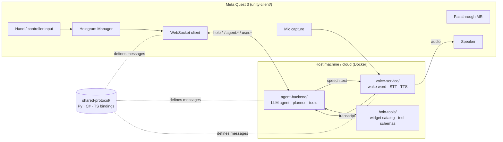
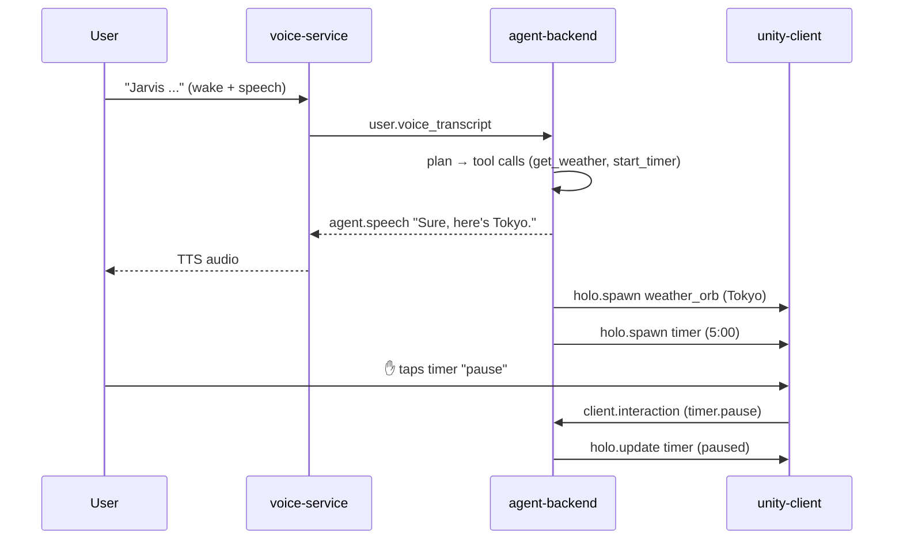
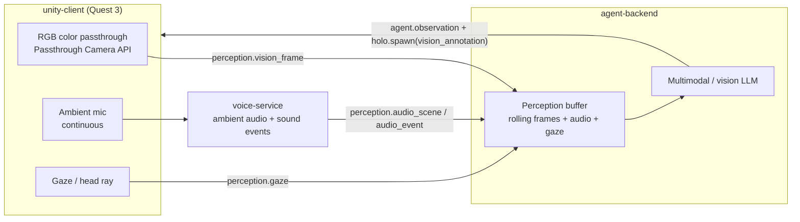
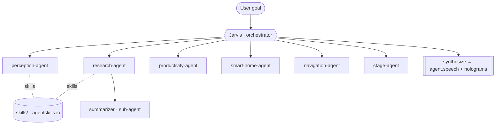

# JarvisVR — Architecture

This document is the system-level design contract. Every component is built to fit these
boundaries. The wire-level details live in [`docs/PROTOCOL.md`](./docs/PROTOCOL.md).

## 1. Design goals

1. **Spatial-first.** The primary UI is the room around the user (Quest 3 passthrough MR).
2. **Agentic.** An LLM plans multi-step tasks and calls tools; it is not a fixed command parser.
3. **Decoupled.** The headset (rendering + input) and the brain (reasoning) talk over a single
   versioned WebSocket protocol so either side can be replaced.
4. **Low latency, streaming.** Speech, agent tokens, and render commands all stream.
5. **Extensible holograms.** New 3D widgets can be added by declaring a schema + a prefab.

## 2. Component map

## 3. Components

### 3.1 `unity-client/` — the MR shell (Quest 3)
- Unity (2022 LTS) + **Meta XR SDK / OpenXR**; passthrough enabled (mixed reality).
- **Hologram Manager**: spawns/updates/destroys holographic objects on `holo.*` messages,
  maps each `widget_type` to a prefab from the catalog, and routes hand interactions back as
  `client.interaction` messages.
- **Spatial OS shell**: a persistent "Jarvis presence" (e.g., an orb/HUD), window/panel
  manager, and world/head/hand/surface anchoring.
- **Connection layer**: WebSocket client implementing `docs/PROTOCOL.md`, reconnect + heartbeat.
- Audio: streams mic frames to the voice path and plays TTS audio (or uses on-device options).

### 3.2 `agent-backend/` — the brain
- Python service hosting the **WebSocket server** (the protocol endpoint for the client).
- **Agent loop**: an LLM with tool/function calling, planning, short- and long-term memory.
- Maps tool calls → `holo.*` render commands and `agent.speech` outputs.
- Pluggable LLM provider (OpenAI/Anthropic/local) behind an interface; runs without keys in a
  deterministic **mock mode** so the whole stack is demoable offline.

### 3.3 `voice-service/` — ears & mouth
- **Wake word** detection ("Jarvis"), streaming **STT**, and **TTS** ("Jarvis" voice).
- Exposes a small internal API/stream to the backend; pluggable engines with offline fallbacks.

### 3.4 `holo-tools/` — the hologram catalog
- Declarative catalog of widgets (`weather_orb`, `chart_3d`, `model_viewer`, `panel`,
  `media_player`, `map_3d`, `smart_home_panel`, `timer`, …). Each entry defines: a JSON
  **props schema**, supported **interactions**, a default **transform/anchor**, and the Unity
  **prefab id** the client renders.
- Exports **agent tool schemas** (function-calling JSON) so the backend can summon widgets, and a
  machine-readable **registry** (`registry.json`) consumed by both backend and client.

### 3.5 `shared-protocol/` — the contract code
- Source-generated/handwritten bindings for the messages in `docs/PROTOCOL.md` in **Python**
  (backend, voice), **C#** (Unity), and **TypeScript** (tooling/tests). Single source of truth =
  JSON Schema in `shared-protocol/schema/`.

### 3.6 `infra/` — glue
- `docker-compose` for `agent-backend` + `voice-service`, dev scripts, mock client, and an
  **end-to-end harness** that drives a scripted conversation through the protocol.

## 4. End-to-end flow (example)

> User: *"Jarvis, show me the weather in Tokyo and start a 5-minute timer."*

## 5. Cross-cutting conventions
- **IDs**: UUID v4 strings. Every object the client renders has a server-assigned `object_id`.
- **Coordinates**: right-handed, meters, Unity convention (Y up). `position=[x,y,z]`,
  `rotation` = quaternion `[x,y,z,w]`, `scale=[x,y,z]`.
- **Anchors**: `world | head | hand_left | hand_right | surface`.
- **Versioning**: protocol carries `protocol_version` in the hello handshake (see PROTOCOL.md).
- **Errors**: surfaced as `server.error` / `client.error` with a `code` and human `message`.

## 6. Build order & contracts
All components depend only on `docs/PROTOCOL.md` + `holo-tools/registry.json`. They are built in
parallel; integration is validated by `infra/`'s e2e harness against the mock backend.

## 7. Multimodal Perception (v1.1)

Jarvis perceives the user's real environment in realtime and reasons over it:

- **Sight**: `unity-client` captures the forward RGB passthrough stream (Meta Passthrough Camera
  API) and streams JPEG frames (`perception.vision_frame`, pull-based 1–3 fps) with camera pose.
- **Hearing**: `voice-service` continuously analyzes room audio for an ambient transcript + sound
  events (`perception.audio_scene` / `perception.audio_event`), distinct from wake-word/STT.
- **Attention**: gaze/head ray (`perception.gaze`) tells the agent *what* the user is looking at.
- **Reasoning**: `agent-backend` keeps a rolling **perception buffer** and feeds the latest
  context to a **vision-capable LLM**, auto-correlated with each utterance, then responds with
  `agent.observation` + world-anchored `vision_annotation` holograms.
- **Control & privacy**: streams are negotiated via `perception.request` (start/stop/once) so the
  cameras/mic run only when needed. See `docs/PROTOCOL.md` §8 and `docs/FEATURES.md`.

## 8. Multi-Agent Orchestration (v1.2)

JarvisVR's "brain" is itself an **operating system of agents**, not a single prompt. An
orchestrator named **Jarvis** decomposes each goal and delegates to skill-specialized agents
(which may spawn sub-agents — a multi-level hierarchy).

- **Jarvis (L0)** conducts: understand → decompose → route → monitor → synthesize. It never does
  domain work itself.
- **Specialist agents (L1)** each own a domain and carry only the **Agent Skills** + tools they
  need (`perception-agent`, `research-agent`, `productivity-agent`, `smart-home-agent`,
  `navigation-agent`, `media-agent`, `communication-agent`, `stage-agent`, `system-agent`).
- **Skills** live in [`skills/`](./skills) as [agentskills.io](https://agentskills.io) `SKILL.md`
  packages; each declares its owning agent via `metadata.agent`, and the backend loads them with
  progressive disclosure (name+description at startup, full body on activation).
- **The team is visible**: every plan/delegation/step is streamed to the headset via the
  `orchestration.*` messages so the MR shell can render the live "org chart" of agents.

Full design in [`docs/ORCHESTRATION.md`](./docs/ORCHESTRATION.md); wire messages in
[`docs/PROTOCOL.md` §9](./docs/PROTOCOL.md).
