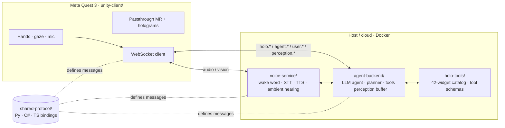

# JarvisVR

### Your own **J.A.R.V.I.S.** — an AI agentic operating system for mixed reality, running on the Meta Quest 3 VR headset.

*Speak to the room around you. An LLM agent plans, calls tools, and materializes interactive 3D holograms you can grab with your hands — and it can **see** and **hear** your real world in realtime.*

  


[CI](https://github.com/sumitaich1998/jarvisvr/actions/workflows/ci.yml)
[License: MIT](./LICENSE)
[PRs Welcome](./CONTRIBUTING.md)
[Protocol](./docs/PROTOCOL.md)
[Python](./agent-backend)
[Unity](./unity-client)
[Meta Quest 3](./unity-client)

[Stars](https://github.com/sumitaich1998/jarvisvr/stargazers)
[Forks](https://github.com/sumitaich1998/jarvisvr/network/members)

**[Features](#-highlights) · [Architecture](#%EF%B8%8F-architecture) · [Quickstart](#-quickstart) · [Docs](#-documentation) · [Contributing**](#-contributing)

---

## What is JarvisVR?

JarvisVR turns the space around you into a programmable, conversational computer. Say *"Jarvis, show
me the weather in Tokyo and start a 5-minute timer"* and a planning **LLM agent** decides what to do,
calls tools, and spawns **interactive holograms** into your room (Quest 3 passthrough mixed reality)
that you can grab, press, resize, and arrange with your hands.

It doesn't just listen for commands — it **perceives**. JarvisVR streams the Quest 3 **color
passthrough camera**, **ambient room audio**, and **gaze** to a vision-capable agent, so you can ask
about whatever you're looking at or hearing: *"what is this on my desk?"*, *"read this sign and
translate it"*, *"what was that sound?"* — realtime multimodal input (**sight + sound + gaze +
voice**).

```
        🗣️  "Jarvis, ..."            🧠 plan + tools            ✋ interact
   You ───────────────▶ Voice ──▶ Agent Backend ──▶ Holograms ──▶ You
                         (STT)      (LLM + tools)     (Quest 3 MR)
   You ◀─────────────── Voice ◀──  (TTS speech)  ◀── render cmds
        👁️  sees · 👂 hears · 🎯 gaze  ──▶  realtime multimodal perception
```

> [!NOTE]
> **Early, honest scaffold.** Every component runs **fully offline** out of the box via deterministic
> mock providers, and all of them talk over one versioned WebSocket protocol. The Unity client is a
> complete project you build locally with Unity + the Meta XR SDK — there is **no prebuilt APK**, and
> the UI imagery below is a **concept mockup**.

## ✨ Highlights

- 👁️ **Color-passthrough vision** — streams the Quest 3 forward RGB camera (Meta Passthrough Camera API) to a vision LLM, pull-based at 1–3 fps.
- 👂 **Ambient hearing + sound events** — continuous room-audio understanding (overheard speech, soundscape) and event detection (doorbell, alarm, glass break…) beyond the wake word.
- 🎯 **Gaze & attention** — eye/head ray tells the agent *what* you're looking at.
- 🧠 **Agentic tool-calling brain** — an LLM that *plans → calls tools → observes → responds*, not a fixed command parser.
- 🪟 **42 holographic widgets** — weather orbs, 3D charts, model viewers, maps, smart-home panels, live captions, vision annotations, and more — all schema-validated.
- 🔌 **20 LLM providers** — OpenAI, Anthropic, Gemini, Groq, local Ollama/LM Studio/vLLM, … with an **install-time key wizard** *and* **in-headset key config**.
- 🎙️ **Voice + barge-in** — wake word "Jarvis", streaming STT, natural TTS, and interruptibility (talk over Jarvis to cancel a turn).
- 🛜 **Offline mock mode** — the entire stack is demoable with **no API key and no hardware**.
- 📜 **Open protocol** — a clean, versioned WebSocket contract (v1.1) with Python, C#, and TypeScript bindings, so you can swap the model, the voice, or even the rendering engine.

## 🖼️ Gallery


**Concept mockup** — holographic widgets anchored in a real room (illustrative, not a screenshot of a shipped build).


## 🏗️ Architecture

A headset **shell** (rendering + input) and an AI **brain** (reasoning) are fully decoupled across one
versioned WebSocket protocol, so either side can be replaced.


**Mermaid fallback (component map)**




See `**[ARCHITECTURE.md](./ARCHITECTURE.md)**` for the full system design and data flow.

## 🚀 Quickstart

> Full setup lives in each component's README and in `[infra/](./infra)`. The whole stack runs
> **offline** on the deterministic `mock` provider, so you can try it with no API key.

### Option A — Install the brain with the key wizard

```bash
cd infra && make install
```

This installs the `agent-backend` and runs an interactive wizard that lets you **pick a provider**
(OpenAI, Anthropic, Gemini, Groq, Ollama/local, … or `**mock`** for fully offline) and **enter your
API key** (masked input). The key is saved to `agent-backend/.env` (`chmod 600`) and **never
printed**. Then run it:

```bash
cd ../agent-backend && source .venv/bin/activate && python -m jarvis_backend
# -> ws://0.0.0.0:8765/jarvis   (offline on the mock provider if you skipped the key)
```

Re-run the wizard anytime with `jarvis-backend setup`; list providers with `jarvis-backend providers`.

### Option B — Docker (mock brain, no key needed)

```bash
cd infra && docker compose up --build
```

### Then: open the Quest 3 client

Open `[unity-client/](./unity-client)` in **Unity 2022 LTS** with the **Meta XR SDK**, point its
`JarvisConfig` at your backend host, and **Build & Run** to a Quest 3 (or test in the editor over
Quest Link). Full steps in the [unity-client README](./unity-client/README.md).

## 🔌 Supported LLM providers

Pick any provider at install time *or* hot-swap it from the in-headset Settings panel — keys are
stored in `.env` (`chmod 600`) and never logged or echoed. Run `jarvis-backend providers` for the
live list.


|     | Provider               | Notes                                                 |
| --- | ---------------------- | ----------------------------------------------------- |
| 🧪  | **Mock**               | Deterministic, offline, no key — the default.         |
| 🟢  | **OpenAI**             | `gpt-4o`, `gpt-4o-mini`, `o4-mini` (native SDK).      |
| 🟣  | **Anthropic (Claude)** | `claude-3.5-sonnet`, `claude-3.5-haiku` (native SDK). |
| 🔵  | **Google Gemini**      | OpenAI-compatible endpoint.                           |
| ☁️  | **Google Vertex AI**   | via LiteLLM (Google ADC).                             |
| 🟦  | **Azure OpenAI**       | via LiteLLM (set base URL).                           |
| 🟧  | **AWS Bedrock**        | via LiteLLM (AWS creds).                              |
| 🟠  | **Mistral AI**         | OpenAI-compatible.                                    |
| 🔶  | **Cohere**             | via LiteLLM.                                          |
| ⚡   | **Groq**               | OpenAI-compatible, very fast.                         |
| 🤝  | **Together AI**        | OpenAI-compatible.                                    |
| 🧭  | **OpenRouter**         | OpenAI-compatible meta-router.                        |
| 🐳  | **DeepSeek**           | OpenAI-compatible.                                    |
| ✖️  | **xAI (Grok)**         | OpenAI-compatible (vision).                           |
| 🔎  | **Perplexity**         | OpenAI-compatible (online).                           |
| 🎆  | **Fireworks AI**       | OpenAI-compatible.                                    |
| 🦙  | **Ollama (local)**     | Local, usually no key.                                |
| 🖥️ | **LM Studio (local)**  | Local OpenAI-compatible server.                       |
| 🚄  | **vLLM (self-hosted)** | Self-hosted OpenAI-compatible.                        |
| 🛠️ | **Custom**             | Any OpenAI-compatible `base_url`.                     |


Reached natively, via a generic OpenAI-compatible client, or through the **LiteLLM** universal adapter.

## 🗂️ Repository layout


| Path                                    | Component                                              | Role                                              |
| --------------------------------------- | ------------------------------------------------------ | ------------------------------------------------- |
| `[unity-client/](./unity-client)`       | Quest 3 Unity MR app (the "shell")                     | Renders holograms, captures hands/gaze/camera/mic |
| `[agent-backend/](./agent-backend)`     | LLM agent orchestration server                         | The "brain": plan → tools → perception → render   |
| `[voice-service/](./voice-service)`     | Wake word + STT + TTS + ambient hearing                | Ears & mouth                                      |
| `[holo-tools/](./holo-tools)`           | 42-widget catalog + agent tool schemas                 | What Jarvis can show                              |
| `[shared-protocol/](./shared-protocol)` | Protocol bindings (Python / C# / TypeScript)           | One contract, three languages                     |
| `[infra/](./infra)`                     | Docker Compose, dev scripts, mock backend, e2e harness | Glue & conformance                                |
| `[docs/](./docs)`                       | Architecture, protocol, features, widget catalog       | Source-of-truth contracts                         |


## 🗺️ Roadmap

Driven by `[docs/FEATURES.md](./docs/FEATURES.md)` (priorities **P0** = now, **P1** = next, **P2** = later).

- **✅ Now (P0)** — multimodal perception (vision · hearing · sound events · gaze), agentic planning + tool-calling, the 42-widget catalog, 20 LLM providers with install-time + in-headset key config, voice with barge-in, pull-based privacy-gated perception, and a fully offline mock for every capability.
- **🔜 Next (P1)** — spatial + episodic memory ("where did I leave my keys?"), session persistence & multi-window spatial OS shell, more integrations (smart home, calendar, music, maps, web search, stocks/news), routines/macros, and real-time translation.
- **🌟 Later (P2)** — multi-user shared sessions, device hand-off, speaker diarization & voice biometrics, generative 3D asset creation, and a phone-notification mirror.

## 📚 Documentation

- `[Documentation hub](./docs/README.md)` — **start here**: getting-started, concepts, component deep-dives, guides & reference.
- `[ARCHITECTURE.md](./ARCHITECTURE.md)` — system design, components, and data flow.
- `[docs/PROTOCOL.md](./docs/PROTOCOL.md)` — the WebSocket message contract (the source of truth every component conforms to).
- `[docs/HOLO_TOOLS.md](./docs/HOLO_TOOLS.md)` — the holographic widget catalog & agent tool schemas.
- `[docs/FEATURES.md](./docs/FEATURES.md)` — the full feature set & roadmap (incl. perception).
- `[docs/PUBLISHING.md](./docs/PUBLISHING.md)` — the ship checklist for launching this repo publicly.
- `[CHANGELOG.md](./CHANGELOG.md)` — notable changes, per release.

## 🤝 Contributing

Contributions are very welcome! JarvisVR is built **protocol-first**: every change conforms to
`[docs/PROTOCOL.md](./docs/PROTOCOL.md)`, and the `[infra/](./infra)` e2e harness validates the whole
stack against the mock backend.

- 📖 Read `**[CONTRIBUTING.md](./CONTRIBUTING.md)`** for per-component dev setup, how to run each test suite, and the PR process.
- 🐛 File a [bug report or feature request](https://github.com/sumitaich1998/jarvisvr/issues/new/choose).
- 🔒 Found a vulnerability? See `**[SECURITY.md](./SECURITY.md)**`.
- 🙌 Please be kind — we follow the **[Contributor Covenant](./CODE_OF_CONDUCT.md)**.

## 🌐 Community & support

- 💬 [GitHub Discussions](https://github.com/sumitaich1998/jarvisvr/discussions) — ideas, questions, show & tell.
- 🐞 [Issues](https://github.com/sumitaich1998/jarvisvr/issues) — bugs and feature requests.
- ⭐ Star the repo to follow along!

## 📄 License

Released under the **[MIT License](./LICENSE)** © 2026 The JarvisVR contributors. Cite it via
`[CITATION.cff](./CITATION.cff)`.

## ⚠️ Disclaimer

JarvisVR is an independent project and is **not affiliated with, endorsed by, or sponsored by** Marvel,
Meta, or any third party. "J.A.R.V.I.S." is referenced only as cultural inspiration. Product names and
trademarks belong to their respective owners.

---


**If JarvisVR sparks your imagination, consider giving it a ⭐ — it genuinely helps.**

Built in the open. [Come build the spatial AI future with us.](./CONTRIBUTING.md)

