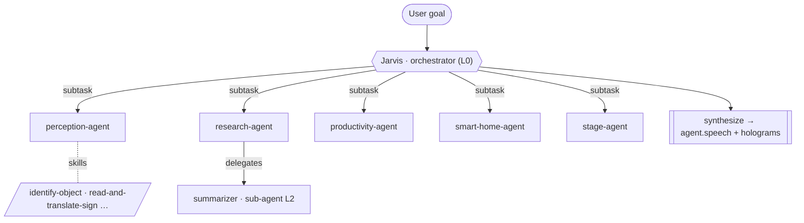
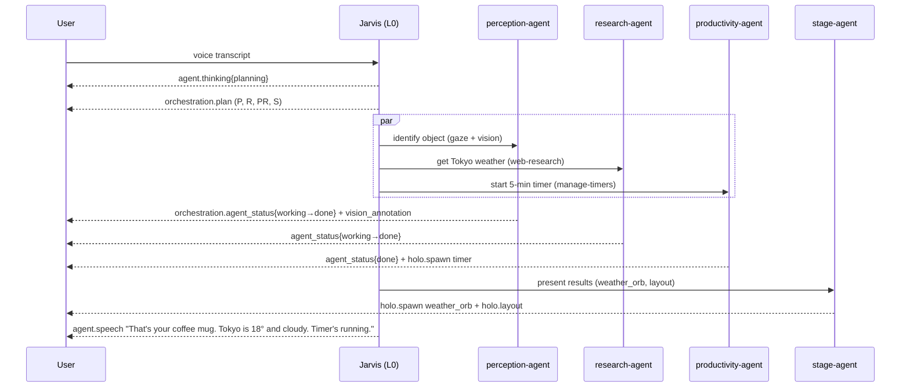

<div align="center">


# JarvisVR — Multi-Agent Orchestration

**From a monolithic agent to a hierarchical team of skill-specialized agents, conducted by Jarvis.**

</div>

This is the design contract for JarvisVR's multi-agent OS (protocol **v1.2**, see
[`PROTOCOL.md` §9](./PROTOCOL.md)). Every component builds against it:

- `agent-backend/` implements the orchestrator + specialist agents + skill runtime.
- `skills/` holds the **Agent Skills** ([agentskills.io](https://agentskills.io) standard) that
  specialize each agent.
- `unity-client/` visualizes the live team via the `orchestration.*` messages.
- `shared-protocol/` adds bindings for the new messages.

---

## 1. Why multi-agent?

A single "do-everything" prompt gets brittle as capabilities grow. JarvisVR instead models an
**operating system of agents**:

- **Jarvis** is the *orchestrator* (the kernel/conductor). It understands the user's goal, breaks
  it into sub-tasks, routes each to the best specialist, runs them (in parallel where possible),
  and synthesizes one coherent response.
- **Specialist agents** each own a domain and are **skill-specialized** — equipped only with the
  Skills and tools relevant to their job, so each stays focused, debuggable, and swappable.
- **Sub-agents** let any agent delegate further (multi-level hierarchy), e.g. a research agent
  spawning per-source summarizers.



## 2. The orchestrator — Jarvis (L0)

Jarvis never does domain work itself; it **conducts**. Responsibilities:

1. **Understand & clarify** the goal (ask only when blocked — `clarify-intent` skill).
2. **Decompose** into a plan: a small DAG of sub-tasks with dependencies (`task-decomposition`).
3. **Route** each sub-task to the best specialist by matching it against agent roles + skill
   descriptions (`agent-routing`).
4. **Dispatch & monitor**: run independent sub-tasks concurrently, sequence dependent ones, handle
   failures/retries, and emit `orchestration.*` so the client can watch.
5. **Synthesize** the specialists' results into one spoken reply and coordinate the final spatial
   layout via the `stage-agent` (`result-synthesis`).

Jarvis emits `orchestration.plan` once, then `orchestration.agent_status` as the team progresses,
and finally the usual `agent.speech{final}`.

## 3. The specialist roster (L1)

Each agent has a stable **role id**, a persona, an assigned **skill set** (from `skills/`), and a
**tool set** (from `holo-tools` + backend tools). Roles are the values used in `orchestration.*`.

| Role id | Owns | Example skills | Primary tools / widgets |
| ------- | ---- | -------------- | ----------------------- |
| `perception-agent` | Seeing & understanding the room | `identify-object`, `read-and-translate-sign`, `describe-surroundings`, `locate-remembered-object` | vision buffer, `vision_annotation`, `bounding_box_3d` |
| `research-agent` | Knowledge, web, news, finance | `web-research`, `summarize-source`, `news-digest`, `market-briefing` | `web_search`, `panel`, `data_table`, `stocks_ticker`, `news_feed` |
| `productivity-agent` | Time, reminders, notes, tasks, calendar | `manage-timers`, `set-reminders`, `capture-note`, `manage-tasks`, `manage-calendar` | `timer`, `pomodoro`, `todo_list`, `calendar`, `sticky_note` |
| `smart-home-agent` | Devices & scenes | `control-lighting`, `manage-climate`, `secure-home`, `run-home-scene` | `smart_home_panel` |
| `navigation-agent` | Maps, wayfinding, spatial memory, measuring | `show-map`, `wayfind`, `measure-space`, `remember-location` | `map_3d`, `navigation_arrow`, `measuring_tape`, `scene_label` |
| `media-agent` | Music, video, generated imagery | `control-media-playback`, `create-image`, `set-soundscape` | `media_player`, `music_visualizer`, `image_gen_viewer` |
| `communication-agent` | Translation, captions, messages | `live-translate`, `caption-conversation`, `draft-message` | `translator`, `live_caption`, `panel` |
| `stage-agent` | The spatial compositor (UI) | `compose-workspace`, `present-data`, `annotate-reality`, `declutter-space` | all `holo.*` (spawn/update/layout/destroy) |
| `system-agent` | Settings, providers, privacy, diagnostics | `configure-llm`, `manage-privacy`, `run-diagnostics` | settings (`§5.15`), `perception.request`, `settings_panel` |

> The **`stage-agent`** is special: most agents describe *what* to show; the stage-agent decides
> *how/where* to render it (arrangement, anchoring, decluttering), turning intents into `holo.*`.

## 4. Sub-agents & multi-level delegation

Any agent may spawn sub-agents for parallel or specialized work, emitting `orchestration.handoff`
and using dotted ids (`a1` → `a1.1`, `a1.2`). Example: `research-agent` (a1) fans out three
`summarizer` sub-agents (a1.1–a1.3), one per source, then merges. Keep depth shallow (≤3 levels)
and prefer parallel siblings over deep chains.

## 5. The Skills system (agentskills.io)

Skills are how agents are **specialized**. JarvisVR adopts the open
[Agent Skills](https://agentskills.io/specification) standard verbatim.

### 5.1 Format
A skill is a **directory** whose immediate parent name equals the skill `name`, containing a
`SKILL.md`:

```
skills/<category>/<skill-name>/
├── SKILL.md          # required: YAML frontmatter + Markdown instructions
├── scripts/          # optional: executable helpers
├── references/       # optional: deeper docs the agent loads on demand
└── assets/           # optional: templates/resources
```

`SKILL.md` frontmatter (per the spec):

```yaml
---
name: identify-object              # required; 1-64 chars; [a-z0-9-]; matches the parent dir
description: >-                    # required; ≤1024 chars; what it does + WHEN to use it (keywords!)
  Identify a real-world object the user is looking at or asking about, using the latest
  passthrough vision frame and gaze. Use for "what is this?", "what am I holding?", naming
  objects on a surface, or labeling things in the room.
license: MIT                       # optional
compatibility: Requires JarvisVR agent-backend with perception enabled   # optional, ≤500 chars
metadata:                          # optional, string→string
  agent: perception-agent          # JarvisVR convention: which specialist owns this skill
  category: perception
  version: "1.0"
  author: jarvisvr
allowed-tools: identify_object look read_text   # optional (experimental); tools the skill may call
---
```

The Markdown **body** holds the instructions (steps, examples, edge cases) — keep it under ~500
lines and push deep material into `references/`.

### 5.2 JarvisVR conventions (on top of the spec)
- **`metadata.agent`** declares the owning specialist role id (e.g. `perception-agent`, or
  `jarvis` for orchestrator meta-skills). This is how the backend assigns skills to agents.
- **`metadata.category`** mirrors the `skills/<category>/` folder for humans.
- **`allowed-tools`** lists JarvisVR tool ids (from `holo-tools/tools.json` + backend tools) the
  skill expects, so routing and validation can reason about capabilities.

### 5.3 Progressive disclosure (how the backend uses skills)
1. **Discovery (startup):** the skill loader scans `skills/`, parses only `name` + `description` +
   `metadata` for every skill, and groups them by `metadata.agent`. ~100 tokens/skill.
2. **Activation (per sub-task):** when an agent picks up a sub-task, it loads the **full `SKILL.md`
   body** of the matching skill(s) into its context.
3. **Execution:** the agent follows the instructions, calling its `allowed-tools` and loading
   `references/`/`scripts/`/`assets/` only as needed.

### 5.4 Catalog layout
```
skills/
├── README.md
├── orchestration/   # jarvis meta-skills: task-decomposition, agent-routing, result-synthesis, clarify-intent
├── perception/      # perception-agent skills
├── research/        # research-agent skills
├── productivity/    # productivity-agent skills
├── smart-home/      # smart-home-agent skills
├── navigation/      # navigation-agent skills
├── media/           # media-agent skills
├── communication/   # communication-agent skills
├── stage/           # stage-agent skills
└── system/          # system-agent skills
```

## 6. The orchestration loop (worked example)

> User: *"Jarvis, what's this on my desk, and what's the weather in Tokyo? Start a 5-minute timer."*



Offline, the **MockLLM** path is deterministic: keyword intent → plan → fixed routing → each
agent's skill produces canned-but-valid results, so the whole multi-agent flow is demoable with no
API key.

## 7. Extending the system

- **Add a skill:** create `skills/<category>/<name>/SKILL.md` with `metadata.agent` set; the loader
  auto-assigns it. See [`guides/add-a-skill.md`](./guides/add-a-skill.md) *(if present)* and
  [`CONTRIBUTING.md`](../CONTRIBUTING.md).
- **Add an agent:** register a new role (id, persona, tool set) in the backend; it automatically
  receives every skill whose `metadata.agent` matches its role id.

## 8. Design principles
- **Specialize, don't centralize** — narrow skill sets beat one giant prompt.
- **Make the team visible** — every delegation emits `orchestration.*` for the MR UI.
- **Offline-first** — the mock orchestrator runs the full hierarchy with zero keys.
- **Protocol-first & additive** — v1.2 changes are optional; v1.0/v1.1 clients keep working.
- **The user stays in control** — perception/tool actions remain gated as in v1.1.

See [`PROTOCOL.md` §9](./PROTOCOL.md) for the wire messages and the component deep-dives for
implementation details.

## 9. Per-agent memory, tracing & in-headset authoring (v1.3)

The multi-agent OS is observable and **user-extensible** ([`PROTOCOL.md` §10](./PROTOCOL.md)):

### 9.1 Per-agent memory
Each specialist owns a **memory namespace** (keyed by role): short-term within a turn plus a
persisted long-term store. Agents recall their own prior context (e.g. `research-agent` remembers
recent lookups; `perception-agent` + the spatial index remember seen objects), and recalls surface
in the trace as `memory_read`/`memory_write` events. Inspect any agent via `client.agent_inspect`
→ `server.agent_info` (persona, skills, tools, memory summary).

### 9.2 Tracing
The orchestrator records a **trace** of every turn — each agent's skill activations, tool calls,
observations, memory ops, and delegations — streamed live as `orchestration.trace_event` (gated by
`client.trace_subscribe`) and fetchable in full via `client.trace_get` → `server.trace`. The
headset renders this as an expandable timeline under the Agent Team view, so you can *watch each
agent think*. Traces carry only short, secret-redacted summaries.

### 9.3 Compose your own agents & skills (from the headset)
A **Studio/Composer** in MR lets users author capabilities at runtime:
- **New Skill** — name, description (when-to-use), owning agent, instructions body, and pickable
  tools → `client.author_skill`. The server validates ([agentskills.io](https://agentskills.io)
  rules), writes the `SKILL.md` under the skills root with `metadata.source: user`, and **hot-reloads**
  the registry — the owning agent gains the skill on its next turn.
- **New Agent** — role id, name, persona, tool set, and attached skills → `client.author_agent`.
  The server registers the role immediately; it joins routing and the Agent Team view.

> **Safety:** the server sanitizes names (no path traversal / reserved-name collisions), confines
> writes to the skills root, and never lets a user item overwrite a built-in (only user-authored
> items are editable/deletable). See `guides/add-a-skill.md` for the file-level equivalent.

This closes the loop: JarvisVR ships a strong default team, and users grow it — new skills and even
new specialists — without leaving mixed reality.
