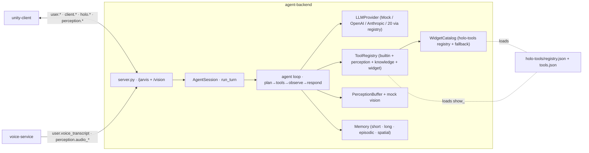

# Component deep-dive: `agent-backend`

> The **brain**. A Python WebSocket server that hosts the protocol endpoint,
> runs the agent loop (*plan → call tools → observe → respond*), turns tool
> results into `holo.*` render commands, and *sees/hears* the room via the v1.1
> perception buffer — all working **fully offline** on a deterministic mock LLM.

| | |
| --- | --- |
| **Path** | [`agent-backend/`](../../agent-backend/) |
| **Language / runtime** | Python **3.11+** · `websockets` · `pydantic v2` · `httpx` |
| **Listens on** | `ws://0.0.0.0:8765/jarvis` (JSON) + `ws://…:8765/vision` (binary frames) |
| **Role in the system** | The reasoning half of the shell ↔ brain split; the protocol **server** |
| **Source README** | [`agent-backend/README.md`](../../agent-backend/README.md) |

---

## Purpose & role

`agent-backend` is the WebSocket **server** that the Quest 3
[`unity-client`](./unity-client.md) and the [`voice-service`](./voice-service.md)
connect to. When a user speaks, the backend runs an **LLM agent** that plans a
multi-step task, calls **network-free tools**, and streams `agent.thinking` +
`agent.speech` back while emitting `holo.*` commands that materialize interactive
holograms. With **v1.1 multimodal perception** it also keeps a rolling buffer of
camera frames, ambient sound events, gaze, and detected objects, auto-correlates
it with each utterance, and answers questions like *"what is this?"* /
*"read this sign"* / *"where did I leave my keys?"* — pinning answers onto real
objects with `vision_annotation` holograms.

The defining property is that **everything runs with no API keys**: a
deterministic `MockLLM` plans from keywords/intent and a mock "vision" describes
the scene from the perception buffer, so the entire stack is demoable offline.
Plugging in a real provider is a one-liner (`jarvis-backend setup`), and a
missing key/SDK **falls back to mock** with a warning rather than crashing.

## Where it fits



**Receives:** `client.hello`, `client.heartbeat`, `client.bye`, `user.text`,
`user.voice_transcript`, `user.voice_partial` (ignored), `client.interaction`,
`client.scene`, `client.ack`, `client.error`, `client.barge_in`,
`client.settings_get`, `client.settings_update`, and the `perception.*` streams
(`vision_frame`, `gaze`, `scene_objects`, `state`, `audio_event`, `audio_scene`).

**Sends:** `server.hello_ack`, `server.heartbeat`, `agent.thinking`,
`agent.speech`, `agent.transcript`, `agent.observation`, `holo.spawn`,
`holo.update`, `holo.destroy`, `holo.layout`, `perception.request`,
`server.settings`, `server.error`.

## Directory & key files

| File | What it does |
| --- | --- |
| [`pyproject.toml`](../../agent-backend/pyproject.toml) | Packaging + pinned deps; `[project.scripts] jarvis-backend`; extras `openai`, `anthropic`, `providers`/`llm` (LiteLLM), `dev`, `all`. |
| `jarvis_backend/__main__.py` | CLI: `serve` (default), `setup`/`init`, `providers`. |
| `jarvis_backend/server.py` | WebSocket server: per-connection `Connection` (envelope routing, session, ordered outbound queue), `/jarvis` + `/vision` + `/audio` handlers, dispatch table. |
| `jarvis_backend/config.py` | `Config.from_env()` — every `JARVIS_*` setting with safe defaults; resolves the holo-tools registry path, `.env` path, data dir. |
| `jarvis_backend/protocol.py` | Self-contained v1.1 envelope + pydantic payload models + `MsgType`/`ErrorCode` (mirrors [`docs/PROTOCOL.md`](../PROTOCOL.md)). |
| `jarvis_backend/providers.py` | The **provider registry** (20 providers): id, key env var, default models, base_url, capabilities, routing `kind`; `resolve(config)` → concrete `ResolvedLLM`. |
| `jarvis_backend/setup_wizard.py` | `jarvis-backend setup`: masked key entry (`getpass`), atomic **chmod-600** `.env` writer, optional live validation, non-interactive CI mode. |
| `jarvis_backend/settings_service.py` | §5.15 runtime settings: builds `server.settings` (no keys, ever) and applies `client.settings_update` (validate → persist → **hot-swap** the live LLM). |
| `jarvis_backend/catalog.py` | `WidgetCatalog`: loads `holo-tools/registry.json` (+ merges built-in fallback widgets) and validates `widget_type` + `props`. |
| `jarvis_backend/agent/agent.py` | `Agent` (shared resources) + `AgentSession` (per-connection turn loop, barge-in, perception control, directive→protocol translation). |
| `jarvis_backend/agent/llm.py` | `LLMProvider` interface + `MockLLM` / `OpenAILLM` / `AnthropicLLM` / generic OpenAI-compatible / LiteLLM; `create_llm(config)`; multimodal `images=` support. |
| `jarvis_backend/agent/tools/` | `base.py` (Tool/Registry/`ToolResult`/holo directives), `builtins.py`, `perception_tools.py`, `knowledge_tools.py`, `widget_tools.py`. |
| `jarvis_backend/agent/memory.py` | Short-term conversation + long-term JSON store + episodic/semantic facts + spatial object index. |
| `jarvis_backend/agent/{persona,state}.py` | Perception-aware system prompt; per-session state (objects/refs/store/perception buffer). |
| `jarvis_backend/perception/{buffer,vision}.py` | Rolling `PerceptionBuffer` + `/vision` binary codec; deterministic offline scene description / OCR / translate. |
| `scripts/smoke_client.py` | Connect + drive one full turn end-to-end. |
| `tests/` | pytest suite (protocol, agent, tools, server, perception, settings, providers, barge-in, catalog). |

## How it works

### Server & connection

`server.py` serves one `Connection` per headset. Inbound frames are parsed
(`protocol.parse_inbound`); a malformed frame returns `server.error{bad_envelope}`.
A dispatch table routes by `type`: hello → `server.hello_ack` (assigns the
session and advertises agent/model/tools/voice/widgets); heartbeat is echoed;
`user.text`/`user.voice_transcript` and `client.interaction` are run as **guarded
tasks under a per-connection agent lock**; `client.barge_in` is handled *inline*
(outside the lock, so it can interrupt a live turn); the quiet `perception.*`
streams update the session buffer; settings reads/writes are serialized with the
agent lock. **Outbound frames go through a per-connection queue + writer task**,
so frames never interleave even when a background interaction emits concurrently
with an agent turn. Unknown types are ignored (§2).

The parallel **`/vision`** endpoint ingests §8.2 length-prefixed binary frames
(`[4-byte BE len][JSON header][JPEG bytes]`), routes them to the right session via
`?session=<id>` (a shared session registry links the two sockets), and pushes
them into that session's perception buffer. `/audio` is accepted and drained
(binary PCM not yet consumed here; JSON transcripts/speech carry the audio path).

### The agent loop

`AgentSession.handle_user_text` is the heart of it:

```
user.text ─▶ emit agent.transcript (echo)
          ─▶ ("watch the room" / "stop watching"? → perception.request, return)
          ─▶ attach perception? → perception.request{start} + agent.thinking{perceiving}
          ─▶ else agent.thinking{planning}
   ┌───── for step in range(max_tool_steps) ──────────────────────────────┐
   │  result = llm.complete(messages, tool_specs, images=…)               │
   │   ├─ tool_calls? → emit agent.thinking{tool_call|looking} ; run tool ;│
   │   │                directives → holo.spawn/update/destroy (assign uuid)│
   │   │                observation? → agent.observation ; feed result back │
   │   └─ final text? → break                                              │
   └──────────────────────────────────────────────────────────────────────┘
          ─▶ ≥2 new holograms? emit holo.layout{arc}
          ─▶ stream agent.speech (sentence by sentence, final on last)
          ─▶ agent.thinking{done} ; stop one-shot camera ; memory.maybe_summarize()
```

The loop is capped at `JARVIS_MAX_STEPS` (default 6). A `client.barge_in` sets a
per-turn cancel flag and cancels the task, so `agent.speech`/`agent.observation`
stop immediately and the one-shot camera is turned back off (§5.14).
`client.interaction` is first handled by built-in widget logic (timer
pause/cancel, panel close, media toggle); anything unhandled is fed back to the
LLM as synthetic context so it can decide how to update the holograms.

### LLM providers

`agent/llm.py` exposes one `LLMProvider.complete(messages, tools, *, images=…)`
interface with three first-class implementations:

- **`MockLLM`** (default) — deterministic keyword/intent planner. Maps user text →
  tool calls, runs them, and synthesizes the spoken reply from the tools'
  structured results. It also "sees" deterministically via the perception buffer
  for offline vision Q&A. No network, fully reproducible.
- **`OpenAILLM` / `AnthropicLLM`** — real function/tool-calling with native SDKs;
  image content blocks for vision.
- **Generic OpenAI-compatible & LiteLLM** — any of the 20 registry providers
  (see below), reached over plain `httpx` or the universal LiteLLM adapter.

`create_llm(config)` resolves the provider via `providers.resolve()`. If the key
or SDK is missing it **logs a warning and falls back to `MockLLM`** — never a
crash.

### Tools → holograms

A *tool* (`agent/tools/base.py`) is a JSON-schema-typed callable returning a
`ToolResult` with structured `data` (the LLM observation) **and** holo
*directives* (`SpawnDirective` / `UpdateDirective` / `DestroyDirective`). The
agent translates directives into `holo.*` messages, assigning each object a UUID
`object_id`, a transform from the catalog default, and the widget's supported
interactions — after validating `widget_type` + `props` against the catalog
(rejecting with `server.error{unknown_widget|invalid_props}`).

Tools registered by default:

| Module | Tools |
| --- | --- |
| `builtins.py` | `get_weather`, `start_timer`, `stop_timer`, `get_time`, `take_note`, `list_notes`, `set_reminder`, `show_panel`, `show_text`, `open_widget` |
| `perception_tools.py` | `describe_view`, `identify_object`, `read_text`, `translate_text`, `translate_view`, `remember_object`, `find_object`, `identify_sound`, `measure` |
| `knowledge_tools.py` | `web_search`, `get_news`, `get_stocks`, `get_calendar`, `navigate_to` |
| `widget_tools.py` | a generated `show_<widget>` spawn tool **for every catalog widget** (from [`holo-tools/tools.json`](../../holo-tools/tools.json) + `registry.json`, with a built-in fallback) |

All tools are network-free and mock-friendly (`get_weather` uses deterministic
data unless `JARVIS_WEATHER_API_KEY` is set → live OpenWeatherMap).

### Memory & perception

`agent/memory.py` keeps **short-term** conversation history (with a
summarization hook), a **long-term** JSON key/value store (notes/reminders that
persist across sessions), **episodic** events (with timestamp + pose/anchor),
**semantic** facts, and a **spatial index** of seen objects keyed by name →
pose/anchor. Detected `scene_objects` are auto-indexed, so *"where did I leave my
keys?"* recalls a place and drops a marker + navigation arrow.

`perception/buffer.py` is a per-session rolling store of the latest frames
(+ decoded size/thumbnail metadata), audio events/scenes, latest gaze, and
detected objects; `current_context()` is what the agent attaches to a turn. The
mock vision in `perception/vision.py` produces an offline scene description / OCR
/ translation so the whole multimodal flow works with no key.

### Settings hot-swap (§5.15)

`settings_service.py` builds `server.settings` (provider catalog + current config,
with `key_set` booleans **only** — the key is never returned) and applies
`client.settings_update` by validating the provider/model/base_url, persisting any
new `api_key` via the wizard's atomic **chmod-600** `.env` writer, updating the
live `Config`, and **hot-swapping** the active LLM (`agent.set_llm`) so the next
turn uses it — no reconnect.

## Run & test

```bash
cd agent-backend
python -m venv .venv && source .venv/bin/activate
pip install -e ".[dev,providers]"      # core + tests + LiteLLM universal adapter

jarvis-backend setup                    # pick a provider + enter the API key (masked); or choose "mock"
python -m jarvis_backend                # -> ws://0.0.0.0:8765/jarvis  (mock if you skipped the key)
```

Or from the repo: `cd infra && make install` (venv + install + the key wizard).
`jarvis-backend providers` lists every supported provider; `jarvis-backend setup`
reconfigures anytime.

**Drive one turn** with the smoke client or `websocat`:

```bash
python scripts/smoke_client.py "show weather in tokyo"
python scripts/smoke_client.py "what is this on my desk?"   # vision turn
```

**What green looks like:** the log prints
`JarvisVR agent-backend listening on ws://0.0.0.0:8765/jarvis`, a turn produces
`agent.thinking → agent.speech → holo.spawn (weather_orb)`, and a vision turn
produces `perception.request{start} → agent.thinking{perceiving} →
agent.observation → holo.spawn vision_annotation → perception.request{stop}`.

**Tests:**

```bash
pip install -e ".[dev]"
pytest
```

The suite covers the protocol envelope round-trip + validation, the mock agent
producing a valid `holo.spawn` for "show weather in tokyo", heartbeat echo,
unknown-type-ignored, a full streamed turn over a real socket, the tools, and the
**v1.1** vision turn, `/vision` binary ingest, `perception.request` emission,
sound-event handling, the perception buffer + binary codec, and a conformance
test that runs **every** perception/knowledge tool against the **canonical**
[`holo-tools/registry.json`](../../holo-tools/registry.json) asserting zero
`server.error`.

**Docker:**

```bash
docker build -t jarvisvr/agent-backend .
docker run --rm -p 8765:8765 jarvisvr/agent-backend
```

The [`infra/`](./infra.md) compose stack references this image as service
**`agent-backend`** on port **8765**.

## Configuration

All settings come from the environment (or an `.env` file; see
[`.env.example`](../../agent-backend/.env.example)). Every value has a safe default.

| Env var | Default | Purpose |
| --- | --- | --- |
| `JARVIS_HOST` / `JARVIS_PORT` / `JARVIS_WS_PATH` | `0.0.0.0` / `8765` / `/jarvis` | Bind + path |
| `JARVIS_LLM` | `mock` | Provider id (`mock`, `openai`, `anthropic`, `gemini`, `groq`, `ollama`, …) |
| `JARVIS_MODEL` / `JARVIS_OPENAI_MODEL` / `JARVIS_ANTHROPIC_MODEL` | — / `gpt-4o-mini` / `claude-3-5-sonnet-latest` | Model overrides |
| `JARVIS_LLM_BASE_URL` / `JARVIS_LLM_API_KEY` | — | Generic base URL / key (custom/local/OpenAI-compatible) |
| `OPENAI_API_KEY` / `ANTHROPIC_API_KEY` / `GROQ_API_KEY` / … | — | Provider-conventional keys |
| `JARVIS_USE_LITELLM` | `0` | Force everything through the LiteLLM universal adapter |
| `JARVIS_VISION` | `mock` | Vision provider: `mock` / `openai` / `anthropic` |
| `JARVIS_PERCEPTION` | `1` | Master switch for perception |
| `JARVIS_PROACTIVE` | `0` | Proactive observations on notable sounds (opt-in) |
| `JARVIS_VISION_FPS` / `JARVIS_VISION_BUFFER` | `2` / `8` | Default fps when enabling vision / frames kept in the buffer |
| `JARVIS_HOLO_REGISTRY` | `../holo-tools/registry.json` | Widget catalog path (built-in fallback merge) |
| `JARVIS_WEATHER_API_KEY` | — | Optional live weather (OpenWeatherMap) |
| `JARVIS_DATA_DIR` | `.data` | Long-term / episodic / spatial memory dir |
| `JARVIS_MAX_STEPS` | `6` | Max plan→tool→observe iterations / turn |
| `JARVIS_SETTINGS_VALIDATE` | `0` | Best-effort live key validation on `settings_update` |
| `JARVIS_LOG_LEVEL` / `JARVIS_LOG_JSON` | `INFO` / `0` | Logging |

### Provider registry (20 providers)

[`providers.py`](../../agent-backend/jarvis_backend/providers.py) describes each
provider and how it's reached:

| How it's reached | Providers |
| --- | --- |
| **Native SDK** | `openai`, `anthropic` |
| **Generic OpenAI-compatible** (plain `httpx`) | `gemini`, `groq`, `openrouter`, `deepseek`, `xai`, `mistral`, `together`, `perplexity`, `fireworks`, `ollama`, `lmstudio`, `vllm`, `custom` |
| **LiteLLM universal adapter** (`pip install '.[providers]'`) | the above **plus** `azure`, `bedrock`, `vertex`, `cohere`, and 100+ more |

Key resolution precedence: the provider's conventional env var → generic
`JARVIS_LLM_API_KEY`. The install-time wizard (`setup_wizard.py`) reads the key
with `getpass` (never echoed), writes `.env` atomically + `chmod 600`, shows only
a masked `•••• (N chars)` confirmation, and is fully non-interactive for CI:
`jarvis-backend setup --non-interactive --provider openai --api-key "$OPENAI_API_KEY"`.

## Extension points

- **Write a new agent tool** — register a `Tool` returning a `ToolResult` (data +
  holo directives). Follow [Write an agent tool](../guides/write-a-tool.md).
- **Add an LLM provider** — add a `ProviderInfo` to `providers.py` (native,
  OpenAI-compatible, or LiteLLM). See [Add an LLM provider](../guides/add-an-llm-provider.md).
- **Add a widget** — declare it in [`holo-tools`](./holo-tools.md); a `show_<widget>`
  tool is generated automatically. See [Add a holographic widget](../guides/add-a-widget.md).
- **Swap memory/persona** — `agent/memory.py` and `agent/persona.py` are
  self-contained and replaceable behind their interfaces.

## Notes & caveats

- **Offline-first by design.** The default is `MockLLM` + mock vision; a missing
  key/SDK **falls back to mock** (logged), never a crash. Determinism makes demos
  and tests reproducible but the mock is *not* a real reasoner.
- **Self-contained `protocol.py`.** Mirrors `docs/PROTOCOL.md` exactly so the
  service isn't blocked on the [`shared-protocol`](./shared-protocol.md) Python
  bindings landing; reconcile later (wire shapes are identical).
- **Light, defensive catalog validation.** `catalog.py` enforces widget existence,
  required keys, basic types, enums, and closed (`additionalProperties:false`)
  schemas — but it is intentionally lighter than the full JSON-Schema validator in
  [`holo-tools`](./holo-tools.md); the canonical registry is the source of truth.
- **Secrets.** API keys travel only on `client.settings_update`, are stored
  chmod-600, and are **never** logged or echoed back (`key_set` is a boolean).
  Use `wss://` in production.

---

### See also

- [Architecture](../../ARCHITECTURE.md) · [Protocol reference](../PROTOCOL.md) · [Widget catalog](../HOLO_TOOLS.md)
- Concepts: [The agent loop](../concepts/agent-loop.md) · [Perception](../concepts/perception.md)
- Reference: [CLI](../reference/cli.md) · [Environment variables](../reference/env-vars.md)
- Siblings: [`unity-client`](./unity-client.md) · [`voice-service`](./voice-service.md) · [`holo-tools`](./holo-tools.md) · [`shared-protocol`](./shared-protocol.md) · [`infra`](./infra.md)
- Repo: [`agent-backend/`](../../agent-backend/) · issues at `https://github.com/sumitaich1998/jarvisvr/issues`
