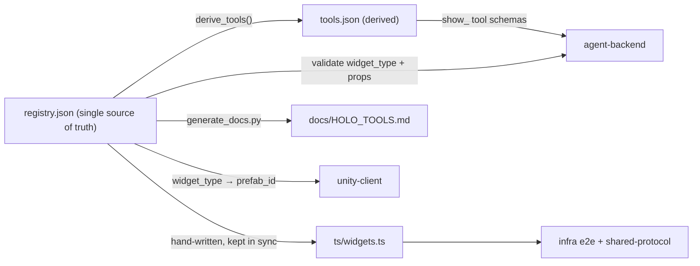

# Component deep-dive: `holo-tools`

> The **catalog of everything Jarvis can show** — the bridge between the AI agent
> and what the user sees. One source-of-truth registry defines all 42 holographic
> widgets, their `props` schemas, interactions, default placement, Unity prefab
> ids, and the agent-facing tool/function-calling schemas derived from them.

| | |
| --- | --- |
| **Path** | [`holo-tools/`](../../holo-tools/) |
| **Source of truth** | [`registry.json`](../../holo-tools/registry.json) (catalog **v1.1.0**, 42 widgets) |
| **Consumers** | [`agent-backend`](./agent-backend.md) (tools + validation), [`unity-client`](./unity-client.md) (`widget_type` → prefab), [`shared-protocol`](./shared-protocol.md)/[`infra`](./infra.md) (TS types + e2e) |
| **Python package** | `jarvis-holo-tools` (`import holo_tools`) |
| **Source README** | [`holo-tools/README.md`](../../holo-tools/README.md) · human catalog: [`docs/HOLO_TOOLS.md`](../HOLO_TOOLS.md) |

---

## Purpose & role

`holo-tools` is the single, language-neutral **contract for the widget layer**.
A `holo.spawn` is only meaningful if both ends agree on what `weather_orb` means,
which props it takes, how it can be touched, and which prefab renders it. This
package owns that agreement: [`registry.json`](../../holo-tools/registry.json) is
the authoritative catalog, and everything else —
[`tools.json`](../../holo-tools/tools.json), the TypeScript types, and the
human-readable [`docs/HOLO_TOOLS.md`](../HOLO_TOOLS.md) — is kept consistent with
it (and `tools.json` is literally **generated** from it).

Everything conforms to [`docs/PROTOCOL.md`](../PROTOCOL.md) §5.6 *The Holographic
Object* (and §8.5 for the perception widgets). The catalog is **v1.1.0** with
**42 widgets**: the 12 v1.0 widgets, 5 **perception** widgets that let Jarvis
annotate the real world, and 25 feature widgets.

## Where it fits



`holo-tools` is **data + validators**, not a network service — it doesn't speak
the protocol itself. It is *consumed* by the components that do: the backend
exposes its tools to the LLM and validates each `holo.spawn` against it before
sending; the client maps each `widget_type` to a prefab; the e2e harness checks
spawned objects against it.

## Directory & key files

| File | What it does |
| --- | --- |
| [`registry.json`](../../holo-tools/registry.json) | **The catalog.** `version`/`protocol_version` (`1.1.0`), `anchors`, `interactions`, `categories` (14), `error_codes`, and a `widgets` **list** (42 entries). |
| [`tools.json`](../../holo-tools/tools.json) | **Derived** agent tools: 42 `show_<widget>` spawn tools + 3 utility tools (`arrange_holograms`, `close_hologram`, `update_hologram`) = 45. |
| `holo_tools/__init__.py` | Parsed catalog + validators re-exported: `WIDGET_TYPES`, `WIDGETS_BY_TYPE`, `TOOLS_BY_NAME`, `validate_widget`, `validate_holo_object`, `derive_tools`, `VERSION`, `ANCHORS`, `INTERACTIONS`, `CATEGORIES`. |
| `holo_tools/loader.py` | `load_registry()` / `load_tools()` (cached, search upward), `registry_path()`, `widgets_by_type()`, `get_widgets()`. |
| `holo_tools/validate.py` | `validate_widget()` / `validate_holo_object()` via `jsonschema` Draft 2020-12; `UnknownWidgetError` / `InvalidPropsError` with `.to_error_payload()`. |
| `holo_tools/tools.py` | `derive_tools()` / `derive_widget_tool()` + `WIDGET_TOOL_NAMES` (the friendly tool name per widget) + the utility tools. |
| `ts/widgets.ts` | Hand-written TypeScript: per-widget props interfaces, the `WidgetType` union, `WidgetPropsMap`, and a discriminated `HoloObject` union. |
| `scripts/generate_docs.py` | Regenerates [`docs/HOLO_TOOLS.md`](../HOLO_TOOLS.md) from the registry. |
| `tests/` | pytest: every `props_schema` is valid Draft 2020-12, every `example_props` validates, good/bad props accepted/rejected, holo objects validate, every tool references a real `widget_type`. |
| `pyproject.toml` | Package `jarvis-holo-tools` (+ `jsonschema`); `[test]` extra adds pytest. |

### A widget entry (`registry.json`)

Each of the 42 entries follows this shape (PROTOCOL.md §5.6 conventions):

```jsonc
{
  "widget_type": "weather_orb",          // snake_case id used on the wire
  "title": "Weather Orb",
  "description": "...",
  "category": "information",
  "prefab_id": "Holo_WeatherOrb",         // Unity prefab to instantiate
  "interactions": ["tap", "grab", "resize", "dwell"],
  "default_transform": {                   // meters, quat [x,y,z,w], billboard
    "anchor": "head", "position": [0.45, 0.1, 0.9],
    "rotation": [0, 0, 0, 1], "scale": [1, 1, 1], "billboard": true
  },
  "events": [ { "name": "expand_forecast", "element": "orb", "action": "tap" } ],
  "props_schema": { /* JSON Schema draft 2020-12, additionalProperties:false */ },
  "example_props": { /* a valid props example */ }
}
```

## How it works

### One source, three artifacts

`registry.json` is authored by hand; the rest is kept in lock-step:

- **`tools.json`** is generated by `derive_tools(REGISTRY)` — for every widget it
  builds an OpenAI/Anthropic-style `{name, description, parameters}` tool whose
  `parameters` are the widget's `props_schema` properties plus optional placement
  overrides (`anchor`, `position`, `billboard`). Each tool carries `x_widget_type`
  / `x_prefab_id` / `x_action` extension keys (strip `x_*` before sending to an
  LLM if your provider rejects unknown fields). Three utility tools
  (`arrange_holograms` → `holo.layout`, `close_hologram` → `holo.destroy`,
  `update_hologram` → `holo.update`) round it out.
- **`ts/widgets.ts`** mirrors the catalog as type-safe interfaces for TS tooling.
- **`docs/HOLO_TOOLS.md`** is regenerated by `scripts/generate_docs.py`.

### Validation (`validate.py`)

Two functions, both backed by the `jsonschema` Draft 2020-12 validator, with
errors that map to wire-protocol codes (§5.13):

- **`validate_widget(widget_type, props)`** — strict: unknown `widget_type` raises
  `UnknownWidgetError` (code `unknown_widget`); props are validated against the
  catalog schema, which is **closed** (`additionalProperties: false`) so the agent
  can't hallucinate props — failures raise `InvalidPropsError` (code
  `invalid_props`).
- **`validate_holo_object(obj)`** — validates a full holographic object (§5.6):
  must be an object with a known `widget_type`; the envelope (transform /
  interactions / ttl) type-checks **leniently** (unknown keys ignored, honoring
  forward-compatibility); the requested `interactions` must be a **subset** of the
  widget's supported set; then the widget-specific props validate.

Both raise `HoloValidationError` subclasses with `.to_error_payload()`:

```python
import holo_tools as ht
try:
    ht.validate_widget(widget_type, props)
except ht.HoloValidationError as e:
    send(e.to_error_payload())   # {"code": "...", "message": "...", "fatal": False}
```

## Run & test

### Consume from Python ([`agent-backend`](./agent-backend.md), [`voice-service`](./voice-service.md))

```bash
cd holo-tools
python -m venv .venv && source .venv/bin/activate
pip install -e .            # installs jarvis-holo-tools + jsonschema
```

```python
import holo_tools as ht

ht.WIDGET_TYPES                              # ['weather_orb', 'timer', 'chart_3d', ...]
ht.WIDGETS_BY_TYPE["timer"]["prefab_id"]     # 'Holo_Timer'
ht.TOOLS_BY_NAME["show_weather"]             # OpenAI/Anthropic-style tool schema
ht.validate_widget("weather_orb", {"city": "Tokyo", "temp_c": 18, "condition": "clouds"})
```

### Consume from Unity ([`unity-client`](./unity-client.md), C#)

Treat `registry.json` as read-only data: ship a copy in `Resources/` (or fetch
it), build a `Dictionary<string, GameObject>` from `widget_type` → the prefab
named by `prefab_id`, apply the `transform` on `holo.spawn`, enable only the
listed `interactions`, and emit `client.interaction` using the `events[].element`
/ `action` identifiers.

### Consume from TypeScript ([`shared-protocol`](./shared-protocol.md), [`infra`](./infra.md))

```ts
import type { HoloObject, WeatherOrbProps, WidgetType } from "../holo-tools/ts/widgets";
import registry from "../holo-tools/registry.json";   // resolveJsonModule: true
```

### Regenerate derived artifacts (after editing the registry)

```bash
# tools.json
python -c "import json, holo_tools as ht; \
open('tools.json','w').write(json.dumps(ht.derive_tools(ht.REGISTRY), indent=2, ensure_ascii=False) + '\n')"
# docs/HOLO_TOOLS.md
python scripts/generate_docs.py
```

### Tests

```bash
cd holo-tools
pip install -e ".[test]"      # + jsonschema + pytest
pytest
```

**What green looks like:** every `props_schema` is a valid Draft 2020-12 schema,
every widget's `example_props` validates, good/bad props are accepted/rejected,
holo objects validate, and every tool in `tools.json` references a real
`widget_type`.

## Configuration

`holo-tools` has **no runtime configuration** — it is static data + pure
functions. The only "config" is which catalog file consumers point at:

- The backend resolves the registry via `JARVIS_HOLO_REGISTRY` (default
  `../holo-tools/registry.json`), merging in built-in fallbacks for any widget the
  registry hasn't published yet (see [`agent-backend`](./agent-backend.md)).
- The loaders search **upward** from the package for `registry.json` / `tools.json`,
  so they work from an editable install or directly from the source tree.

## Extension points

Adding a widget is the canonical extension; it touches every consumer, which is
exactly why the contract lives here. The full walkthrough is
[Add a holographic widget](../guides/add-a-widget.md); in short:

1. Add an entry to `registry.json` (with `props_schema` + `example_props`).
2. Regenerate `tools.json` (`derive_tools`) and the docs (`generate_docs.py`).
3. Add the TypeScript types in `ts/widgets.ts`.
4. Build the Unity prefab named by `prefab_id` (or rely on a procedural renderer
   in [`unity-client`](./unity-client.md)).
5. Run `pytest`.

The backend automatically gets a `show_<widget>` tool for the new widget (no code
change), and the `WIDGET_TOOL_NAMES` map in `tools.py` lets you give it a friendly
name (e.g. `weather_orb` → `show_weather`).

## Notes & caveats

- **`registry.json` is the single source of truth.** `tools.json`,
  `ts/widgets.ts`, and `docs/HOLO_TOOLS.md` are derived/synced — edit the registry,
  then regenerate. The tests guard against drift between tools and widgets.
- **C# bindings aren't compiled here.** The catalog is exposed to Unity as
  read-only JSON; there's no C# package in this folder. The
  [`unity-client`](./unity-client.md) also ships a built-in `WidgetCatalog` so it
  renders the known types procedurally even before a prefab registry is wired in.
- **Backend fallback can diverge.** When the canonical registry is absent the
  [`agent-backend`](./agent-backend.md) uses a lighter built-in fallback catalog;
  published widgets always win, but the fallback's prop schemas are intentionally
  looser. Run the [`infra/` harness](./infra.md) with `E2E_STRICT_PROPS=1` to catch
  prop drift.
- **Props validation is strict; the holo-object envelope is lenient** — by design,
  to honor the protocol's forward-compatibility rule (unknown envelope keys are
  ignored) while still preventing hallucinated props.

---

### See also

- [Widget catalog (human-readable)](../HOLO_TOOLS.md) · [Protocol reference](../PROTOCOL.md) · [Architecture](../../ARCHITECTURE.md)
- Concepts: [Holograms & interaction](../concepts/holograms.md)
- Siblings: [`unity-client`](./unity-client.md) · [`agent-backend`](./agent-backend.md) · [`voice-service`](./voice-service.md) · [`shared-protocol`](./shared-protocol.md) · [`infra`](./infra.md)
- Repo: [`holo-tools/`](../../holo-tools/) · issues at `https://github.com/sumitaich1998/jarvisvr/issues`
