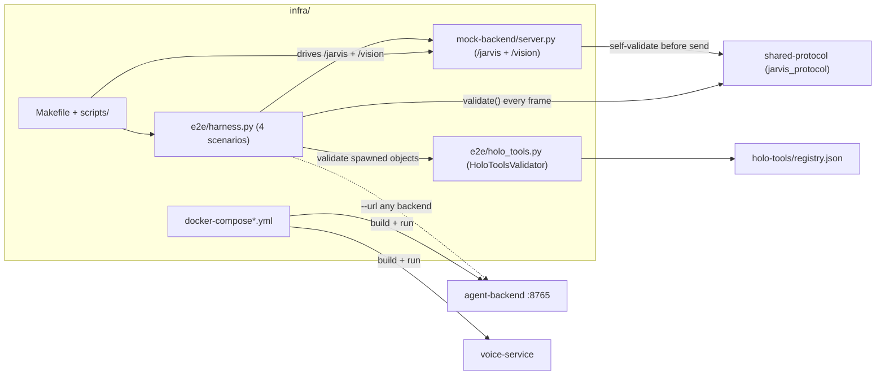

# Component deep-dive: `infra`

> **Glue & conformance.** Docker Compose for the backend + voice services, dev
> scripts, a self-contained **mock brain**, and an **end-to-end protocol
> conformance harness** that drives a scripted multimodal conversation and
> validates every frame against the shared schemas. The mock + harness run with
> **no Docker** (pure Python venv).

| | |
| --- | --- |
| **Path** | [`infra/`](../../infra/) |
| **Entry point** | [`infra/Makefile`](../../infra/Makefile) (`make install / up / down / mock / e2e / test / lint / fmt / config`) |
| **Covers** | PROTOCOL **v1.1** (incl. §8 perception, §5.14 barge-in, §5.15 settings) |
| **Depends on** | Docker (optional) · Python 3.9+ · Node 18+ (optional, TS tests) · the [`shared-protocol`](./shared-protocol.md) Python binding |
| **Source README** | [`infra/README.md`](../../infra/README.md) |

---

## Purpose & role

`infra` is the **integration layer** that makes six independently-built
components behave like one product. It provides three things:

1. **A way to run the stack** — `docker compose` for the real
   [`agent-backend`](./agent-backend.md) + [`voice-service`](./voice-service.md),
   with overrides for a mock brain and for GPU.
2. **A self-contained mock brain** — a dependency-light WebSocket server that
   implements [`docs/PROTOCOL.md`](../PROTOCOL.md) on `/jarvis` + `/vision`, so
   the [`unity-client`](./unity-client.md) and `voice-service` can be developed
   and tested **without** the real backend.
3. **A conformance harness** — a scripted mock client that drives multi-turn
   conversations (v1 + v1.1 multimodal + barge-in + settings) and asserts that
   **every received frame** validates against the
   [`shared-protocol`](./shared-protocol.md) JSON Schemas, and that spawned objects
   validate against [`holo-tools/registry.json`](../../holo-tools/registry.json).

Crucially, the mock brain and the harness run **without Docker** (a pure Python
venv), so you can validate protocol conformance even when the sibling images
aren't built yet — the whole point of building protocol-first, in parallel.

## Where it fits



The harness can target the local mock **or any backend** (`--url` /
`JARVIS_BACKEND_URL`), so the same conformance run validates the real
`agent-backend` too.

## Directory & key files

| Path | What it does |
| --- | --- |
| [`Makefile`](../../infra/Makefile) | Common dev tasks (see [Make targets](#make-targets)); `make help` lists them. |
| [`docker-compose.yml`](../../infra/docker-compose.yml) | Base stack: `agent-backend` (`8765:8765`, healthcheck) + `voice-service` (internal, dials `ws://agent-backend:8765/jarvis`). |
| `docker-compose.mock.yml` | Override: swap `agent-backend` for the mock brain (no sibling images needed). |
| `docker-compose.gpu.yml` | Override: NVIDIA GPU reservation for `voice-service`. |
| `.env.example` | Copy to `.env` (git-ignored); Compose passes it via `env_file`. |
| `mock-backend/server.py` | The **mock brain** — implements PROTOCOL.md on `/jarvis` + `/vision`; self-validates every frame with `jarvis_protocol` before sending. |
| `e2e/harness.py` | The **conformance harness**: 4 scripted scenarios; validates every frame; non-zero exit on any violation. |
| `e2e/holo_tools.py` | `HoloToolsValidator` — validates spawned objects against `holo-tools/registry.json` (membership + props). |
| `e2e/conftest.py` · `e2e/test_conformance.py` | pytest wrapper: boots the mock on a free port, runs the scenarios, asserts zero violations. |
| `scripts/` | `install.sh`, `dev_up.sh`, `dev_down.sh`, `mock.sh`, `e2e.sh`, `test.sh`, `lint.sh`, `fmt.sh`, `_lib.sh` (venv/port helpers). |

## How it works

### The mock brain (`mock-backend/server.py`)

A dependency-light WebSocket server that implements the protocol on `/jarvis` and
serves the `/vision` binary endpoint on the **same port 8765**. It **reuses the
`jarvis_protocol` binding** to build and **self-validate every frame before
sending**, so it can never emit a non-conformant message. It reads
`holo-tools/registry.json` when available (to pick known `widget_type`s, e.g.
`weather_orb`/`timer`/`panel`/`vision_annotation`) and otherwise falls back to
built-ins. It implements:

- **`client.hello` → `server.hello_ack`** (assigns a session), heartbeat echo,
  and a tiny intent parser for weather/timer/panel turns.
- **A multimodal vision turn** when the user asks *"what is this?"* (or sends a
  turn with `attach_perception:true` and a buffered frame):
  `perception.request{vision,start}` → `agent.thinking{perceiving}` →
  `agent.observation` → `holo.spawn vision_annotation` (world-anchored, billboard)
  → `agent.speech` → `agent.thinking{done}` → `perception.request{vision,stop}`.
- **`/vision`** ingest of §8.2 length-prefixed binary frames (validating each JSON
  header as a `perception.vision_frame`), plus inline `perception.*` buffered in a
  rolling per-connection buffer.
- **§5.15 settings** — `client.settings_get` / `client.settings_update` against a
  small in-memory provider catalog (the API key is **never** stored or echoed,
  only `key_set` flips true).
- Unknown types are ignored (forward-compatible).

### The conformance harness (`e2e/harness.py`)

A mock WS client that connects (to the mock by default; `--url` for any backend)
and runs **four scenarios**, calling `jarvis_protocol.validate(...)` on every
received frame and `HoloToolsValidator` on every `holo.spawn`:

1. **v1 scripted conversation** — hello → heartbeat → "weather in tokyo"
   (`agent.thinking*` + `agent.speech` + `holo.spawn weather_orb` → `client.ack`)
   → "start a 5 minute timer" (→ `holo.spawn timer`) → tap the timer
   (`client.interaction`) → `holo.update` → `client.bye`.
2. **v1.1 multimodal turn** — opens `/vision` and sends one §8.2 length-prefixed
   binary frame; then hello (with `camera_passthrough`) → streams
   `perception.vision_frame` (inline) + `perception.scene_objects` → "what is this
   on my desk?" (`attach_perception:true`) → asserts
   `perception.request{start}` → `agent.thinking{perceiving}` →
   `agent.observation` → `holo.spawn vision_annotation` → `agent.speech` →
   `perception.request{stop}`.
3. **v1.1 barge-in (§5.14)** — start a turn, immediately `client.barge_in`; assert
   the connection stays healthy (a heartbeat still round-trips) and **no
   `server.error`** is produced.
4. **v1.1 settings (§5.15)** — `settings_get` returns a conformant catalog;
   `settings_update{provider, model, api_key}` flips `key_set:true` — and asserts
   the **api key never appears** in any received frame.

For `holo.spawn`, `widget_type` membership is a hard check **except** for
in-flight v1.1 perception widgets (`vision_annotation`, `bounding_box_3d`,
`live_caption`, `vision_feed`, `scene_label`) — a missing one is a logged **note**,
not a failure (structural validation still applies). Props-schema mismatches are
warnings by default, or hard failures with `E2E_STRICT_PROPS=1`.

### The scripts

`scripts/e2e.sh` creates `infra/.venv`, starts the mock on a free port (or uses
`JARVIS_BACKEND_URL`), waits for it, and runs the harness; `_lib.sh` provides
`ensure_venv` / `free_port` / `wait_for_port`. `install.sh` installs the
[`agent-backend`](./agent-backend.md) and runs the LLM key wizard. The scripts
export `JARVIS_PROTOCOL_SCHEMA_DIR` so the bindings find
[`shared-protocol/schema`](../../shared-protocol/schema/) automatically.

## Run & test

### A) Local mock + conformance (no Docker, fastest)

```bash
cd infra
make e2e          # creates infra/.venv, starts the mock locally, runs the harness
```

**What green looks like:** each scenario prints `RESULT: PASS ✅` and the run ends
with `OVERALL: PASS ✅` (the harness exits non-zero on any violation). Run the
pytest wrapper with `pytest e2e/` (boots the mock on a free port automatically).

### B) Mock brain in Docker

```bash
make mock          # docker compose -f docker-compose.yml -f docker-compose.mock.yml up --build agent-backend
# in another shell:
JARVIS_BACKEND_URL=ws://127.0.0.1:8765/jarvis make e2e
```

### C) The real stack

```bash
make up            # docker compose up --build -d  (needs ../agent-backend, ../voice-service images)
make down
```

### D) Install the brain + key wizard

```bash
make install       # venv + install agent-backend + run the LLM key wizard (pick "mock" for offline)
```

### Other useful runs

```bash
make test          # shared-protocol Python + TypeScript suites
make config        # validate the compose files (syntax)
make lint          # ruff/byte-compile + tsc --noEmit (best-effort)
E2E_STRICT_PROPS=1 make e2e   # treat holo-tools props mismatches as failures
```

## Configuration

### Ports & endpoints

| Service | Port (host:container) | Endpoint |
| --- | --- | --- |
| `agent-backend` | `8765:8765` | `ws://localhost:8765/jarvis` **+** `ws://localhost:8765/vision` (v1.1, same port) |
| `voice-service` | internal only | dials `ws://agent-backend:8765/jarvis` |

The v1.1 `/vision` binary transport is a **path on the same `8765` port**, so the
existing mapping already exposes it — no compose change required.

### Environment

Copy `.env.example` → `.env` (the scripts do this automatically; `.env` is
git-ignored). Key vars: `JARVIS_HOST`, `JARVIS_PORT`, `JARVIS_WS_PATH`,
`LLM_PROVIDER` (`mock`/`openai`/`anthropic`), `OPENAI_API_KEY`,
`ANTHROPIC_API_KEY`, `JARVIS_BACKEND_URL`, `WAKE_WORD`, `STT_ENGINE`,
`TTS_ENGINE`. Harness knobs: `JARVIS_BACKEND_URL` (target any backend),
`E2E_STRICT_PROPS=1` (fail on prop drift), `E2E_RECV_TIMEOUT`,
`JARVIS_PROTOCOL_SCHEMA_DIR` (schema location).

### Make targets

| Target | Description |
| --- | --- |
| `make up` / `make down` | Start / stop the real stack |
| `make mock` | Start the mock brain in Docker |
| `make e2e` | Start the mock locally and run the conformance harness |
| `make install` | Install the agent-backend + run the LLM key wizard |
| `make test` | Run the shared-protocol test suites (Python + TypeScript) |
| `make lint` / `make fmt` | Lint/typecheck / autoformat (best-effort) |
| `make config` | Validate the compose files |
| `make clean` | Remove `.venv` and TS build artifacts |

### GPU (optional)

```bash
docker compose -f docker-compose.yml -f docker-compose.gpu.yml up --build
```

(requires the NVIDIA Container Toolkit; or uncomment the `deploy:` block in
`docker-compose.yml`).

## Extension points

- **Add a conformance scenario** — write a new `run_*_conformance(url, …)` in
  `e2e/harness.py` returning a `Report`, and assert it in `main()` /
  `test_conformance.py`. Use `jp.iter_errors()` so the client stays conformant too.
- **Teach the mock a new turn** — extend `handle_turn` in `mock-backend/server.py`;
  build frames with `jarvis_protocol` so they're self-validated before send.
- **Point the harness at the real backend** — `JARVIS_BACKEND_URL=ws://host:8765/jarvis make e2e`
  validates a live [`agent-backend`](./agent-backend.md) against the same schemas.
- **Production deploy** — TLS/`wss://`, auth, and hardening live in
  [Deploy JarvisVR](../guides/deploy.md); the full test matrix is in
  [Testing](../guides/testing.md).

## Notes & caveats

- **The mock brain and harness need no Docker** — the local path
  (`make e2e`, `make test`) runs in a pure Python venv, so protocol conformance is
  verifiable even if the sibling Dockerfiles aren't built yet.
- **Sibling images may not exist.** The compose build contexts point at
  `../agent-backend` and `../voice-service`, owned by other teams; `make config`
  validates compose syntax without building, and `make mock` gives a
  self-contained brain meanwhile. `voice-service` uses
  `depends_on: condition: service_started` (not `service_healthy`) so it still
  comes up if the sibling image lacks the TCP healthcheck.
- **In-flight perception widgets are notes, not failures.** If
  [`holo-tools/registry.json`](../../holo-tools/registry.json) hasn't published a
  v1.1 perception widget yet, the harness logs a note (structural validation still
  applies) rather than failing — so doc/registry work can land independently.
- **Prop drift is a warning by default.** The mock's emitted props are aligned to
  the registry (`weather_orb`/`timer`/`panel`); if those schemas change, run
  `E2E_STRICT_PROPS=1 make e2e` to catch drift and update the mock.
- **The mock is not a reasoner.** It's a deterministic protocol stand-in (a tiny
  intent parser), not the [`agent-backend`](./agent-backend.md) — use it for
  protocol/UI development, not to evaluate agent behavior.

---

### See also

- [Testing guide](../guides/testing.md) · [Deploy guide](../guides/deploy.md) · [Troubleshooting](../guides/troubleshooting.md)
- [Protocol reference](../PROTOCOL.md) · [Architecture](../../ARCHITECTURE.md)
- Siblings: [`unity-client`](./unity-client.md) · [`agent-backend`](./agent-backend.md) · [`voice-service`](./voice-service.md) · [`holo-tools`](./holo-tools.md) · [`shared-protocol`](./shared-protocol.md)
- Repo: [`infra/`](../../infra/) · issues at `https://github.com/sumitaich1998/jarvisvr/issues`
