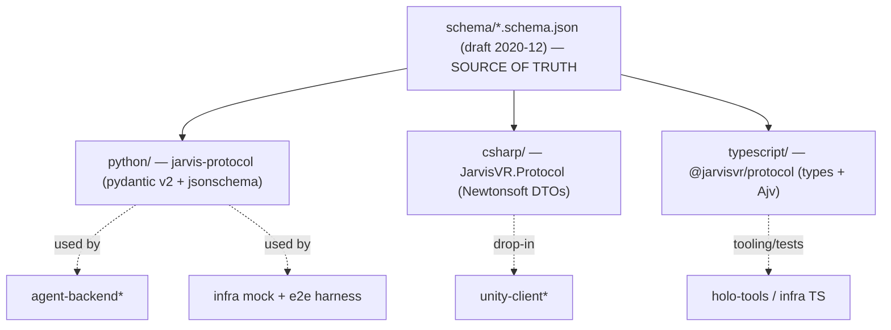

# Component deep-dive: `shared-protocol`

> **One contract, three languages.** Canonical bindings for the JarvisVR wire
> protocol (v1.1): a single set of JSON Schemas is the source of truth, with thin,
> hand-written **Python / C# / TypeScript** mirrors and validators that load those
> exact schemas. Every component validates against the *same* files.

| | |
| --- | --- |
| **Path** | [`shared-protocol/`](../../shared-protocol/) |
| **Source of truth** | [`schema/`](../../shared-protocol/schema/) — JSON Schema (draft 2020-12) |
| **Protocol version** | `1.1.0` (accepts `1.0.0` too) — pinned in `schema/version.json` |
| **Packages** | `jarvis-protocol` (Python) · `JarvisVR.Protocol` (C#) · `@jarvisvr/protocol` (TS) |
| **Source README** | [`shared-protocol/README.md`](../../shared-protocol/README.md) · spec: [`docs/PROTOCOL.md`](../PROTOCOL.md) |

---

## Purpose & role

`shared-protocol` turns the prose spec in [`docs/PROTOCOL.md`](../PROTOCOL.md)
into **executable schemas + typed bindings** so every component agrees on the
wire byte-for-byte. The JSON Schemas in [`schema/`](../../shared-protocol/schema/)
are the single source of truth; the three language bindings are deliberately
**thin**: hand-written DTOs/models for ergonomics, plus a validator that runs the
*actual* schema files (not a re-implementation). That means a message is
conformant in Python iff it's conformant in TypeScript iff it's conformant in C#.

It is **schemas-first** because all four protocol participants
([`unity-client`](./unity-client.md), [`agent-backend`](./agent-backend.md),
[`voice-service`](./voice-service.md), and the [`infra` e2e harness](./infra.md))
must independently produce and accept the exact same frames. v1.1 adds Multimodal
Perception additively: the wire `v` accepts both `"1.1.0"` and `"1.0.0"`, so v1.0
clients keep working.

## Where it fits



> *Today the [`agent-backend`](./agent-backend.md) and
> [`voice-service`](./voice-service.md) ship their **own** self-contained
> `protocol.py`, and [`unity-client`](./unity-client.md) ships its own C# in
> `Protocol/`, so none of them are blocked while this package matures. The wire
> shapes are identical and meant to be reconciled onto these canonical bindings.
> The component that exercises `shared-protocol` end-to-end **today** is
> [`infra`](./infra.md): the mock brain and the e2e harness import the Python
> `jarvis_protocol` binding and `validate()` every frame.*

## Directory & key files

| Path | What it does |
| --- | --- |
| [`schema/`](../../shared-protocol/schema/) | **The source of truth.** `version.json`, `envelope.schema.json` (strict, `additionalProperties:false`), `common.schema.json` (`$defs`: vec3, quat, bbox, anchor, interaction, pose, camera, transform, …), `holo_object.schema.json`, and one file per message `type`. |
| `python/src/jarvis_protocol/` | `models.py` (pydantic v2 payloads + `Envelope`), `codec.py` (`new_message`/`encode`/`decode`/`validate`), `schemas.py` (locate + load schemas), `catalog.py` (`MessageType`, `TYPE_TO_SCHEMA`), `version.py`. |
| `csharp/JarvisVR.Protocol/` | `Envelope.cs`, `Payloads.cs`, `Protocol.cs` (version + message-type constants), `JarvisProtocol.cs` (`NewMessage`/`Encode`/`Decode`/`PayloadAs`) — Unity drop-in (needs Newtonsoft.Json). |
| `typescript/` | `src/` (`types.ts`, `codec.ts`, `schemas.ts`, `catalog.ts`, `version.ts`, `index.ts`) + `test/` (vitest) + `package.json`/`tsconfig.json`. |
| `python/tests/` · `typescript/test/` | Round-trip, schema, the §7 reference example, perception (§8.6), and settings (§5.15) suites. |

### Schema coverage

`envelope` · `common` · `holo_object` · `client.hello` · `server.hello_ack` ·
`user.text` / `user.voice_transcript` / `user.voice_partial` · `agent.thinking` ·
`agent.speech` · `agent.transcript` · `holo.spawn` / `holo.update` /
`holo.destroy` / `holo.layout` · `client.interaction` · `client.scene` ·
`client.ack` · `client.bye` · `client.barge_in` · `heartbeat` · `error` (shared
by `server.error` + `client.error`) · `client.settings_get` /
`client.settings_update` / `server.settings`.

**v1.1 perception:** `perception.vision_frame` · `perception.audio_event` ·
`perception.audio_scene` · `perception.gaze` · `perception.scene_objects` ·
`perception.state` · `perception.request` · `agent.observation`.

## How it works

### Schemas first, two-step validation

Each binding (1) locates `schema/` via `JARVIS_PROTOCOL_SCHEMA_DIR` or an upward
search, (2) registers every schema by its `$id` so cross-file `$ref`s resolve
(`common.schema.json#/$defs/transform`, `holo.spawn` → `holo_object`, …), and (3)
validates a message in **two steps**: the **envelope**
(`schema/envelope.schema.json`, strict — `additionalProperties:false`) then the
**payload** against the schema for that `type`.

Validation semantics are **identical across all three languages**:

| Rule | Behavior |
| --- | --- |
| Envelope | Exactly `v,id,type,ts,payload` (+ optional `session`, `reply_to`). `v` is `enum ["1.0.0","1.1.0"]`. |
| `id` / `session` / `object_id` | Any non-empty string — UUID format is **not** enforced (the §7 example uses `"a1"`, `"S"`, `"O1"`). |
| Payload fields | Required/typed fields enforced; **extra keys allowed** (receivers ignore unknown payload keys, §2). |
| Unknown `type` | Tolerated by default (forward-compatible); pass `allow_unknown_types=False` / `{ allowUnknownTypes: false }` to flag them. |
| Decode | Lenient (drops unknown envelope keys); use `validate()` for the strict gate. |

### `v` accepts both versions (v1.1 is additive)

The `version.json` pins `protocol_version = "1.1.0"` and
`supported_versions = ["1.0.0", "1.1.0"]`; the envelope schema's `v` is the same
enum. v1.1 adds the perception capabilities to `client.hello`, the `perceiving` /
`looking` stages to `agent.thinking`, optional `attach_perception` on user input,
the new perception messages/enums, and the `/vision` binary transport — all
without breaking v1.0.

## Run & test

### Python — `jarvis-protocol`

```bash
pip install -e shared-protocol/python[dev]   # editable; finds ../schema automatically
pytest shared-protocol/python                # round-trip + schema + §7 reference + perception + settings
```

```python
from jarvis_protocol import new_message, encode, decode, validate, parse_payload, MessageType, AgentSpeech

msg  = new_message(MessageType.AGENT_SPEECH, AgentSpeech(text="Here's Tokyo.", final=True), session="S")
wire = encode(msg)        # compact JSON; None fields omitted
validate(wire)            # raises ProtocolValidationError(.errors=[...]) if non-conformant
env  = decode(wire)       # -> Envelope
speech = parse_payload(env.type, env.payload)   # -> AgentSpeech
```

v1.1 perception models are first-class (`VisionFrame`, `Pose`, `AgentObservation`,
`Annotation`, `PerceptionRequest`, …) and the §8.6 multimodal turn is validated
end-to-end in `tests/test_perception.py`.

### C# — `JarvisVR.Protocol` (Unity)

Drop `csharp/JarvisVR.Protocol/` into a Unity project that has Newtonsoft.Json
(`com.unity.nuget.newtonsoft-json`). No build step here — the DTOs mirror the
Python models.

```csharp
using JarvisVR.Protocol;

var spawn = new HoloObject {
    ObjectId = "O1", WidgetType = "weather_orb",
    Transform = new Transform { Anchor = Anchors.Head,
        Position = new[]{0.3f,0f,0.8f}, Rotation = new[]{0f,0f,0f,1f}, Scale = new[]{1f,1f,1f}, Billboard = true },
    Interactable = true, Interactions = new[]{ Interactions.Grab, Interactions.Tap },
};
Envelope msg = JarvisProtocol.NewMessage(MessageTypes.HoloSpawn, spawn, session: "S");
string wire  = JarvisProtocol.Encode(msg);   // System.Guid id + epoch-ms ts
HoloObject p = JarvisProtocol.Decode(wire).PayloadAs<HoloObject>();
```

`JarvisProtocol.Settings` omits nulls and ignores unknown members
(forward-compatible).

### TypeScript — `@jarvisvr/protocol`

```bash
cd shared-protocol/typescript && npm install
npm test         # vitest: round-trip + §7 reference + perception + settings
npm run build    # tsc -> dist/
```

```ts
import { newMessage, encode, decode, validate, MessageType, type AgentSpeech } from "@jarvisvr/protocol";

const msg  = newMessage<AgentSpeech>(MessageType.AGENT_SPEECH, { text: "Here's Tokyo.", final: true }, "S");
validate(encode(msg));   // throws ProtocolValidationError(.errors) if non-conformant
const env  = decode<AgentSpeech>(encode(msg));
```

The TS validator is **Ajv** running the JSON Schemas directly (chosen over zod so
the schemas stay the single source of truth); Node reads them from `../schema` (or
`JARVIS_PROTOCOL_SCHEMA_DIR`).

**What green looks like:** `pytest shared-protocol/python` and
`npm test` both pass — including the §7 reference turn and the §8.6 multimodal
turn validating end-to-end against the shared schemas. The
[`infra` harness](./infra.md) reuses the Python binding to validate **every** frame
of a live conversation against the mock backend.

## Configuration

The only configuration is **where the schemas live**:

| Variable | Effect |
| --- | --- |
| `JARVIS_PROTOCOL_SCHEMA_DIR` | Absolute path to `shared-protocol/schema`. If unset, each binding searches upward from its package. The [`infra` scripts](./infra.md) export this for you. |

Version constants to bump in lock-step when the schemas change:
`schema/version.json`, `jarvis_protocol.PROTOCOL_VERSION` / `SUPPORTED_VERSIONS`,
`JarvisVR.Protocol.Protocol.Version` / `SupportedVersions`, and the TS
`PROTOCOL_VERSION` / `SUPPORTED_VERSIONS`.

## Extension points

Adding/changing a message is a **schema-first** change:

1. Add or edit the `schema/<type>.schema.json` (and any `$defs` in
   `common.schema.json`); update `schema/version.json` if the wire changes.
2. Mirror it in each binding: a pydantic model + `TYPE_TO_SCHEMA`/`MessageType`
   entry (Python), a DTO + `MessageTypes` constant (C#), an interface + `MessageType`
   (TS).
3. Update [`docs/PROTOCOL.md`](../PROTOCOL.md) in the same change and bump
   `PROTOCOL_VERSION` everywhere.
4. Run the Python + TS suites (and the [`infra` e2e](./infra.md)).

The `/vision` §8.2 binary framing (`[4B BE len][JSON header][image bytes]`) is
handled by the *transports* (see [`infra/mock-backend`](./infra.md)); the bindings
validate the header object as a `perception.vision_frame` payload like any other.

## Notes & caveats

- **Not yet wired into every component.** The runtime components currently use
  their own self-contained protocol implementations (backend/voice `protocol.py`,
  unity `Protocol/`) to avoid cross-team blocking. This package is the canonical
  target; reconciliation is intentional future work. The component that depends on
  it **today** is [`infra`](./infra.md) (mock + e2e via the Python binding).
- **C# is not compiled in this repo.** `JarvisVR.Protocol` is a Unity *drop-in*
  source folder (it needs Newtonsoft.Json from a Unity project); there is no
  standalone C# build/test step here. Python and TypeScript **are** tested.
- **UUIDs aren't enforced.** Per the spec, `id`/`session`/`object_id` are any
  non-empty string; helpers mint UUIDs but validators accept short ids (matching
  the §7 reference example).
- **Forward-compatible by default.** Unknown message types and extra payload keys
  pass validation unless you opt into strict mode — mirroring how receivers behave
  on the wire.

---

### See also

- [Protocol reference](../PROTOCOL.md) · [Message index](../reference/message-index.md) · [Architecture](../../ARCHITECTURE.md)
- Concepts: [Overview](../concepts/overview.md) · [Perception](../concepts/perception.md)
- Siblings: [`unity-client`](./unity-client.md) · [`agent-backend`](./agent-backend.md) · [`voice-service`](./voice-service.md) · [`holo-tools`](./holo-tools.md) · [`infra`](./infra.md)
- Repo: [`shared-protocol/`](../../shared-protocol/) · issues at `https://github.com/sumitaich1998/jarvisvr/issues`
