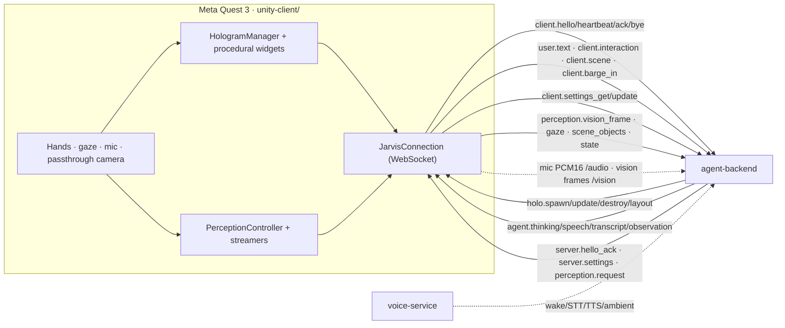

# Component deep-dive: `unity-client`

> The Quest 3 **mixed-reality shell** — Jarvis's body. It renders the holograms
> the agent summons into your room, routes your hands/gaze/voice/camera back to
> the brain, and is the on-device half of the [v1.1 wire protocol](../PROTOCOL.md).

| | |
| --- | --- |
| **Path** | [`unity-client/`](../../unity-client/) |
| **Language / runtime** | C# · Unity **2022.3 LTS** (built with 2022.3.40f1) · Meta XR SDK / OpenXR |
| **Talks to** | `agent-backend` over WebSocket (`ws://<host>:8765/jarvis` + `/audio` + `/vision`) |
| **Role in the system** | The "shell" (rendering + input) in the shell ↔ brain split |
| **Source READMEs** | [`unity-client/README.md`](../../unity-client/README.md) · [`Assets/JarvisVR/README.md`](../../unity-client/Assets/JarvisVR/README.md) (code architecture) · [`Assets/JarvisVR/SETUP.md`](../../unity-client/Assets/JarvisVR/SETUP.md) (scene recipe) |

---

## Purpose & role

The `unity-client` is the headset application a user actually wears. It is built
to be **dumb about reasoning and smart about presence**: it owns nothing about
*what* to say or show — that's the [`agent-backend`](./agent-backend.md) — and
instead owns *how* the room looks and feels. It opens one WebSocket session per
headset, performs the `client.hello` / `server.hello_ack` handshake, and then
spends its life turning `holo.*` render commands into grabbable 3D widgets and
turning hand/gaze/voice interactions back into `client.*` and `perception.*`
messages.

Because the shell and the brain are decoupled across a single versioned
protocol, this client is fully replaceable — but it is also a **complete,
buildable Unity project** (not a stub). It compiles **with or without** the Meta
XR SDK installed, renders every widget **procedurally** so it works with zero
art, and can be exercised on the desktop with a mouse against the
[`infra/` mock backend](./infra.md). It implements **§8 Multimodal Perception**
in full: streaming the color passthrough camera, ambient room audio, and gaze —
all pull-based and privacy-gated.

## Where it fits



**Sends** (client → server): `client.hello`, `client.heartbeat`, `client.bye`,
`client.ack`, `client.error`, `user.text`, `client.interaction`, `client.scene`,
`client.barge_in`, `client.settings_get`, `client.settings_update`,
`perception.vision_frame`, `perception.gaze`, `perception.scene_objects`
(optional), `perception.state`.

**Receives** (server → client): `server.hello_ack`, `server.heartbeat`,
`agent.thinking`, `agent.speech`, `agent.transcript`, `agent.observation`,
`holo.spawn`, `holo.update`, `holo.destroy`, `holo.layout`, `server.error`,
`server.settings`, `perception.request`. Unknown `type`s are ignored
(forward-compatible).

> The directed **wake-word → STT → TTS** path is owned by
> [`voice-service`](./voice-service.md), which connects to the same backend as a
> separate protocol client. The Unity client streams raw mic audio on the
> optional `/audio` channel and plays TTS, and can also send typed `user.text`
> from its spatial menu.

## Directory & key files

The project is organized into focused folders that map onto the protocol. Each is
a Unity assembly (`.asmdef`); see [`Assets/JarvisVR/README.md`](../../unity-client/Assets/JarvisVR/README.md).

| Folder / file | What it does |
| --- | --- |
| [`Packages/manifest.json`](../../unity-client/Packages/manifest.json) | UPM dependencies: `com.meta.xr.sdk.all` (74.0.0), OpenXR, XR Management, Input System, TextMeshPro, Newtonsoft JSON, **NativeWebSocket** (git UPM). |
| `Assets/JarvisVR/Protocol/` | Engine-free wire types. `Envelope` (`{v,id,type,ts,session,reply_to,payload}`), `EnvelopeSerializer`, `MessageRouter`, `ProtocolConstants` (port/path/`/audio`/`/vision`, heartbeat), `MessageTypes`/`Anchors`/`Arrangements`/`InteractionActions`/`WidgetTypes`/`ErrorCodes`, `HologramObject`/`HoloTransform`, `Payloads.cs`, `SettingsPayloads.cs`, `PerceptionPayloads.cs`. |
| `Assets/JarvisVR/Net/JarvisConfig.cs` | `ScriptableObject` with all connection + capability + perception settings (see [Configuration](#configuration)). |
| `Assets/JarvisVR/Net/JarvisConnection.cs` | The §3 lifecycle: connect → hello → store session → 5 s heartbeat → reconnect (backoff). Drains NativeWebSocket on the main thread; exposes `Send/Ack/SendText/SendError`, `Router`, and `OnReady`/`OnStateChanged` events. |
| `Assets/JarvisVR/Holograms/HologramManager.cs` | Subscribes to `holo.*`; instantiates a prefab (`WidgetRegistry`) or procedural widget (`WidgetCatalog`); applies transform/anchor/billboard; ACKs spawns; fades on destroy; expires on `ttl_ms`. |
| `Assets/JarvisVR/Holograms/AnchorService.cs` | Resolves `world\|head\|hand_left\|hand_right\|surface` → a Unity `Transform` parent. |
| `Assets/JarvisVR/Holograms/HoloWidget.cs` | Abstract base: `Build()` once + `ApplyProps()`/`PatchProps()` for `holo.update`; tolerant prop readers + TMP helpers. |
| `Assets/JarvisVR/Holograms/Widgets/` | **33 procedural widget renderers** (no art needed). E.g. `WeatherOrbWidget`, `TimerWidget`, `PanelWidget`, `Chart3DWidget`, `VisionAnnotationWidget`, `LiveCaptionWidget`, `SettingsPanelWidget`, … |
| `Assets/JarvisVR/Holograms/{WidgetRegistry,WidgetCatalog,LayoutArranger,Billboard,LazyFollow,HoloMaterials,HologramPersistence}.cs` | Prefab overrides, built-in catalog, `arc/grid/stack/free` layout, facing/follow behaviors, pipeline-agnostic materials, cross-session layout persistence. |
| `Assets/JarvisVR/Interaction/` | `HoloInteractable` (input-agnostic Tap/Grab/Drag/Slider/Toggle/Resize/Dwell), `InteractionRelay` (→ `client.interaction`), `GazeSelector`, `MouseInteractionTester` (desktop). |
| `Assets/JarvisVR/Shell/` | `JarvisApp` (bootstrap), `JarvisPresence` (orb + captions), `SceneReporter` (→ `client.scene`), `SpatialMenu`, `WristMenu` (privacy + ⚙ Settings), `SettingsController` (§5.15), `VrKeyboard`. |
| `Assets/JarvisVR/Audio/` | `AudioChannel` (`/audio` PCM16), `MicStreamer`, `SpeechPlayer` (TTS playback + Android on-device TTS for narration). |
| `Assets/JarvisVR/Perception/` | `PassthroughCameraProvider`, `VisionStreamer` + `VisionChannel` (`/vision`), `AmbientAudioStreamer`, `GazeProvider`, `PerceptionController` (handles `perception.request`, emits `perception.state`, draws the capture indicator, thermal/fps guard). |
| `Assets/JarvisVR/Meta/` | Optional Meta-SDK integration, each gated by a `defineConstraints` so the project compiles without the SDK (see [Notes & caveats](#notes--caveats)). |
| `Assets/JarvisVR/Util/` | `ProtocolMath` (`float[]` ↔ `Vector3`/`Quaternion`), `ColorUtil`. |

## How it works

### Bootstrap — one component wires the app

`JarvisApp` (`Shell/JarvisApp.cs`) is the only component you place in the scene
(plus `JarvisConfig`). On `Start()` it creates and wires every subsystem as
children: the connection, hologram manager, interaction relay, presence orb,
scene reporter, the audio endpoints, and the **full v1.1 perception stack**
(passthrough camera provider, vision streamer + `/vision` channel, ambient-audio
streamer, gaze provider, perception controller + capture indicator, gaze
selector, layout persistence, and the wrist menu). The scene recipe is in
[`SETUP.md`](../../unity-client/Assets/JarvisVR/SETUP.md).

### Connection & message routing

`JarvisConnection` implements the protocol lifecycle and is the single
thread-boundary: NativeWebSocket frames are drained with `DispatchMessageQueue`
on the Unity main thread, so every handler runs main-thread-safe. Inbound frames
are parsed into an `Envelope` whose `payload` stays a raw `JObject` — the
`MessageRouter` dispatches by `type` first and only deserializes the strongly
typed DTO when a handler needs it. This is what makes unknown types/keys safely
ignorable (protocol §6). Newtonsoft is configured with `NullValueHandling.Ignore`
(so the first `client.hello` omits `session`) and `MissingMemberHandling.Ignore`.

```
agent-backend ──(JSON/WS)──▶ JarvisConnection ──▶ MessageRouter ──▶ handlers
                                   ▲                                  ├─ HologramManager  (holo.*)
   client.* / perception.* ◀───────┘                                  ├─ JarvisPresence   (agent.*)
                                                                      └─ SceneReporter    (client.scene)
hands / gaze / mouse ──▶ HoloInteractable ──▶ InteractionRelay ──▶ client.interaction
```

### Rendering holograms

On `holo.spawn`, `HologramManager` looks up the `widget_type`: if a
`WidgetRegistry` asset maps it to a prefab, that prefab is instantiated;
otherwise the built-in `WidgetCatalog` renders it **procedurally**. The transform
is applied through `AnchorService` (meters + quaternion `[x,y,z,w]` +
`billboard`), interactions are limited to the object's allowed set, and the
client replies with `client.ack` (`reply_to` = the spawn's id). `holo.update`
patches props/transform via `HoloWidget.PatchProps`, `holo.destroy` fades out,
and `holo.layout` runs `LayoutArranger`. Each interactive widget exposes named
child colliders (e.g. `pause_button`) that become the `element` in
`client.interaction`.

### Perception (pull-based, privacy-gated, §8)

Perception is **off until the backend asks for it**. The client advertises
`camera_passthrough` / `ambient_audio` / `eye_tracking` in `client.hello`
(auto-corrected to what the device actually supports). When `PerceptionController`
receives a `perception.request{start|stop|once|set}`, it starts/stops the
relevant streamer and emits `perception.state` (active streams + thermal +
battery):

- **Sight** — `PassthroughCameraProvider` captures the forward RGB camera (Meta
  Passthrough Camera API via `WebCamTexture`; editor webcam / synthetic
  fallback). `VisionStreamer` downscales (≤1024²), JPEG-encodes, and sends
  `perception.vision_frame` length-prefixed binary on `/vision` (§8.2) or inline
  base64, at 1–3 fps with a thermal/fps guard.
- **Hearing** — `AmbientAudioStreamer` sends continuous 16 kHz PCM16 on `/audio`
  for `voice-service` to analyze (separate from the wake/STT path).
- **Attention** — `GazeProvider` emits `perception.gaze` (~8 Hz): eye ray (Meta)
  or head ray, raycast against holograms for `hit_object_id` + dwell.
- **Privacy** — a red **capture indicator** is shown whenever the camera/mic are
  live, and the left-hand **wrist menu** has a hard **Stop capture** kill switch
  plus Camera/Mic toggles.

The client speaks `agent.observation` narration (on-device TTS via `SpeechPlayer`)
and spawns the perception widgets (`vision_annotation`, `bounding_box_3d`,
`live_caption`, `vision_feed`, `scene_label`).

### In-headset LLM settings (§5.15)

The **Settings** panel (wrist menu → ⚙) loads with `client.settings_get` and
renders the `server.settings` reply (provider/model/base_url/`key_set`). Saving
sends `client.settings_update`; the **API key** is included *only if newly typed*
and is sent through a redacted "sensitive" path, shown only as dots, never
logged, and cleared from memory right after. The `VrKeyboard` uses Unity
`TouchScreenKeyboard` (the Meta system VR keyboard, masked secure mode for the
key) with an on-panel fallback in the editor.

## Run & test

There is **no prebuilt APK** — you build it locally. Two common loops:

### A) Desktop / editor against the mock backend (no headset)

```bash
# 1) start a backend (from the repo root)
cd infra && docker compose up --build          # or: make mock  /  make e2e
```

1. Open `unity-client/` in Unity 2022.3 LTS; let it resolve packages, then
   import **Meta XR All-in-One SDK** and **TMP Essentials**.
2. Create a `JarvisConfig` asset and set **host** = `127.0.0.1`; assign it to the
   `JarvisApp` component (see [`SETUP.md`](../../unity-client/Assets/JarvisVR/SETUP.md)).
3. Set **Project Settings ▸ Player ▸ Active Input Handling = Both**, press
   **Play**, and **left-click** holograms/menu items (`MouseInteractionTester`
   sends real `client.interaction` / `user.text`).

**What green looks like:** the presence orb turns from grey (offline) to blue
(connected); with `logTraffic` on you see `client.hello` → `server.hello_ack`;
driving the mock to send a `holo.spawn weather_orb` makes the orb appear in
front of you, and clicking it emits a `client.interaction`.

### B) Build & deploy to Quest 3 (Android)

1. **File ▸ Build Settings ▸ Android ▸ Switch Platform**; texture compression
   **ASTC**; run **Meta ▸ Tools ▸ Project Setup Tool** and apply all fixes.
2. **Player Settings**: scripting backend **IL2CPP**, **ARM64**, min API **29+**,
   **OpenXR** with the **Meta Quest** feature group + **hand-tracking** +
   **passthrough** (+ **eye tracking** for gaze).
3. Grant perception permissions (Setup Tool / AndroidManifest): **Headset
   Camera** (`horizonos.permission.HEADSET_CAMERA` + `android.permission.CAMERA`),
   **Record Audio**, optional **Eye Tracking** (`com.oculus.permission.EYE_TRACKING`).
4. Add the `Jarvis` scene to **Scenes In Build**, connect the Quest
   (`adb devices`), and **Build And Run** (or `adb install -r build/JarvisVR.apk`).

> There is **no automated C# test suite** here (Unity is not built in CI — see
> [Notes & caveats](#notes--caveats)). Protocol behavior is validated against the
> mock backend and the [`infra/` conformance harness](./infra.md); the
> self-contained C# protocol mirrors the same JSON the [Python/TS bindings](./shared-protocol.md) validate.

## Configuration

All connection/behavior settings live in the **`JarvisConfig`**
`ScriptableObject` (**Assets ▸ Create ▸ JarvisVR ▸ Jarvis Config**) — no code
changes needed. Source: [`Net/JarvisConfig.cs`](../../unity-client/Assets/JarvisVR/Net/JarvisConfig.cs).

| Field | Default | Purpose |
| --- | --- | --- |
| `host` / `port` / `path` | `127.0.0.1` / `8765` / `/jarvis` | Backend endpoint (use your dev machine's **LAN IP** on device). |
| `audioPath` / `visionPath` | `/audio` / `/vision` | Parallel channels for PCM16 audio and binary vision frames. |
| `useTls` | `false` | `wss://` instead of `ws://` (`Scheme`/`MainUrl`/`AudioUrl`/`VisionUrl` helpers). |
| `appVersion` / `locale` | `0.1.0` / `en-US` | Advertised in `client.hello`. |
| `capPassthrough`, `capHandTracking`, `capControllers`, `capMic`, `capSpeaker`, `capSceneUnderstanding` | `true` | v1.0 capability advertisement. |
| `capCameraPassthrough`, `capAmbientAudio` | `true` | v1.1 sight/hearing (auto-corrected to device support). |
| `capEyeTracking`, `capOnDeviceVision`, `capDepth` | `false` | v1.1 optional capabilities. |
| `heartbeatSeconds`, `autoReconnect`, `reconnect*Delay`, `reconnectBackoffMultiplier` | `5` / `true` / … | Connection resilience. |
| `logTraffic` | `false` | Console-log every inbound/outbound envelope (verbose). |
| `enableMicStreaming` / `micSampleRate` | `false` / `16000` | Mic PCM16 on `/audio`. |
| `enableSceneReporting` / `sceneReportInterval` | `true` / `2 s` | `client.scene` cadence. |
| `visionPreferBinary`, `visionDefaultFps`, `visionMaxFps`, `visionJpegQuality`, `visionMaxResolution`, `visionCameraNameHint` | `true`, `2`, `5`, `70`, `1024`, `"passthrough"` | Vision stream tuning. |
| `ambientSampleRate` | `16000` | Ambient audio rate. |
| `gazeHz`, `gazeDwellThresholdMs`, `gazeMaxDistance` | `8`, `400`, `12` | Gaze sampling. |
| `showCaptureIndicator`, `thermalFpsGuard`, `perceptionStateInterval` | `true`, `true`, `3 s` | Privacy & guards. |

Optional **scripting define symbols** unlock deeper Meta integration:
`HAS_META_PCA` (accurate camera pose/intrinsics), `HAS_META_ANCHORS` (drift-free
Spatial Anchors), `HAS_META_KEYBOARD` (Meta 3D keyboard). All are off by default
so the project compiles without those APIs.

## Extension points

- **Add a new widget renderer** — build a subclass of `HoloWidget`, map its
  `widget_type` in a `WidgetRegistry` asset (or add it to `WidgetCatalog`), and
  emit `client.interaction` from named colliders. The catalog contract is owned
  by [`holo-tools`](./holo-tools.md); follow the end-to-end recipe in
  [Add a holographic widget](../guides/add-a-widget.md).
- **Custom prefab art** — assign a `WidgetRegistry` to `JarvisApp ▸ Widget
  Registry` to override any procedural widget (see
  [`SETUP.md`](../../unity-client/Assets/JarvisVR/SETUP.md) §5).
- **New protocol messages** — add a DTO under `Protocol/Payloads.cs` and register
  a handler on the `MessageRouter`. Keep wire shapes identical to
  [`docs/PROTOCOL.md`](../PROTOCOL.md).
- **Deeper device integration** — drop in the gated `Meta/` sources and enable
  the matching scripting define (see Configuration).

## Notes & caveats

- **Unity is not built in CI**, and there is **no prebuilt APK** — you build the
  project locally with Unity + the Meta XR SDK. The gallery imagery in the repo
  README is a **concept mockup**, not a screenshot of a shipped build.
- **Self-contained protocol.** This client ships its own C# protocol
  implementation in `Protocol/` rather than depending on the
  [`shared-protocol` C# bindings](./shared-protocol.md), so it isn't blocked while
  those land. The wire shapes are identical and meant to be reconciled later.
- **Procedural-first widgets.** All ~33 known widget types render procedurally
  with no art; the catalog ([`holo-tools/registry.json`](../../holo-tools/registry.json))
  defines 42 widgets, so a handful of niche types fall back to a generic
  placeholder, and any truly unknown `widget_type` renders a placeholder plus a
  `client.error: unknown_widget`.
- **Meta SDK is optional at compile time** but required to actually run on
  device. The `JarvisVR.Meta*` assemblies are skipped entirely via
  `defineConstraints` (`HAS_META_CORE` / `HAS_META_INTERACTION`) when the SDK is
  absent — so the project never fails to compile with unresolved references.
- **Raw `/audio` streaming and on-device STT are partial.** The client streams
  mic PCM16 and plays TTS; the directed wake/STT/ambient analysis lives in
  [`voice-service`](./voice-service.md). Streaming raw TTS audio back over
  `/audio` is a follow-up; JSON transcripts/speech are complete.

---

### See also

- [Architecture](../../ARCHITECTURE.md) · [Protocol reference](../PROTOCOL.md) · [Widget catalog](../HOLO_TOOLS.md)
- Concepts: [Holograms & interaction](../concepts/holograms.md) · [Perception](../concepts/perception.md) · [Voice](../concepts/voice.md)
- Siblings: [`agent-backend`](./agent-backend.md) · [`voice-service`](./voice-service.md) · [`holo-tools`](./holo-tools.md) · [`shared-protocol`](./shared-protocol.md) · [`infra`](./infra.md)
- Repo: [`unity-client/`](../../unity-client/) · issues at `https://github.com/sumitaich1998/jarvisvr/issues`
