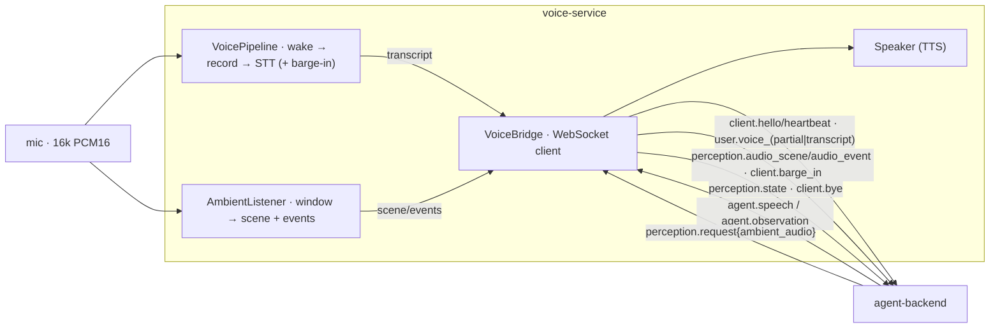

# Component deep-dive: `voice-service`

> Jarvis's **ears and mouth**: wake word → speech-to-text → (agent) →
> text-to-speech, **plus** continuous ambient hearing of the room, sound-event
> detection, and barge-in. Every stage is pluggable and ships with an offline
> fallback, so the whole pipeline runs **headless with zero models or audio
> hardware**.

| | |
| --- | --- |
| **Path** | [`voice-service/`](../../voice-service/) |
| **Language / runtime** | Python **3.11+** · `websockets` · `numpy` · `python-dotenv` (heavy engines are opt-in extras) |
| **Connects to** | `agent-backend` as a protocol **client** (`ws://<host>:8765/jarvis`) |
| **Role in the system** | Voice front-end + ambient perception ("ears & mouth") |
| **Source README** | [`voice-service/README.md`](../../voice-service/README.md) |

---

## Purpose & role

`voice-service` is the **voice front-end** of JarvisVR. It listens for the wake
word **"Jarvis"**, transcribes directed speech (STT), forwards it to the
[`agent-backend`](./agent-backend.md) as `user.voice_transcript`, and speaks the
agent's replies (TTS). With **v1.1 multimodal perception** it *also* hears the
room continuously — emitting an overheard transcript + soundscape
(`perception.audio_scene`) and discrete sound events like doorbells/alarms
(`perception.audio_event`) — and supports **barge-in** (talk over Jarvis to
interrupt the current turn).

Its design rule is **always-on fallbacks**: each of the five stages (wake, STT,
TTS, sound events, ambient STT) sits behind a small interface and degrades to a
mock/heuristic engine, so the service never hard-crashes on a missing
model/engine/mic — it logs and falls back. That makes the whole voice path
unit-testable and demoable offline, with real open engines (openWakeWord,
faster-whisper, Piper, YAMNet) opted in via extras when you want quality.

## Where it fits

The mic stream **fans out** to two independent, frame-driven consumers: the
wake/STT pipeline (directed speech) and the ambient listener (everything else).



**Sends:** `client.hello` (advertising `mic`+`speaker`+`ambient_audio`),
`client.heartbeat`, `user.voice_partial`, `user.voice_transcript`,
`perception.audio_scene`, `perception.audio_event`, `client.barge_in`,
`perception.state`, `client.bye`, `client.error{bad_envelope}`.

**Receives:** `server.hello_ack` (captures `session`), `agent.speech` &
`agent.observation` (→ spoken via TTS), `perception.request{ambient_audio}`
(→ ambient on/off), `agent.thinking`/`agent.transcript`/`server.heartbeat`
(logged). Everything else (`holo.*`, vision `perception.request`, …) is **ignored**
(forward-compatible).

## Directory & key files

| File | What it does |
| --- | --- |
| [`pyproject.toml`](../../voice-service/pyproject.toml) | Packaging + optional-dependency **extras** (`recommended`, `wake-*`, `stt-*`, `tts-*`, `sound-yamnet`, `audio`, `dev`). |
| `jarvis_voice/__main__.py` | CLI: `demo`, `ambient`, `bridge`, `say`, `selftest`, `devices` (+ engine/backend overrides on either side of the subcommand). |
| `jarvis_voice/config.py` | Env-driven `Config` (all `JARVIS_*` knobs); `.env` auto-load; derived helpers (`samples_per_frame`, `ambient_disabled`, `ambient_autostart`). |
| `jarvis_voice/protocol.py` | Self-contained v1.1 envelope + builders/parsers (`client_hello`, `voice_transcript`, `audio_scene`, `audio_event`, `perception_state`, `client_barge_in`, …). |
| `jarvis_voice/audio.py` | Mic/playback + WAV/energy + dBFS/ZCR/spectral helpers (import-guarded so the package imports with no audio backend). |
| `jarvis_voice/wakeword.py` | `WakeWordDetector` + `OpenWakeWord` / `Porcupine` / `EnergyFallback`. |
| `jarvis_voice/stt.py` | `Transcriber` + `FasterWhisperSTT` / `VoskSTT` / `MockSTT`. |
| `jarvis_voice/tts.py` | `Speaker` + `PiperTTS` / `Pyttsx3TTS` / `MockTTS` (+ `stop()` for barge-in, `synthesize() -> wav`). |
| `jarvis_voice/sound_events.py` | `SoundEventDetector` + `YamnetSoundEvents` / `Heuristic` / `Null`. |
| `jarvis_voice/ambient.py` | `AmbientListener`: rolling window → `audio_scene`; per-frame → `audio_event`. |
| `jarvis_voice/pipeline.py` | `VoicePipeline`: frame-driven `LISTENING → RECORDING → STT` state machine + `speak()` + barge-in. |
| `jarvis_voice/bridge.py` | `VoiceBridge`: pipeline + ambient ↔ backend over WebSocket; reconnect with backoff. |
| `tests/` | pytest (protocol, pipeline, bridge, engines, sound_events, ambient, barge_in) — fully headless via mocks + a fake websocket. |

## How it works

### The wake/STT pipeline (`pipeline.py`)

`VoicePipeline` is a small, fully testable state machine that is **frame-driven**:
you push fixed-size PCM16 frames into `process_frame(frame)`, which advances the
machine and fires callbacks.

```
LISTENING ──wake──▶ RECORDING ──(silence | max-len | no-speech)──▶ [STT] ──▶ LISTENING
```

In `LISTENING` it runs each frame through the wake detector; on a hit it begins
recording. In `RECORDING` it buffers frames, emits streaming partials, and
endpoints on trailing silence (energy VAD), a max-utterance cap, or a no-speech
grace window — then runs final STT and fires `on_transcript`. A separate
`speak(text)` path drives TTS and sets a `speaking` flag so the concurrent mic
thread can detect **barge-in** and call `tts.stop()`. `simulate_utterance(text)`
bypasses wake+VAD for headless demos/tests.

### The bridge (`bridge.py`)

`VoiceBridge` is a protocol **client** of the backend. On connect it sends
`client.hello` advertising `mic`+`speaker`+`ambient_audio`, heartbeats every 5 s,
and runs four loops concurrently: `recv` (dispatch inbound), `heartbeat`,
`sender` (drain a thread-safe outbox of transcripts/events), and `capture` (run
mic capture in a background thread, fanning each frame to **both** the pipeline
and — when active — the ambient listener). Inbound `agent.speech` **and**
`agent.observation` are spoken via TTS (off the event loop); a
`perception.request{ambient_audio, start|stop|once}` toggles ambient listening
and is answered with `perception.state`. With no mic it becomes a **speak-only**
bridge (still receives + speaks). It reconnects with exponential backoff.

### Continuous ambient listening (`ambient.py`)

`AmbientListener` keeps a rolling window (`JARVIS_AMBIENT_WINDOW_MS`, default 4 s).
Each window it emits one `perception.audio_scene` with: `ambient_transcript`
(overheard speech, if the window has enough voiced frames — transcribed with the
same STT engine), `speaker` (`user|other|unknown`, default `other`), `sounds`
(soundscape labels), `loudness_db`, and `window_ms`. This is **overheard** speech
— speech *not* directed at Jarvis; wake-word-directed speech goes to the pipeline
instead.

### Sound-event detection (`sound_events.py`)

`SoundEventDetector` analyzes short sub-windows (`JARVIS_SOUND_EVENT_WINDOW_MS`,
default 1 s) and emits low-latency `perception.audio_event{label, confidence,
loudness_db, ts}` for doorbell/alarm/phone/knock/glass_break/music/speech/… The
**`heuristic`** fallback needs no model (it maps loudness + dominant frequency +
spectral flatness + ZCR to a plausible label); install `[sound-yamnet]` and set
`JARVIS_SOUND_EVENTS=yamnet` for the real classifier.

### Barge-in

While Jarvis is speaking, the pipeline watches the mic for the user talking over
it (`JARVIS_BARGE_IN_THRESHOLD` sustained for `JARVIS_BARGE_IN_MIN_FRAMES`). On a
hit it interrupts playback (`Speaker.stop()`), clears the speaking state, and the
bridge sends `client.barge_in` so the backend can cancel its turn. Disable with
`JARVIS_BARGE_IN=off`.

### Lifecycle (pull-based, privacy-aware)

Ambient listening is **negotiated**: the bridge advertises `ambient_audio` in
`client.hello`, then starts/stops on `perception.request{stream:"ambient_audio"}`.
Set `JARVIS_AMBIENT=on` to autostart at connect, or `off` to disable entirely
(capability not advertised, requests refused). Each change is acknowledged with
`perception.state`.

## Engine matrix

Each stage tries your selection and **falls back** if unavailable; the default is
`auto` (prefer the real open engine, else fall back).

| Stage | Env (`auto` default) | Preferred (real) | Alt (real) | Fallback (always works) |
| --- | --- | --- | --- | --- |
| Wake | `JARVIS_WAKE` | `openwakeword` (`hey_jarvis`) | `porcupine` (`jarvis`) | `energy` — speech-onset detector |
| STT | `JARVIS_STT` | `faster-whisper` | `vosk` (streaming) | `mock` — canned/typed text |
| TTS | `JARVIS_TTS` | `piper` (offline neural) | `pyttsx3` (OS voices) | `mock` — logs text + tone WAV |
| Sound events | `JARVIS_SOUND_EVENTS` | `yamnet` (TF-Hub) | — | `heuristic`; `off` = disabled |
| Ambient STT | `JARVIS_STT` (reused) | `faster-whisper` | `vosk` | `mock` |
| Audio I/O | extra `[audio]` | `sounddevice` | — | import-guarded no-op |

Enable real engines à la carte, e.g. `pip install -e ".[recommended]"`
(openWakeWord + faster-whisper + Piper + audio I/O), then set
`JARVIS_PIPER_MODEL=/models/voice.onnx`, etc.

## Run & test

```bash
cd voice-service
python3.11 -m venv .venv && source .venv/bin/activate
pip install -e ".[dev]"          # base + pytest (add ,recommended for real engines)
```

Commands:

```bash
jarvis-voice selftest            # headless end-to-end check (uses fallbacks)
jarvis-voice say "Jarvis online" # TTS smoke test (add --out out.wav to save WAV)
jarvis-voice demo                # mic → wake → STT loop (auto-falls to a typed REPL)
jarvis-voice demo --simulate     # force the typed REPL (no mic)
jarvis-voice ambient             # continuous ambient listening + sound events
jarvis-voice ambient --simulate  # synthetic room audio + typed "overheard" REPL
jarvis-voice bridge              # connect to the agent-backend and act as the voice client
jarvis-voice bridge --no-mic     # speak-only bridge
jarvis-voice devices             # list audio devices (diagnostics)
```

**What green looks like:** `jarvis-voice selftest` runs 9 checks (protocol
round-trip, engine selection, a mock pipeline turn, TTS→WAV, the hello
advertising `mic+speaker+ambient_audio`, sound events, an ambient scene,
barge-in, and v1.1 perception build/parse) and ends with `RESULT: PASS ✅`. The
bridge logs `→ client.hello (mic+speaker+ambient_audio)` then
`← server.hello_ack (session=…)`.

```bash
pytest -q
```

Tests are fully headless (Mock/Energy/Heuristic engines + a fake websocket) and
cover protocol build/parse + v1.1 builders, the wake→record→STT machine, the
bridge's hello/transcript/speech/observation/perception mappings, sound events,
ambient analysis, and barge-in.

**Docker:**

```bash
docker build -t jarvisvr-voice .                          # light base
docker build --build-arg EXTRAS="[recommended]" -t jarvisvr-voice .  # bake in real engines
docker run --rm -e JARVIS_BACKEND_URL=ws://agent-backend:8765/jarvis jarvisvr-voice
```

The build runs `jarvis-voice selftest`; the container `HEALTHCHECK` re-runs it;
default `CMD` is `jarvis-voice bridge`. In [`infra/`](./infra.md) this is the
**`voice-service`** compose service (typically speak-only — mic in a container
needs device passthrough).

## Configuration

All knobs are environment variables (auto-loaded from `.env`). Most-used:

| Variable | Default | Purpose |
| --- | --- | --- |
| `JARVIS_BACKEND_URL` | `ws://localhost:8765/jarvis` | Backend WebSocket endpoint |
| `JARVIS_WAKE` / `JARVIS_STT` / `JARVIS_TTS` | `auto` | Engine selection |
| `JARVIS_WAKE_WORD` | `jarvis` | Wake word |
| `JARVIS_SAMPLE_RATE` / `JARVIS_FRAME_MS` | `16000` / `30` | Audio framing (PCM16 mono) |
| `JARVIS_SILENCE_MS` / `JARVIS_VAD_THRESHOLD` | `800` / `300` | Endpointing silence / speech-vs-silence RMS |
| `JARVIS_WHISPER_MODEL` | `base.en` | faster-whisper model size/path |
| `JARVIS_VOSK_MODEL` / `JARVIS_PIPER_MODEL` | — | Required paths for Vosk / Piper |
| `JARVIS_PORCUPINE_ACCESS_KEY` | — | Required for Porcupine |
| `JARVIS_MOCK_TRANSCRIPT` | `jarvis what is the weather in tokyo` | MockSTT canned text |
| `JARVIS_AMBIENT` | `auto` | Ambient listening: `auto` (on request) / `on` (autostart) / `off` |
| `JARVIS_AMBIENT_WINDOW_MS` / `JARVIS_AMBIENT_SPEAKER` | `4000` / `other` | One `audio_scene` per window / overheard speaker tag |
| `JARVIS_SOUND_EVENTS` / `JARVIS_SOUND_EVENT_THRESHOLD` | `auto` / `0.5` | Sound-event engine / min confidence |
| `JARVIS_BARGE_IN` / `JARVIS_BARGE_IN_THRESHOLD` | `true` / `1500` | Interrupt TTS / RMS energy for barge-in |
| `JARVIS_STT_LANGUAGE` / `JARVIS_TTS_LANGUAGE` | `en` / — | Multi-language hooks (best-effort) |
| `JARVIS_LOG_LEVEL` | `INFO` | Logging |

The optional parallel `ws://<host>:8765/audio` PCM16 channel (`JARVIS_AUDIO_URL`)
is reserved for raw audio; `Speaker.synthesize(text) -> wav` and
`audio.wav_to_pcm16()` provide the bytes. (Streaming raw audio is a follow-up;
JSON transcripts/speech are complete.) See
[`.env.example`](../../voice-service/.env.example) for the full annotated list.

## Extension points

- **Swap an engine** — implement the stage's small interface (e.g. a new
  `Transcriber`) and wire it into the `create_*` factory; the `auto` fallback
  chain keeps the service runnable. See [Voice](../concepts/voice.md).
- **Better VAD/diarization** — endpointing, ambient speech-presence, and barge-in
  all use a dependency-free energy VAD/dBFS behind one hook; swap in WebRTC/Silero
  VAD or speaker diarization (a P2 follow-up).
- **Real sound classification** — install `[sound-yamnet]` and set
  `JARVIS_SOUND_EVENTS=yamnet` to replace the heuristic detector.
- **Reconcile the protocol** — `protocol.py` can later be swapped for the canonical
  [`shared-protocol`](./shared-protocol.md) Python bindings without touching the
  pipeline/bridge.

## Notes & caveats

- **Frame-driven everywhere.** The pipeline *and* the ambient listener consume
  `process_frame(pcm16)`, so the whole system is unit-testable with synthetic
  frames — no audio stack required.
- **The `energy` wake fallback can't recognize the literal word "Jarvis"** (that
  needs a model); it fires on a short burst of speech-level energy so the pipeline
  is usable with zero models. `mock` STT returns `JARVIS_MOCK_TRANSCRIPT`; `mock`
  TTS prints the text and writes a valid tone WAV.
- **The `heuristic` sound-event detector is an approximation, not a trained
  model** — it exists so perception runs offline. Use YAMNet for real accuracy.
- **Overheard vs directed speech.** Wake-directed speech →
  `user.voice_transcript`; everything else → `perception.audio_scene`
  (`speaker=other`). Speaker diarization (user vs other) is a P2 follow-up.
- **`client.hello` advertises `mic`+`speaker`+`ambient_audio` as true** (this
  front-end's role) regardless of whether a local audio device is attached; in a
  container the typical role is **speak-only**.

---

### See also

- [Architecture](../../ARCHITECTURE.md) · [Protocol reference](../PROTOCOL.md) · [Voice concept](../concepts/voice.md) · [Perception](../concepts/perception.md)
- Siblings: [`unity-client`](./unity-client.md) · [`agent-backend`](./agent-backend.md) · [`holo-tools`](./holo-tools.md) · [`shared-protocol`](./shared-protocol.md) · [`infra`](./infra.md)
- Repo: [`voice-service/`](../../voice-service/) · issues at `https://github.com/sumitaich1998/jarvisvr/issues`
