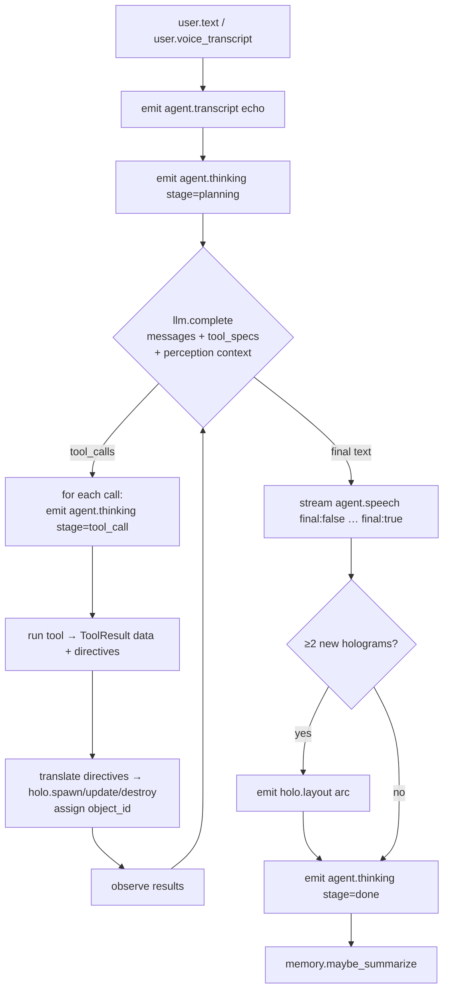
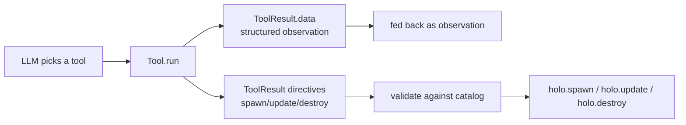
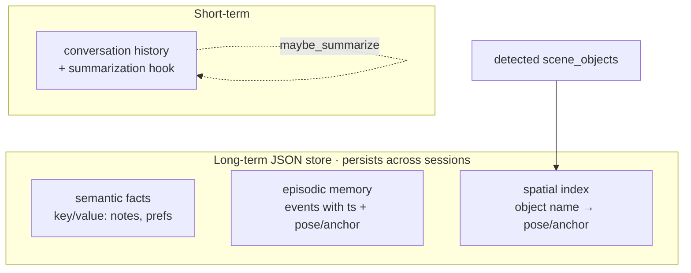

# The agent loop

The `agent-backend` is the **brain** of JarvisVR. It is *not* a command parser that
matches phrases to actions — it's an **LLM agent** that plans, calls tools, observes
the results, remembers, and decides what to say and what to render. This page
explains that loop: how a single user turn becomes `agent.speech`, `holo.*`
commands, and `agent.observation`s.

It reflects the real implementation in
[`agent-backend/`](../../agent-backend/README.md) (`agent/agent.py`,
`agent/llm.py`, `agent/tools/`, `agent/memory.py`). For the wire format see the
[Protocol reference](../PROTOCOL.md); for how rendered objects work see
[Holograms](./holograms.md).

---

## One turn, top to bottom

When a `user.text` or `user.voice_transcript` arrives, the session runs a bounded
**plan → call tools → observe → respond** loop:



In words:

1. **Echo & plan.** The session emits `agent.transcript` (so the shell can caption
   what you said) and `agent.thinking{stage:"planning"}`.
2. **Complete.** It calls the LLM with the conversation messages, the available
   **tool specs**, and (when relevant) the current perception context.
3. **Tool calls.** If the model wants to call tools, for each one it emits
   `agent.thinking{stage:"tool_call", tool:"…"}`, runs the tool, turns the tool's
   **directives** into `holo.spawn`/`holo.update`/`holo.destroy` commands (assigning
   a server-side `object_id`), and feeds the structured result back to the model as
   an observation. The loop repeats — up to `JARVIS_MAX_STEPS` (default 6).
4. **Respond.** When the model produces final text, it's streamed as
   `agent.speech` frames ending with `final:true`.
5. **Arrange & finish.** If two or more holograms were spawned this turn, the brain
   sends a `holo.layout{arc}` to fan them in front of you, then
   `agent.thinking{stage:"done"}`.
6. **Remember.** Memory's summarization hook may fold older turns
   (`memory.maybe_summarize()`).

A safety bound (`JARVIS_MAX_STEPS`) caps how many plan→tool→observe iterations a
single turn can take, so a confused plan can't loop forever.

---

## Planning vs. parsing

The difference matters. Ask *"show me the weather in Tokyo and start a 5-minute
timer"* and the agent recognizes this is **two** independent actions, calls
**both** `get_weather` and `start_timer`, reads both results, and composes one reply
plus two holograms. A fixed command parser would need an exact phrase per command;
the agent generalizes.

The model also decides *when not to* call tools (a plain chat answer), when to ask a
clarifying question, and — for perception — when to turn the camera on, call a
vision tool, and turn it back off (see [Perception](./perception.md)).

---

## The LLM provider abstraction

All reasoning goes through one small interface, `LLMProvider`, in `agent/llm.py`,
with `complete(messages, tools, images=…)`. There are three implementations:

| Provider | When | Behavior |
| --- | --- | --- |
| **`MockLLM`** | default (`JARVIS_LLM=mock`) | Deterministic, keyword/intent-driven planner. Maps text → tool calls, runs them, synthesizes the reply from the structured results. No network, fully reproducible. It also "sees" deterministically via the perception buffer, so vision Q&A works offline. |
| **`OpenAILLM`** | `JARVIS_LLM=openai` | Real OpenAI function/tool-calling + image content blocks for vision. |
| **`AnthropicLLM`** | `JARVIS_LLM=anthropic` | Real Anthropic tool-calling + image blocks. |

Beyond these three native paths, the provider **registry** (`providers.py`) reaches
~20 providers via OpenAI-compatible HTTP or the LiteLLM universal adapter — see
[Configuration](../configuration.md). Whichever you pick, tool/function-calling and
vision image blocks are preserved where supported and degrade gracefully otherwise.

> **Never crashes.** If a selected provider's key or SDK is missing, the server logs
> a warning and **falls back to `MockLLM`** rather than failing. That's why the
> whole stack is always demoable.

The agent's behavior and tone come from a perception-aware system prompt in
`agent/persona.py` ("You are Jarvis…").

---

## Tools — how Jarvis *does* things

Tools are the agent's hands. Each tool is a small, **network-free-by-default**
capability that returns two things:

- **`data`** — a structured result the LLM reads as its observation, and
- **holo directives** — instructions the brain translates into `holo.*` render
  commands.

That dual return is the key idea: a tool both *informs the model* and *draws
something*. Tools live in `agent/tools/` and are organized into registries:

### Built-in tools (`builtins.py`)

| Tool | What it does |
| --- | --- |
| `get_weather` | Deterministic mock weather (or live OpenWeatherMap if `JARVIS_WEATHER_API_KEY` is set) → spawns a `weather_orb`. |
| `start_timer` / `stop_timer` | Manage a countdown → spawns/updates a `timer`. |
| `get_time` | Current time. |
| `take_note` / `list_notes` | Long-term notes (persisted). |
| `set_reminder` | A time- or perception-triggered reminder. |
| `show_panel` / `show_text` | Render a `panel` / `text_label`. |
| `open_widget` | Generic widget spawner. |

### Perception & feature tools (`perception_tools.py`)

`describe_view` / `look`, `identify_object` / `what_is_this`, `read_text` (OCR),
`translate_text`, `translate_view`, `remember_object` + `find_object` (spatial
recall), `identify_sound`, and `measure`. These work with the perception buffer and
the offline mock vision (`perception/vision.py`).

### Knowledge & integration tools (`knowledge_tools.py`)

`web_search`, `get_news`, `get_stocks`, `get_calendar`, `navigate_to` — all
mock-friendly so they run offline, pluggable to real backends later.

### Dynamic widget tools (`widget_tools.py`)

On top of all the above, a **`show_<widget>` spawn tool is generated for every
widget in the catalog** (loaded from `holo-tools/tools.json` + `registry.json`, with
a built-in fallback). So the agent can summon any of the 40+ widgets —
`show_weather`, `show_chart`, `show_map`, `show_calendar`, and so on — without each
needing hand-written code. See [Holograms](./holograms.md) and
[HOLO_TOOLS.md](../HOLO_TOOLS.md).



Every spawn is validated against the widget catalog (`widget_type` + `props`) before
it goes out — an invalid one becomes a `server.error` (`unknown_widget` /
`invalid_props`), never a malformed frame.

---

## Memory

The agent keeps several kinds of memory (`agent/memory.py`), so it can hold a
conversation, remember your preferences, and recall things it has seen.



| Kind | What it holds | Lifetime |
| --- | --- | --- |
| **Short-term** | Recent conversation turns, with a hook that **summarizes** old turns once history grows. | The session (folded over time). |
| **Long-term / semantic** | A JSON key/value store of facts, notes, reminders, and preferences. | Persists across sessions (in `JARVIS_DATA_DIR`). |
| **Episodic** | Events with a timestamp and pose/anchor — "what happened, when, and where." | Persists. |
| **Spatial** | An index of seen objects keyed by name → pose/anchor. | Persists. |

The spatial index is what makes *"where did I leave my keys?"* work: detected
`perception.scene_objects` are **auto-indexed**, so later the agent can recall the
last place it saw an object, drop a marker, and spawn a `navigation_arrow` pointing
you there. Long-term memory lives under `JARVIS_DATA_DIR` (default `.data`) — see
[Configuration §6](../configuration.md#6-holograms-tools--memory).

---

## How outputs reach the headset

A turn produces three kinds of outbound messages, each with a clear job:

| Output | Carries | Rendered as |
| --- | --- | --- |
| **`agent.speech`** | What Jarvis says (TTS + caption). Streams `final:false` … `final:true`. | Spoken by the voice-service; captioned by the shell. |
| **`agent.observation`** | What Jarvis *perceives*, with optional spatial `annotations`. | Spoken narration + world-anchored annotation holograms. |
| **`holo.*`** | `spawn` / `update` / `destroy` / `layout` of holographic objects. | 3D widgets in your room. |

So a tool result fans out: its `data` shaped the `agent.speech` reply, and its
directives became `holo.spawn` objects — with `agent.observation` reserved for the
perception path. The shell turns those into a coherent scene; the voice turns the
speech into audio.

---

## Interactions feed back in

The loop is two-way. When you touch a hologram, the shell sends
`client.interaction` (e.g. tapping a timer's pause button):

```jsonc
{ "object_id":"O1", "widget_type":"timer", "action":"tap",
  "element":"pause_button", "hand":"right" }
```

Recognized interactions are routed straight back into the **tool layer** to update
holograms (`holo.update` / `holo.destroy`) — tapping pause sends the timer to
`paused`. **Unhandled** interactions are fed back to the **agent/LLM** so it can
decide what to do, keeping behavior open-ended rather than hard-coded. Barge-in
(`client.barge_in`) cancels the in-flight turn — stopping streaming speech and
aborting pending tool calls where safe (see [Voice](./voice.md)).

---

## Putting it together

The *"weather + 5-minute timer"* turn, as the agent actually runs it:

```text
user.text "show weather in tokyo and start a 5 minute timer"
  ├─ agent.transcript (echo)
  ├─ agent.thinking {planning}
  ├─ llm.complete → tool_calls: [get_weather(city=Tokyo), start_timer(5m)]
  │    ├─ agent.thinking {tool_call: get_weather} → run → holo.spawn weather_orb
  │    └─ agent.thinking {tool_call: start_timer} → run → holo.spawn timer
  ├─ llm.complete → final text
  │    └─ agent.speech "Here's Tokyo, and your timer is running." {final:true}
  ├─ holo.layout {arc}        (because 2 holograms were spawned)
  └─ agent.thinking {done} ; memory.maybe_summarize()
```

Deterministic on the `mock` provider, identical every run — which is exactly what
the e2e conformance harness checks.

---

## Next steps

- [Holograms & interaction](./holograms.md) — what those `holo.spawn` directives become in 3D.
- [Perception](./perception.md) — how sight/sound/gaze enter the loop and become observations.
- [Voice](./voice.md) — how speech in and out (and barge-in) connect to the loop.
- [agent-backend README](../../agent-backend/README.md) — the implementation, file by file.
- [Write a tool](../guides/write-a-tool.md) — give Jarvis a new capability.
- [Configuration](../configuration.md) — pick a real LLM provider and tune `JARVIS_MAX_STEPS`, memory, and tools.
