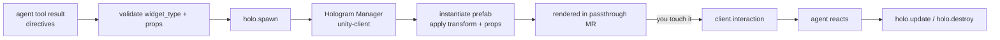

# Holograms & interaction

Holograms are what make JarvisVR *spatial*. When the agent decides to show you
something — the weather, a timer, a chart, a label on the real object you're looking
at — it spawns a **holographic widget** into your room. This page explains the
widget system: the `holo.*` commands, the shape of a holographic object, anchors and
transforms, how you interact with widgets, and the 42-widget catalog.

The machine-readable source of truth is
[`holo-tools/registry.json`](../../holo-tools/registry.json); the human-readable
catalog with every widget's props and examples is
[HOLO_TOOLS.md](../HOLO_TOOLS.md). The wire shape is
[Protocol §5.6](../PROTOCOL.md#56-the-holographic-object).

---

## The four `holo.*` commands

The brain manages your room's holograms with exactly four message types
(brain → shell):

| Message | Purpose |
| --- | --- |
| **`holo.spawn`** | Create a holographic object. The shell SHOULD reply `client.ack`. |
| **`holo.update`** | Patch an existing object's `props` and/or `transform` (omit unchanged keys). |
| **`holo.destroy`** | Remove an object (with an optional `fade_ms`). |
| **`holo.layout`** | Batch-arrange multiple objects (`arc` / `grid` / `stack` / `free`). |



The agent never writes these messages by hand — it calls **tools**, and the backend
translates tool directives into validated `holo.*` commands (see
[The agent loop](./agent-loop.md)). On the headset, the **Hologram Manager** maps
each `widget_type` to a Unity prefab (or a built-in **procedural** renderer so it
works with no custom art) and applies the transform.

---

## The holographic-object shape

Every `holo.spawn` payload (and the target of `holo.update`) is a single
**Holographic Object**:

```jsonc
{
  "object_id": "uuid-v4",          // server-assigned, stable for the object's lifetime
  "widget_type": "weather_orb",    // must exist in holo-tools/registry.json
  "transform": {
    "anchor": "world",             // world | head | hand_left | hand_right | surface
    "position": [0.0, 1.4, 1.0],   // meters, relative to anchor
    "rotation": [0, 0, 0, 1],      // quaternion x,y,z,w
    "scale":    [1, 1, 1],
    "billboard": false              // if true, always face the user
  },
  "props": { },                    // widget-specific; validated against the widget's schema
  "interactable": true,
  "interactions": ["grab", "tap", "resize"],  // subset of the widget's supported set
  "ttl_ms": 0                       // 0 = persists until destroyed
}
```

Key fields:

- **`object_id`** — assigned by the server and stable for the object's whole life,
  so later `holo.update` / `holo.destroy` / `client.interaction` messages all refer
  to the same thing.
- **`widget_type`** — the snake_case id of a widget in the catalog. The backend
  validates this (and `props`) before spawning.
- **`props`** — the widget-specific data, validated strictly against that widget's
  JSON Schema (draft 2020-12, `additionalProperties:false`).
- **`interactions`** — the gestures enabled on *this* object, a subset of what the
  widget type supports.
- **`ttl_ms`** — `0` means it persists until destroyed; a positive value
  auto-expires it.

---

## Anchors

The `anchor` decides what frame of reference a hologram's position is relative to —
which is what makes a hologram feel *placed* in your world rather than stuck to a 2D
screen.

| Anchor | The object is positioned relative to… | Good for |
| --- | --- | --- |
| `world` | A fixed point in the room. | Labels on real objects, things that stay put as you move. |
| `head` | Your head (it follows you). | HUD-style glanceables, the presence orb, captions. |
| `hand_left` / `hand_right` | A hand. | Wrist menus, hand-attached tools. |
| `surface` | A detected surface (floor, table, wall). | Panels that sit on a desk, art on a wall. |

A world-anchored `vision_annotation` stays pinned to your coffee mug even as you
walk around; a head-anchored `weather_orb` glides along with you. The set of valid
anchors is defined in [`ARCHITECTURE.md` §5](../../ARCHITECTURE.md#5-cross-cutting-conventions)
and the [protocol](../PROTOCOL.md).

---

## Transforms — meters & quaternions

JarvisVR uses one coordinate convention everywhere, matching Unity:

- **Right-handed, meters, Y up.**
- `position = [x, y, z]` in meters, relative to the anchor.
- `rotation` is a **quaternion** `[x, y, z, w]` (not Euler angles). The identity
  rotation is `[0, 0, 0, 1]`.
- `scale = [x, y, z]` (usually `[1, 1, 1]`).
- `billboard: true` makes the object continuously face the user, overriding the
  rotation for readability — perfect for orbs, labels, and captions.

So `position:[0.45, 0.1, 0.9]` with `anchor:"head"` means "45 cm to the right, 10 cm
up, 90 cm in front of your face." Using real-world units keeps holograms physically
plausible across devices.

Each widget defines a sensible **`default_transform`** in the catalog, which a tool
can override per-spawn (e.g. to place an annotation on the exact object you're
looking at).

---

## Interactions

Holograms are touchable. The protocol defines eight interaction types; a widget
declares which it supports, and each spawned object enables a subset.

| Interaction | Gesture |
| --- | --- |
| `tap` | Poke / pinch a button or element. |
| `grab` | Grab and move the whole object. |
| `release` | Let go after a grab. |
| `drag` | Drag an element (e.g. a handle). |
| `slider` | Move a slider value. |
| `toggle` | Flip a switch. |
| `resize` | Two-handed scale. |
| `dwell` | Gaze/hover for a moment (eye or head ray). |

When you interact, the shell sends `client.interaction` back to the brain:

```jsonc
{
  "object_id": "uuid-v4",
  "widget_type": "timer",
  "action": "tap",                 // one of the interaction types above
  "element": "pause_button",       // optional sub-element id within the widget
  "value": { },                    // action data, e.g. {"slider": 0.4}
  "hand": "right"
}
```

The `element` and `action` ids come straight from the widget's catalog entry (its
`events`). For example, the `timer` widget emits `pause` (element `pause_button`,
action `tap`), `resume`, `reset`, and `dismiss`. The agent reacts — typically with a
`holo.update` (pausing the timer) — and unhandled interactions are passed to the LLM
to decide (see [the agent loop](./agent-loop.md)).

On the Unity side, interaction is multimodal: **gaze + pinch**, poke/grab via the
Meta Interaction SDK, voice selection, and gaze-dwell all map to these same
`client.interaction` messages.

---

## A concrete example: the weather orb

Putting the pieces together, here's a real `holo.spawn` for a `weather_orb` (from
the catalog):

```jsonc
{
  "v": "1.1.0",
  "id": "msg-uuid",
  "type": "holo.spawn",
  "ts": 1733397600000,
  "session": "session-uuid",
  "payload": {
    "object_id": "object-uuid",
    "widget_type": "weather_orb",
    "transform": {
      "anchor": "head",
      "position": [0.45, 0.1, 0.9],
      "rotation": [0, 0, 0, 1],
      "scale": [1, 1, 1],
      "billboard": true
    },
    "props": {
      "city": "Tokyo",
      "temp_c": 18.0,
      "condition": "clouds",
      "humidity_pct": 64,
      "wind_kph": 12.5
    },
    "interactable": true,
    "interactions": ["tap", "grab", "resize", "dwell"]
  }
}
```

Tapping the orb emits `expand_forecast` (`element:"orb"`, `action:"tap"`); dwelling
on it emits `inspect`. The full props schema, every event, and the
`default_transform` are in the
[`weather_orb` entry](../HOLO_TOOLS.md#weather_orb--weather-orb).

---

## Arranging multiple holograms with `holo.layout`

When a turn produces several objects, the brain tidies them with `holo.layout`
instead of overlapping them:

```jsonc
{
  "arrangement": "arc",            // arc | grid | stack | free
  "anchor": "head",
  "objects": ["object_id_1", "object_id_2"],
  "spacing": 0.25
}
```

This is why "show weather **and** start a timer" results in a neat **arc** of two
widgets in front of you — the agent emits a `holo.layout{arc}` automatically when it
spawns two or more holograms in a turn.

---

## The 42-widget catalog

The catalog (version 1.1.0) defines **42 widgets** across three groups. Each entry
declares a `title`, `category`, `prefab_id`, supported `interactions`, a
`default_transform`, the `events` it emits, a `props_schema`, and `example_props`.

**v1.0 core (12):** `weather_orb`, `chart_3d`, `model_viewer`, `panel`,
`text_label`, `button`, `timer`, `media_player`, `map_3d`, `smart_home_panel`,
`todo_list`, `image_board`.

**v1.1 perception (5):** `vision_annotation`, `bounding_box_3d`, `live_caption`,
`vision_feed`, `scene_label` — these let Jarvis annotate the *real* world.

**v1.1 feature (25):** `clock`, `world_clock`, `calendar`, `stocks_ticker`,
`news_feed`, `translator`, `recipe_card`, `whiteboard`, `sticky_note`,
`code_viewer`, `document_viewer`, `web_panel`, `avatar`, `navigation_arrow`,
`health_ring`, `music_visualizer`, `graph_3d`, `data_table`, `measuring_tape`,
`pomodoro`, `image_gen_viewer`, `volumetric_globe`, `system_launcher`,
`notification_toast`, `settings_panel`.

Browse them all — with props, events, and example spawns — in
**[HOLO_TOOLS.md](../HOLO_TOOLS.md)**.

### Perception widgets in depth

These five are how perception answers become spatial (see
[Perception](./perception.md)):

| Widget | What it shows |
| --- | --- |
| `vision_annotation` | A world-anchored callout/label on a real object, with optional confidence, detail, and a leader line to the target. |
| `bounding_box_3d` | A 3D box around a detected real-world object. |
| `live_caption` | A rolling caption panel of speech Jarvis hears (ambient transcript / translation). |
| `vision_feed` | A panel showing what Jarvis currently sees. |
| `scene_label` | A simple label placed in the scene. |

For example, the `vision_annotation` props include `label` (required),
`confidence`, `detail`, `leader_line`, `target_object_id`, and `target_position`,
and it defaults to a **world** anchor with `billboard:true` — exactly what you want
for a callout that stays on a real object but faces you. See its
[catalog entry](../HOLO_TOOLS.md#vision_annotation--vision-annotation).

---

## Validation & errors

Before any `holo.spawn`/`holo.update` goes out, the backend validates it against the
catalog (via `holo-tools`):

- `validate_widget(widget_type, props)` — is the type known, and do the props match
  the schema?
- `validate_holo_object(obj)` — is the whole object structurally valid (transform,
  anchor, interactions)?

Failures surface as a `server.error` with a protocol code, not a malformed frame:

- **`unknown_widget`** — the `widget_type` isn't in the registry.
- **`invalid_props`** — props (or the object structure) failed schema validation.

On the client, an unknown `widget_type` still renders a **placeholder** and reports
`client.error: unknown_widget`, so the system fails visibly but gracefully. The
surrounding envelope is validated **leniently** (unknown keys ignored) per the
protocol's forward-compatibility rule, while props are validated **strictly**.

---

## How the shell renders a widget

On the Unity side, the flow is: load `registry.json`, build a map of
`widget_type → prefab` (named by `prefab_id`, e.g. `weather_orb → Holo_WeatherOrb`),
and on `holo.spawn` instantiate the prefab, apply the `transform` (meters,
quaternion, billboard), and hand `props` to the prefab's controller. Only the
gestures in the object's `interactions` are enabled, and they emit
`client.interaction` using the catalog's `element`/`action` ids. Every known type
also has a **procedural** renderer so it works before any custom art exists — see
the [unity-client SETUP](../../unity-client/Assets/JarvisVR/SETUP.md).

---

## Next steps

- [The agent loop](./agent-loop.md) — how tool results become these `holo.*` commands.
- [Perception](./perception.md) — the perception widgets and world annotations.
- [HOLO_TOOLS.md](../HOLO_TOOLS.md) — the complete widget catalog and tool schemas.
- [Add a holographic widget](../guides/add-a-widget.md) — registry → schema → renderer → tool.
- [holo-tools README](../../holo-tools/README.md) — how the catalog is consumed in Python, C#, and TypeScript.
- [Protocol §5.6–§5.11](../PROTOCOL.md#56-the-holographic-object) — the exact wire schemas.
