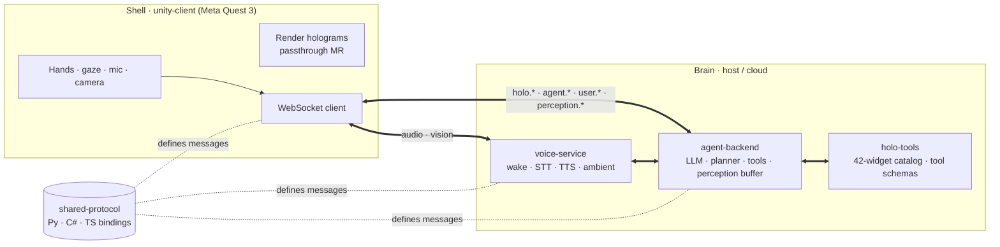
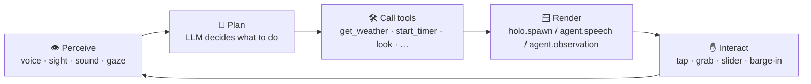
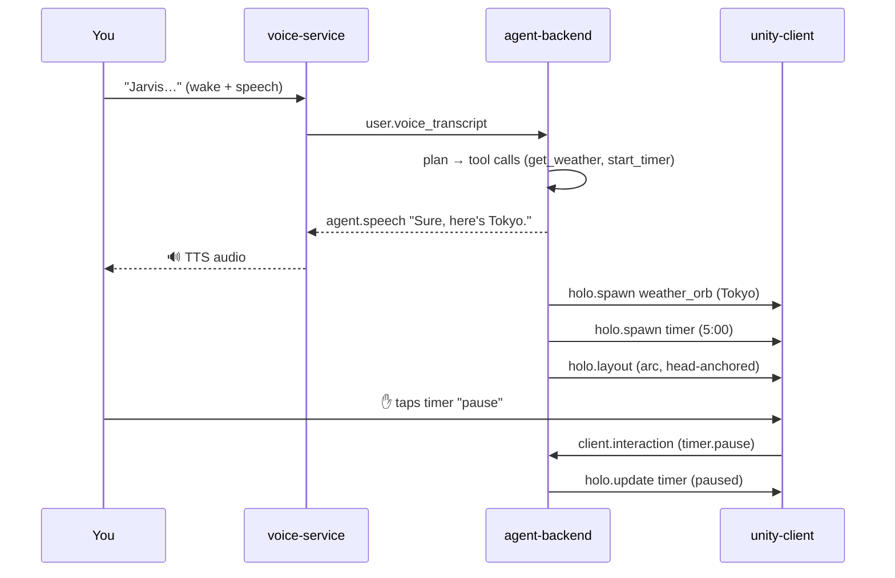

# Overview — the mental model

This is the page to read first if you want to *understand* JarvisVR rather than just
run it. It explains the one big idea the whole system is built around, the loop that
every interaction follows, and why everything works offline by default.

If you haven't run the demo yet, do that first in
[Getting Started](../getting-started.md) — the concepts land better once you've seen
the messages fly.

---

## The one big idea: a decoupled shell and brain

JarvisVR splits cleanly into two halves that know almost nothing about each other:

- **The shell** — the `unity-client` running on the Meta Quest 3. It is the *body*:
  it renders holograms with passthrough mixed reality, captures your hands, gaze,
  voice, the room's camera and audio, and shows a persistent "Jarvis presence." It
  does **no reasoning**.
- **The brain** — the `agent-backend`, a Python server. It is the *mind*: an LLM
  agent that plans, calls tools, remembers, perceives, and decides what should
  appear in your room. It renders **nothing** itself.

Between them sits a single, versioned **WebSocket protocol**. The shell sends the
brain what's happening ("the user said X", "the user tapped the timer", "here's a
camera frame"); the brain sends the shell what to do ("say this", "spawn a weather
orb here", "turn the camera on"). Because the only coupling is that message
contract, **either half can be replaced**: swap the model, swap the voice, even
swap Unity for another rendering engine — as long as it speaks the protocol.



### The cast of components

| Component | Role | Lives in |
| --- | --- | --- |
| **unity-client** | The MR shell: renders holograms, captures input/camera/mic. | `unity-client/` |
| **agent-backend** | The brain: plan → tools → perception → render. | `agent-backend/` |
| **voice-service** | Ears & mouth: wake word, STT, TTS, ambient hearing. | `voice-service/` |
| **holo-tools** | The catalog of 42 widgets + the agent's tool schemas. | `holo-tools/` |
| **shared-protocol** | The protocol contract in Python, C#, and TypeScript. | `shared-protocol/` |
| **infra** | Docker, the mock brain, and the e2e conformance harness. | `infra/` |

The deep system-level design contract is [`ARCHITECTURE.md`](../../ARCHITECTURE.md);
the wire-level message contract is the [Protocol reference](../PROTOCOL.md).

---

## The protocol in 30 seconds

Every message is a JSON object with the same envelope, regardless of direction:

```jsonc
{
  "v": "1.1.0",            // protocol version (semver)
  "id": "uuid-v4",         // unique message id
  "type": "holo.spawn",    // namespace.name (see the catalog)
  "ts": 1733397600000,      // epoch milliseconds
  "session": "uuid-v4",    // assigned by server.hello_ack
  "payload": { }            // type-specific object
}
```

Messages are grouped by namespace, which tells you who sends what:

| Namespace | Direction | Examples |
| --- | --- | --- |
| `client.*` | shell → brain | `client.hello`, `client.interaction`, `client.ack`, `client.barge_in`, `client.settings_update` |
| `user.*` | shell → brain | `user.text`, `user.voice_transcript` |
| `agent.*` | brain → shell | `agent.thinking`, `agent.speech`, `agent.observation` |
| `holo.*` | brain → shell | `holo.spawn`, `holo.update`, `holo.destroy`, `holo.layout` |
| `perception.*` | both | `perception.vision_frame` (→), `perception.request` (←), `perception.gaze` (→) |
| `server.*` | brain → shell | `server.hello_ack`, `server.heartbeat`, `server.error`, `server.settings` |

Two rules keep it robust and future-proof:

- **Unknown message `type`s are ignored.** A v1.0 client and a v1.1 server can talk
  — the older side just skips messages it doesn't understand. (That's how
  perception was added without breaking anyone.)
- **The connection is stateful per session.** It opens with a
  `client.hello` / `server.hello_ack` handshake (which assigns the `session` and
  advertises capabilities), then both sides heartbeat every 5 seconds.

Full details, every payload schema, and worked examples are in the
[Protocol reference](../PROTOCOL.md).

---

## The core loop: perceive → plan → call tools → render → interact

Everything JarvisVR does is one turn of the same loop. A turn usually starts with
you speaking, but it can also start from perception (a sound, something you're
looking at).



1. **Perceive.** The shell turns the real world into messages: your speech becomes
   `user.voice_transcript`, a glance becomes `perception.gaze`, the room's camera
   becomes `perception.vision_frame`, ambient sound becomes
   `perception.audio_scene` / `perception.audio_event`. The brain keeps a short
   rolling **perception buffer** of the latest of each.

2. **Plan.** The LLM agent receives your request plus the relevant perception
   context and decides on a plan — possibly multiple steps. It streams
   `agent.thinking` so the shell can show "thinking…", "calling get_weather…".

3. **Call tools.** Instead of inventing answers, the agent calls **tools** —
   small, structured capabilities like `get_weather`, `start_timer`, `look`,
   `read_text`, `find_object`. Each returns structured data the agent reads, plus
   *holo directives* describing what to draw.

4. **Render.** The brain converts those directives into `holo.spawn` / `holo.update`
   / `holo.destroy` / `holo.layout` commands (validated against the widget catalog)
   and streams `agent.speech` for the voice to speak. Perception answers come back
   as `agent.observation` with spatial annotations.

5. **Interact.** You reach out and tap, grab, or drag a hologram — the shell sends
   `client.interaction`. You talk over Jarvis — `client.barge_in` cancels the turn.
   Each interaction can kick off the loop again.

Each stage has its own concept page:

- [Perception](./perception.md) — sight, hearing, gaze, the buffer, and privacy.
- [The agent loop](./agent-loop.md) — planning, tools, and memory.
- [Holograms & interaction](./holograms.md) — the widget system and 3D rendering.
- [Voice](./voice.md) — wake word, STT, TTS, and barge-in.

---

## A worked example

Here is the loop for *"Jarvis, show me the weather in Tokyo and start a 5-minute
timer"* — the same turn the e2e harness and smoke client run:



The brain *planned* (two tools, not one), *rendered* two holograms and arranged
them, *spoke*, and then handled a live interaction — all over the protocol, with no
component reaching into another's internals. This exact turn is narrated message by
message in [Getting Started](../getting-started.md#your-first-conversation-narrated).

---

## The offline mock philosophy

A defining design choice: **every capability has a deterministic, offline mock.**

- The brain ships a `MockLLM` — a deterministic, keyword-driven planner that maps
  your text to tool calls and synthesizes a reply from the results. No network, no
  key, fully reproducible.
- Vision has a mock provider that "sees" by synthesizing a scene description from
  the perception buffer, so *"what is this?"* works offline.
- The voice-service has fallback engines for wake word, STT, TTS, and sound events
  that run with no models and no microphone.
- `infra/` has a self-contained mock brain and an e2e harness that drives the whole
  protocol with no Docker and no keys.

Why this matters:

- **Onboarding is instant** — clone, run, and see a full multimodal turn in
  minutes, with zero accounts.
- **Tests are deterministic** — the same input always yields the same frames, so
  conformance can be asserted exactly.
- **Development is decoupled** — you can build and test the shell against a mock
  brain (and vice-versa) without standing up real models or hardware.
- **It degrades gracefully** — if a real provider's key or SDK is missing, the
  brain logs a warning and **falls back to mock** instead of crashing.

When you're ready for real intelligence, you flip a single setting (`JARVIS_LLM`)
to a real provider — see [Configuration](../configuration.md). Everything else
stays the same, because the protocol doesn't care which brain is behind it.

---

## Honest status

JarvisVR is an early, open scaffold built protocol-first:

- The whole stack is **demoable offline** today; the mock is the default.
- The **Unity client is a complete project you build locally** — there is no
  prebuilt APK, and the gallery imagery is concept art, not a shipped-build
  screenshot.
- Some features are roadmap items (see [FEATURES.md](../FEATURES.md)): spatial
  memory, multi-user sessions, speaker diarization, and more.

What *is* solid is the contract: the [protocol](../PROTOCOL.md), the
[widget catalog](../HOLO_TOOLS.md), and the conformance harness that validates every
component against them.

---

## Next steps

- [The agent loop](./agent-loop.md) — how planning, tools, and memory actually work.
- [Perception](./perception.md) — how Jarvis sees and hears your room.
- [Holograms & interaction](./holograms.md) — the widget system in depth.
- [Voice](./voice.md) — the wake word → STT → TTS → barge-in pipeline.
- [Architecture](../../ARCHITECTURE.md) — the system-level design contract.
- [Protocol reference](../PROTOCOL.md) — the wire-level source of truth.
