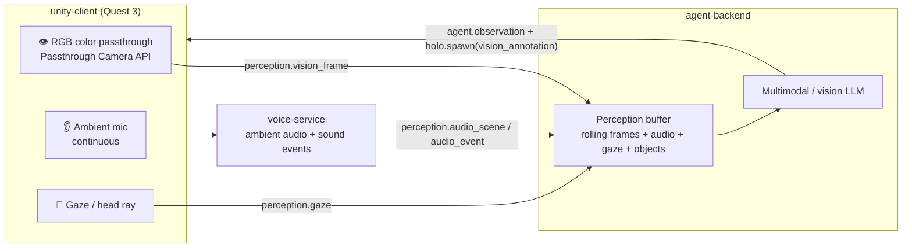
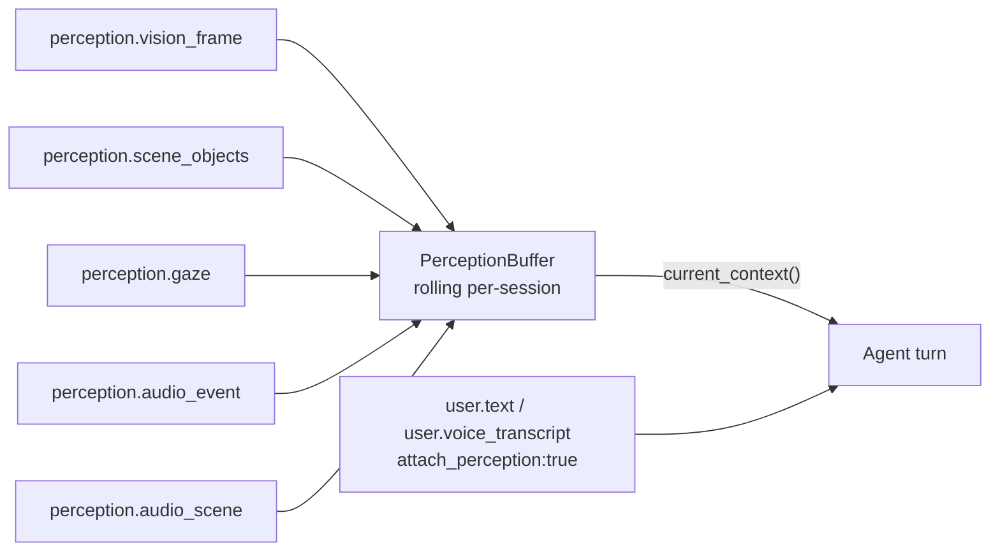
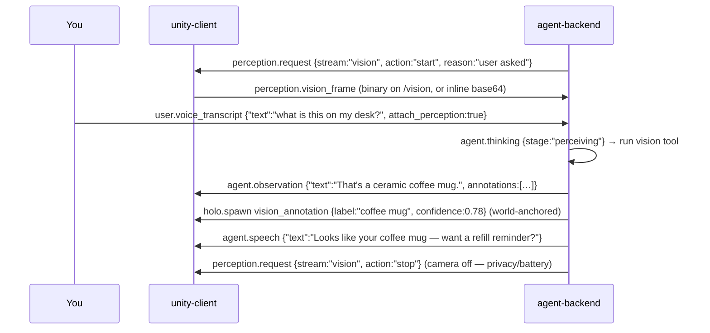

# Perception — sight, hearing & gaze

Most assistants only *listen for commands*. JarvisVR **perceives**. With v1.1
Multimodal Perception, Jarvis can see your room through the Quest 3 color
passthrough cameras, hear it continuously (beyond the wake word), and know what
you're looking at — so you can have realtime conversations *about your physical
space*: *"what is this on my desk?"*, *"read this sign and translate it"*,
*"what was that sound?"*, *"where did I leave my keys?"*

This page explains how perception works conceptually and on the wire. The
authoritative message schemas are in [Protocol §8](../PROTOCOL.md#8-multimodal-perception-v11--additive-optional-negotiated);
the capture/permissions side lives in the
[unity-client](../../unity-client/README.md#perception--privacy-v11) and
[voice-service](../../voice-service/README.md) READMEs.

---

## The big picture

Three senses flow from the headset into a rolling **perception buffer** on the
brain, which a vision-capable LLM reasons over and answers with narration plus
spatial annotations pinned onto real objects.



Every perception stream is **optional and negotiated**. The client advertises what
it can do in `client.hello.capabilities`; the brain turns streams on and off with
`perception.request` (pull-based) to manage bandwidth, battery, and — most
importantly — privacy. Nothing is captured unless a stream is actively requested.

---

## Sight — color passthrough vision

### What it is

On the Quest 3 / 3S, the shell captures the **forward RGB passthrough camera**
(Meta's **Passthrough Camera API**, accessed as a `WebCamTexture` after the
headset-camera permission is granted). Frames are downscaled (≤1024²),
JPEG-encoded, and streamed with the camera pose so the brain knows *where* the
camera was when each frame was taken. It's **pull-based at 1–3 fps** by default —
not a continuous video feed — to save battery and bandwidth, with a thermal/fps
guard that throttles when the headset gets hot.

### The `perception.vision_frame` message

```jsonc
{
  "frame_id": "uuid-v4",
  "camera": "rgb_center",         // rgb_left | rgb_right | rgb_center
  "format": "jpeg",               // jpeg | png | rgb24
  "width": 1024, "height": 1024,
  "quality": 70,
  "transport": "inline",          // inline (base64 in `data`) | binary (on /vision)
  "data": "<base64…>",            // present iff transport=inline
  "seq": 1234,                     // monotonic per stream
  "ts_capture": 1733397600000,
  "pose": { "position": [0,1.6,0], "rotation": [0,0,0,1] },   // camera pose in world
  "intrinsics": { "fx": 720, "fy": 720, "cx": 512, "cy": 512 } // optional, for unprojection
}
```

### The two transports — `/vision` vs inline

Because JPEG frames are big, JarvisVR offers two ways to send them:

- **Binary on `/vision`** (recommended for real streaming). A parallel WebSocket
  endpoint `ws://<host>:8765/vision` carries **length-prefixed** frames:

  ```text
  [4-byte big-endian uint32 = headerLen][headerLen bytes UTF-8 JSON header][image bytes…]
  ```

  The JSON header is exactly the `perception.vision_frame` payload **without**
  `data`, with `transport:"binary"`. The client attaches to a session with
  `?session=<id>`. This avoids base64 bloat and keeps the main JSON channel clean.

- **Inline on `/jarvis`** (fine for low frame rates). The whole
  `perception.vision_frame` (with base64 `data` and `transport:"inline"`) is sent
  as a normal JSON message on the main channel.

Both share port `8765`, so no extra port mapping is needed.

---

## Hearing — ambient audio & sound events

Hearing is **two distinct things**, and neither is the wake word:

1. **Continuous ambient understanding** — the `voice-service` keeps a rolling
   window of room audio (default 4 s) and, each window, emits one
   `perception.audio_scene` with an *overheard* transcript (speech **not** directed
   at Jarvis), a soundscape, a speaker tag, and loudness.

2. **Sound-event detection** — short sub-windows are scanned for discrete events
   (doorbell, alarm, phone, knock, glass break, …) and emitted as low-latency
   `perception.audio_event`s.

```jsonc
// perception.audio_scene  (one per ~4s window)
{
  "ambient_transcript": "…overheard speech, not directed at Jarvis…",
  "speaker": "other",             // user | other | unknown
  "sounds": [ { "label": "music", "confidence": 0.6 } ],
  "loudness_db": -30.0,
  "window_ms": 4000
}

// perception.audio_event  (discrete, low-latency)
{ "label": "doorbell", "confidence": 0.82, "ts": 1733397600000, "loudness_db": -22.0 }
```

This is what powers *"what was that sound?"* and (opt-in) proactive nudges like
"that sounded like your doorbell." The wake-word and directed-speech path is
separate — see [Voice](./voice.md). The engines (YAMNet / heuristic fallback, the
ambient listener) are detailed in the
[voice-service README](../../voice-service/README.md).

---

## Attention — gaze

Gaze tells the agent *what* you're paying attention to, which disambiguates words
like "this" and "that." It uses **eye gaze** when the eye-tracking permission is
granted (via `OVREyeGaze`), and otherwise falls back to the **head ray**. The shell
raycasts it against holograms so the brain knows what (if anything) you're looking
at, plus how long you've dwelled.

```jsonc
// perception.gaze
{
  "source": "eyes",               // eyes | head
  "origin": [0,1.6,0], "direction": [0,0,1],
  "hit_object_id": "uuid-or-null",
  "hit_point": [0.2,1.3,0.9],
  "dwell_ms": 600
}
```

Dwell is also a first-class **interaction** for holograms — see
[Holograms](./holograms.md).

### Client-side scene objects (optional)

If the device does on-device object detection, it can send
`perception.scene_objects` — detected objects with labels, confidences, and 3D
positions. The brain auto-indexes these into **spatial memory** (so it can later
recall *where* it saw something). This stream is optional.

```jsonc
// perception.scene_objects
{
  "frame_id": "uuid-v4",
  "objects": [
    { "label": "coffee mug", "confidence": 0.78, "bbox": [120, 80, 64, 64],
      "position": [0.3,0.8,0.7], "anchor": "world" }
  ]
}
```

---

## The rolling perception buffer

The brain doesn't reason over a live stream — it keeps a small, in-memory,
per-session **perception buffer** (`perception/buffer.py`) holding the most recent:

- **frames** (the latest N, where N is `JARVIS_VISION_BUFFER`, default 8, plus
  decoded size / thumbnail metadata),
- **audio** scenes and events,
- the **latest gaze**, and
- detected **scene objects**.

The buffer exposes a "current perception context" that the agent **auto-correlates
with each utterance**. So when you ask "what is this?", the agent already has the
most recent frame and gaze to reason about — it doesn't need to ask the camera to
take a fresh photo first (though it can).



Utterances can carry **`attach_perception: true`** (the default while vision is
active or the request is clearly about sight/sound) so the agent considers current
perception. With the **mock** vision provider, the buffer + a synthesized scene
description let vision Q&A work **fully offline** — no key, no real camera.

---

## Pull-based control with `perception.request`

The brain controls every stream with `perception.request` (server → client). This
is the heart of the privacy and battery model: the camera and mic run **only while
a stream is active**.

```jsonc
// perception.request  (server → client)
{
  "stream": "vision",             // vision | ambient_audio | gaze | scene_objects
  "action": "start",              // start | stop | once (single snapshot) | set
  "fps": 2,                        // for vision/gaze
  "max_resolution": "1024x1024",
  "quality": 70,
  "duration_ms": 0,                // 0 = until stopped
  "reason": "user asked about the room"   // optional, surfaced for consent/UX
}
```

- **`start` / `stop`** turn a continuous stream on and off.
- **`once`** asks for a single snapshot — perfect for a one-shot "what is this?"
  without leaving the camera running.
- **`set`** adjusts parameters (e.g. fps) on a running stream.
- **`reason`** is surfaced to the user for consent/UX.

The client reports what's currently captured with `perception.state`:

```jsonc
// perception.state  (client → server)
{
  "vision": { "active": true, "fps": 2, "resolution": "1024x1024", "camera": "rgb_center" },
  "ambient_audio": { "active": true },
  "gaze": { "active": false },
  "thermal": "nominal",           // nominal | fair | serious | critical
  "battery": 0.74
}
```

In the backend, the agent's control loop (`agent/agent.py`) decides when to enable
sight/hearing, emits the `start`/`once`/`stop` requests, and shuts streams off when
the turn is done. Saying *"watch the room"* / *"stop watching"* toggles continuous
vision.

---

## What Jarvis says back — `agent.observation`

Perception answers don't come back as plain speech; they come back as
**`agent.observation`**, which carries narration *and* optional spatial annotations
that get realized as world-anchored holograms.

```jsonc
// agent.observation  (server → client)
{
  "text": "I can see a coffee mug and a laptop on your desk.",
  "final": true,
  "annotations": [
    { "label": "coffee mug", "object_id": "O9", "position": [0.3,0.8,0.7], "anchor": "world" }
  ]
}
```

Each annotation is typically spawned as a `vision_annotation` (a world-anchored
callout/label) or `bounding_box_3d` via `holo.spawn`, while the
`agent.observation.text` is the spoken/captioned narration. The perception widgets
— `vision_annotation`, `bounding_box_3d`, `live_caption`, `vision_feed`,
`scene_label` — are described in [Holograms](./holograms.md) and cataloged in
[HOLO_TOOLS.md](../HOLO_TOOLS.md#annotating-the-real-world-v11-perception).

`agent.thinking` also gains perception-specific stages so the shell can show what's
happening: `"perceiving"` and `"looking"`.

---

## A full multimodal turn, end to end

Here's the canonical *"what is this on my desk?"* turn — exactly what the e2e
harness and `smoke_client.py "what is this on my desk?"` exercise:



Notice the camera is **turned off as soon as the turn is done**. That's the model
working as intended.

The matching wire frames (with envelopes) are in
[Protocol §8.6](../PROTOCOL.md#86-realtime-multimodal-turn-example).

---

## The privacy model

Privacy is a design constraint, not an afterthought:

- **Capture only while streaming.** Cameras and mics run **only** while a
  `perception.request` stream is active. `perception.state` always reflects exactly
  what's being captured.
- **On-device gating.** Capture is user-initiated and gated by Android/Meta runtime
  permissions (`HEADSET_CAMERA` + `CAMERA`, `RECORD_AUDIO`, `EYE_TRACKING`).
- **Visible indicators.** A red **capture indicator** appears in view whenever the
  camera/mic are active, and the left-hand **wrist menu** has a **Stop capture**
  kill switch plus per-stream Camera/Mic toggles.
- **In-memory by default.** Servers SHOULD process frames/audio in memory and avoid
  persistence unless the user opts in. Proactive observations are **opt-in** too
  (`JARVIS_PROACTIVE=1`).
- **One-shot when possible.** The `once` action lets Jarvis answer a single
  question with a single snapshot rather than a continuous stream.

See the toggles in [Configuration §5](../configuration.md#5-perception-sight--hearing--gaze-toggles)
and the on-device controls in the
[unity-client README](../../unity-client/README.md#perception--privacy-v11).

---

## How it all stays offline

Every perception capability has an offline path so the whole feature works with no
keys and no hardware:

- **Vision:** `JARVIS_VISION=mock` synthesizes a deterministic scene description
  from the buffer (it "sees" the buffered/detected objects).
- **Hearing:** the voice-service's heuristic sound-event detector and mock STT
  produce plausible `audio_event`/`audio_scene` data with no models.
- **Frames:** in the Unity editor, the default webcam (or a synthetic frame) stands
  in for the passthrough camera.

Flip `JARVIS_VISION` to `openai` or `anthropic` (with a key) to send real image
content blocks to a vision-capable model.

---

## Next steps

- [The agent loop](./agent-loop.md) — how perception context becomes tool calls and observations, plus spatial memory ("where did I leave my keys?").
- [Holograms & interaction](./holograms.md) — the perception widgets that annotate the real world.
- [Voice](./voice.md) — the directed-speech path and ambient hearing engines.
- [Protocol §8](../PROTOCOL.md#8-multimodal-perception-v11--additive-optional-negotiated) — every perception message schema.
- [FEATURES.md](../FEATURES.md) — the full perception feature set and roadmap.
