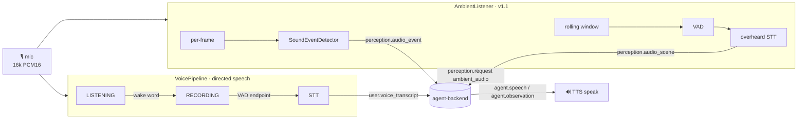
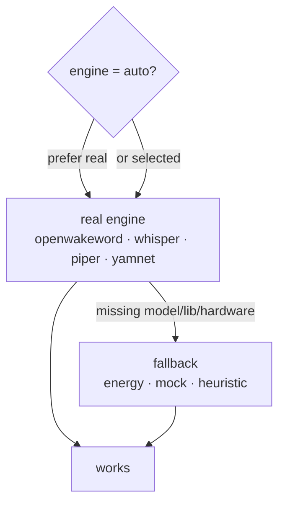
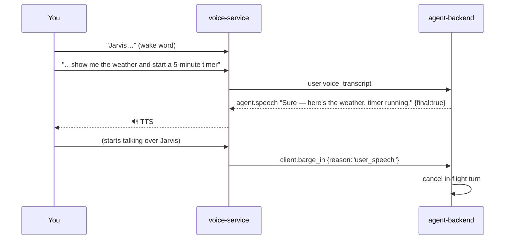

# Voice

Voice is how you *talk to* Jarvis and how Jarvis *talks back*. The `voice-service`
is Jarvis's **ears and mouth**: it listens for the wake word "Jarvis", transcribes
your speech (STT), forwards it to the brain, speaks the replies (TTS), and — with
v1.1 — also **hears your room continuously** and lets you **interrupt** Jarvis
mid-sentence.

Like every other component, it runs **fully offline** with no models, no audio
hardware, and no external services, thanks to fallback engines at every stage.

This page covers the concepts. The full engine matrix, CLI, and every config knob
are in the [voice-service README](../../voice-service/README.md); the ambient/sound
side connects to [Perception](./perception.md).

---

## The pipeline at a glance

The microphone stream fans out to **two** independent consumers: the **wake/STT
pipeline** (speech directed *at* Jarvis) and the **ambient listener** (everything
else the room produces).



The piece that ties this to the brain is the **VoiceBridge** — a protocol client of
the backend's WebSocket server. It advertises `mic`, `speaker`, and `ambient_audio`
in `client.hello`, heartbeats every 5 s, sends transcripts and perception events
out, and speaks `agent.speech` / `agent.observation` coming back.

---

## Wake word

Continuous always-on transcription would be wasteful and creepy, so the pipeline
sits in a low-cost **LISTENING** state until it hears the wake word **"Jarvis"**.
Only then does it start **RECORDING** your actual request.

Three engines, chosen by `JARVIS_WAKE` (default `auto` = prefer real, else fall
back):

| Engine | Notes |
| --- | --- |
| `openwakeword` | Open neural wake word (`hey_jarvis`). The preferred real engine. |
| `porcupine` | Picovoice Porcupine (`jarvis` keyword); needs an access key. |
| `energy` (fallback) | A dependency-free speech-onset detector. It **can't** recognize the literal word "Jarvis" — it just fires on a short burst of speech energy — but it keeps the pipeline usable with zero models. |

The wake word itself is configurable (`JARVIS_WAKE_WORD`, default `jarvis`).

---

## Speech-to-text (STT)

Once awake, the pipeline records until you stop talking — detected by **VAD**
(voice-activity detection) plus an endpointing rule (trailing silence
`JARVIS_SILENCE_MS`, default 800 ms, or a max length). The recorded utterance is
transcribed and sent to the brain as **`user.voice_transcript`** (with interim
**`user.voice_partial`** frames where the engine supports streaming).

| Engine (`JARVIS_STT`) | Notes |
| --- | --- |
| `faster-whisper` | High-quality offline Whisper. Final-only transcripts today. |
| `vosk` | Streaming STT (true partials); needs a model dir. |
| `mock` (fallback) | Returns canned text (`JARVIS_MOCK_TRANSCRIPT`) or the typed text in the demo REPL. |

```jsonc
// voice-service → agent-backend
{ "type": "user.voice_transcript", "payload": { "text": "show the weather in tokyo", "confidence": 0.96 } }
```

---

## Text-to-speech (TTS)

The brain's replies arrive as `agent.speech` (what to say) and `agent.observation`
(what Jarvis perceives) — both are spoken by the **Speaker** via TTS.

| Engine (`JARVIS_TTS`) | Notes |
| --- | --- |
| `piper` | Offline neural voice; needs a voice `.onnx` (`JARVIS_PIPER_MODEL`). |
| `pyttsx3` | Uses the OS speech engine / system voices. |
| `mock` (fallback) | Logs the text and synthesizes a valid tone WAV, so the path is testable with no audio stack. |

Because replies stream (`agent.speech` with `final:false` … `final:true`), Jarvis
can begin speaking before the full answer is ready.

---

## Continuous ambient listening (v1.1)

Separate from the wake/STT path, the **AmbientListener** keeps a rolling window of
room audio (`JARVIS_AMBIENT_WINDOW_MS`, default 4 s) and, each window, emits one
**`perception.audio_scene`**. This is how Jarvis can chat about what it's *overhearing*
— speech **not** directed at it — without you saying the wake word.

```jsonc
// perception.audio_scene
{
  "ambient_transcript": "…overheard speech, not directed at Jarvis…",
  "speaker": "other",             // user | other | unknown (JARVIS_AMBIENT_SPEAKER)
  "sounds": [ { "label": "music", "confidence": 0.6 } ],
  "loudness_db": -30.0,
  "window_ms": 4000
}
```

- The **`ambient_transcript`** is produced by the *same* STT engine as the pipeline,
  but only when the window actually contains speech (gated by an energy VAD).
- **Overheard vs directed:** wake-word-directed speech goes to the pipeline
  (`user.voice_transcript`); everything else the room produces is ambient
  (`perception.audio_scene`, `speaker=other` by default). Real speaker diarization
  (telling *who* is speaking) is a roadmap (P2) item.

This stream feeds the brain's perception buffer just like vision and gaze — see
[Perception](./perception.md).

---

## Sound-event detection (v1.1)

The **SoundEventDetector** scans short sub-windows
(`JARVIS_SOUND_EVENT_WINDOW_MS`, default 1 s) for discrete events and emits
low-latency **`perception.audio_event`**s — doorbell, alarm, phone, knock, glass
break, music, speech, …

```jsonc
// perception.audio_event
{ "label": "doorbell", "confidence": 0.82, "loudness_db": -22.0, "ts": 1733397600000 }
```

| Engine (`JARVIS_SOUND_EVENTS`) | Notes |
| --- | --- |
| `yamnet` | TensorFlow-Hub model, 521 sound classes. The real classifier (`[sound-yamnet]`). |
| `heuristic` (fallback) | Maps loudness + dominant frequency + spectral flatness + zero-crossing rate to a plausible label. An **approximation**, not a trained model — it exists so perception runs fully offline. |
| `off` | Disabled. |

This is what powers *"what was that sound?"* and (when `JARVIS_PROACTIVE=1` on the
backend) proactive nudges like "that sounded like your doorbell."

---

## Barge-in — interrupting Jarvis

Natural conversation means you can cut in. While Jarvis is speaking, the pipeline
watches the mic for you **talking over the TTS** (energy above
`JARVIS_BARGE_IN_THRESHOLD`, sustained for a few frames — set above the normal VAD
threshold so it resists the TTS audio bleeding back into the mic).

On a hit it:

1. **Stops playback immediately** (`Speaker.stop()` / stops `sounddevice`),
2. clears the speaking state, and
3. sends **`client.barge_in`** to the backend so the agent can cancel its turn.

```jsonc
// voice-service → agent-backend
{ "type": "client.barge_in", "payload": { "reason": "user_speech" } }
```

On the brain side, `client.barge_in` cancels the in-flight turn: it stops streaming
`agent.speech` / `agent.observation`, aborts pending tool calls where safe, and may
emit `agent.thinking{stage:"done"}`. It's **idempotent** — ignored if no turn is
active — and **forward-compatible**: a pre-v1.1 backend simply ignores it. Disable
the feature with `JARVIS_BARGE_IN=off`.

---

## The pluggable-engine + offline-fallback design

The defining idea of the voice-service is that **every stage is pluggable and every
stage has an offline fallback**. Each of the five stages — wake word, STT, TTS,
sound events, ambient STT — sits behind a small interface and tries your selected
engine, **falling back** if it's unavailable.



Why it's built this way:

- **It never hard-crashes.** A missing model, engine, or microphone is logged and
  the stage falls back — the pipeline keeps running.
- **It's headless-testable.** Everything is **frame-driven**
  (`process_frame(pcm16)`), so the whole system is unit-tested by feeding synthetic
  audio frames — no mic, no models. The mic thread simply fans each real frame to
  both consumers.
- **You pay only for what you want.** The base install is tiny (`websockets`,
  `numpy`, `python-dotenv`); real engines are opt-in extras
  (`[recommended]`, `[wake-openwakeword]`, `[stt-whisper]`, `[tts-piper]`,
  `[sound-yamnet]`, `[audio]`).

Select engines explicitly or leave them on `auto`:

```bash
export JARVIS_WAKE=openwakeword JARVIS_STT=faster-whisper JARVIS_TTS=piper
export JARVIS_PIPER_MODEL=/models/en_US-amy-medium.onnx
```

---

## Run modes

The `jarvis-voice` CLI has a few entry points, all of which work offline:

```bash
jarvis-voice selftest            # headless end-to-end check (uses fallbacks)
jarvis-voice say "Jarvis online" # TTS smoke test (add --out out.wav to save)
jarvis-voice demo                # mic → wake → STT loop (falls back to a typed REPL)
jarvis-voice demo --simulate     # force the typed REPL (no mic needed)
jarvis-voice ambient             # continuous ambient listening + sound events (v1.1)
jarvis-voice ambient --simulate  # synthetic room audio + typed "overheard" REPL
jarvis-voice bridge              # connect to the backend and act as the voice client
jarvis-voice devices             # list audio devices (diagnostics)
```

The **bridge** is the real integration: it runs mic capture in a background thread,
fans each frame to both the wake/STT pipeline and (when active) the ambient
listener, sends transcripts + perception events to the backend, and speaks what
comes back. With no mic it becomes **speak-only** (still receives and speaks), and
it reconnects with exponential backoff.

---

## Pull-based & privacy-aware

Ambient listening is **negotiated**, just like vision. The bridge advertises
`ambient_audio` in `client.hello`, then starts/stops on the backend's
`perception.request{stream:"ambient_audio", action:start|stop|once}`. After each
change it replies with `perception.state` reflecting what's active. You can
autostart ambient at connect with `JARVIS_AMBIENT=on`, or disable it entirely with
`JARVIS_AMBIENT=off` (the capability isn't advertised and requests are refused).

---

## How it all connects to a turn

For the canonical *"Jarvis, show me the weather and start a 5-minute timer"*:



That's the voice path; the brain's side of the same turn is in
[The agent loop](./agent-loop.md), and the holograms it spawns are in
[Holograms](./holograms.md).

---

## Next steps

- [Perception](./perception.md) — how ambient audio and sound events become perception context.
- [The agent loop](./agent-loop.md) — what the brain does with a transcript, and how barge-in cancels a turn.
- [voice-service README](../../voice-service/README.md) — the full engine matrix, every config knob, and the integration contract.
- [Configuration §10](../configuration.md#10-voice-service-configuration-quick-reference) — the most-used voice env vars.
- [Protocol §5.14](../PROTOCOL.md#514-clientbarge_in-v11) — the `client.barge_in` contract.
