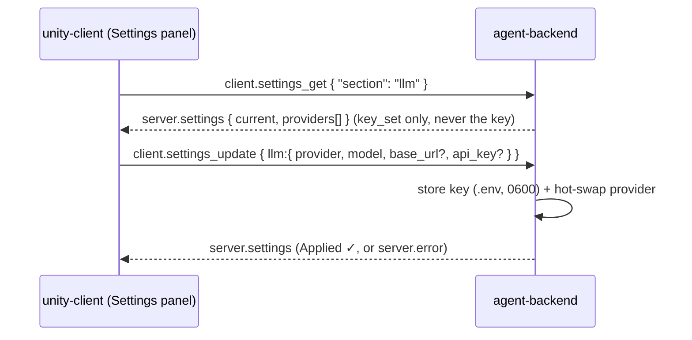

# Configuration

JarvisVR is designed so that **everything has a safe default** — the backend boots
with zero configuration and runs fully offline on the deterministic `mock`
provider. You only change settings when you want to: use a real LLM, point at a
local model, tune perception, or move ports around.

There are **three** places configuration lives, in order of how often you'll touch
them:

1. **The `jarvis-backend setup` wizard** — the friendly way to pick a provider and
   store an API key (writes `.env` for you).
2. **Environment variables / `.env`** — the full set of knobs, all `JARVIS_*`
   plus provider key vars.
3. **In-headset Settings panel** — change the LLM provider/model/key at runtime
   from inside the Quest 3, no rebuild (protocol [§5.15](./PROTOCOL.md#515-settings--clientsettings_get--clientsettings_update--serversettings-v11)).

This page is the thorough tour. For the bigger picture see
[Configuration in the agent-backend README](../agent-backend/README.md#configuration)
and the annotated [`.env.example`](../agent-backend/.env.example).

---

## 1. The `jarvis-backend setup` key wizard

The wizard is the recommended way to configure the brain. Run it from the
`agent-backend` venv (or via `cd infra && make install`, which runs it for you):

```bash
jarvis-backend setup        # alias: jarvis-backend init
```

It will:

1. **List every provider** and let you pick one (e.g. `mock`, `openai`,
   `anthropic`, `gemini`, `ollama`, …).
2. **Prompt for the API key** with **masked, non-echoing input** (`getpass`) — only
   for providers that need one. Pick `mock` (or a local provider) and it skips this.
3. Ask for the **model** (with a sensible default per provider) and, for
   custom/local endpoints, a **`base_url`**.
4. Optionally **validate** the key with a tiny live call (skippable/offline).
5. Write or update **`agent-backend/.env`** atomically and `chmod 600` it.

Security properties you can rely on:

- **The key is never printed or logged** — you only see a masked
  `•••• (N chars)` confirmation.
- `.env` is written with mode **0600** (owner read/write only).
- The wizard is **idempotent and re-runnable** — reconfigure, add more providers,
  or switch the default anytime.

For CI / scripting, run it non-interactively:

```bash
jarvis-backend setup --provider openai            # prompts only for the key (masked)
jarvis-backend setup --non-interactive --provider openai --api-key "$OPENAI_API_KEY"
```

List providers (with their key env var and default models) anytime:

```bash
jarvis-backend providers
```

---

## 2. Selecting an LLM provider (`JARVIS_LLM`)

The active provider is chosen by **`JARVIS_LLM`** (an id from the registry). `mock`
is the default and needs no key. The registry in
[`providers.py`](../agent-backend/jarvis_backend/providers.py) describes each
provider — its id, display name, conventional key env var, default model(s),
whether it needs a `base_url`, and its capabilities (tools/vision).

```bash
JARVIS_LLM=mock                          # offline, deterministic — the default
JARVIS_LLM=openai   OPENAI_API_KEY=sk-…  python -m jarvis_backend
JARVIS_LLM=groq     GROQ_API_KEY=gsk-…   python -m jarvis_backend
```

### Supported providers and how they're reached

| `JARVIS_LLM` | Provider | Key env var | Reached via | Vision |
| --- | --- | --- | --- | :--: |
| `mock` | Mock (offline) | — | built-in deterministic planner | ✅ |
| `openai` | OpenAI | `OPENAI_API_KEY` | native SDK | ✅ |
| `anthropic` | Anthropic (Claude) | `ANTHROPIC_API_KEY` | native SDK | ✅ |
| `gemini` | Google Gemini | `GEMINI_API_KEY` | OpenAI-compatible | ✅ |
| `groq` | Groq | `GROQ_API_KEY` | OpenAI-compatible | |
| `mistral` | Mistral AI | `MISTRAL_API_KEY` | OpenAI-compatible | |
| `together` | Together AI | `TOGETHER_API_KEY` | OpenAI-compatible | |
| `openrouter` | OpenRouter | `OPENROUTER_API_KEY` | OpenAI-compatible | ✅ |
| `deepseek` | DeepSeek | `DEEPSEEK_API_KEY` | OpenAI-compatible | |
| `xai` | xAI (Grok) | `XAI_API_KEY` | OpenAI-compatible | ✅ |
| `perplexity` | Perplexity | `PERPLEXITY_API_KEY` | OpenAI-compatible (no tools) | |
| `fireworks` | Fireworks AI | `FIREWORKS_API_KEY` | OpenAI-compatible | |
| `ollama` | Ollama (local) | — | OpenAI-compatible (needs `base_url`) | |
| `lmstudio` | LM Studio (local) | — | OpenAI-compatible (needs `base_url`) | |
| `vllm` | vLLM (self-hosted) | — | OpenAI-compatible (needs `base_url`) | |
| `custom` | Any OpenAI-compatible | `JARVIS_LLM_API_KEY` | OpenAI-compatible (needs `base_url`) | |
| `azure` | Azure OpenAI | `AZURE_API_KEY` | LiteLLM (needs `base_url`) | ✅ |
| `bedrock` | AWS Bedrock | *(AWS creds)* | LiteLLM | ✅ |
| `vertex` | Google Vertex AI | *(Google ADC)* | LiteLLM | ✅ |
| `cohere` | Cohere | `COHERE_API_KEY` | LiteLLM | |

The three routing kinds:

- **Native SDK** (`openai`, `anthropic`) — first-party SDKs.
- **Generic OpenAI-compatible** — any `/chat/completions` endpoint, over plain
  `httpx`, **no extra SDK** needed.
- **LiteLLM universal adapter** — `azure`, `bedrock`, `vertex`, `cohere`, and 100+
  more; requires the `[providers]` extra (`pip install -e ".[providers]"`).

You can force **any** provider through LiteLLM with `JARVIS_USE_LITELLM=1`.

> **Graceful fallback:** if the selected provider's key or SDK is missing, the
> server logs a warning and **falls back to `mock`** — it never crashes. The same
> applies to vision and tool-calling: capabilities that a provider doesn't support
> degrade gracefully.

### Setting the model and base URL

```bash
# Per-provider model override env vars (JARVIS_<ID>_MODEL):
JARVIS_OPENAI_MODEL=gpt-4o-mini
JARVIS_ANTHROPIC_MODEL=claude-3-5-sonnet-latest
JARVIS_GEMINI_MODEL=gemini-1.5-flash
JARVIS_GROQ_MODEL=llama-3.3-70b-versatile

# Generic, applies to whatever provider is active:
JARVIS_MODEL=…                 # generic model override (wins over per-provider)
JARVIS_LLM_BASE_URL=…          # custom/self-hosted OpenAI-compatible base URL
JARVIS_LLM_API_KEY=…           # generic key fallback (handy for custom/local)
```

---

## 3. Key, model & base-URL resolution precedence

When the backend resolves which key/model/base-URL to actually use, it follows a
deterministic precedence (implemented in `providers.resolve()`). Understanding it
prevents surprises when you've set several variables.

### API key precedence

```text
1. the provider's conventional env var   (e.g. OPENAI_API_KEY, GROQ_API_KEY)
2. the generic JARVIS_LLM_API_KEY        (fallback for custom/self-hosted)
```

For the `custom` provider (or any keyless local provider) you typically use
`JARVIS_LLM_API_KEY`. Keyless providers like `ollama`, `vllm`, `bedrock`, and
`vertex` use no key var at all (local servers, or cloud credentials/ADC).

### Model precedence

```text
1. JARVIS_MODEL                              (generic override)
2. provider-specific config / JARVIS_<ID>_MODEL
   (e.g. JARVIS_OPENAI_MODEL, JARVIS_ANTHROPIC_MODEL, JARVIS_GROQ_MODEL)
3. the provider's registry default model
```

### Base-URL precedence

```text
1. JARVIS_<ID>_BASE_URL                      (per-provider, e.g. JARVIS_OLLAMA_BASE_URL)
2. JARVIS_LLM_BASE_URL  (a.k.a. JARVIS_BASE_URL)   (generic explicit)
3. OPENAI_BASE_URL                           (openai provider only)
4. the provider's registry default base URL
```

Per-provider variables win first so reconfiguring one provider can never silently
break another.

---

## 4. Local & OpenAI-compatible providers

Local models work the same way — they're just OpenAI-compatible endpoints that
usually need no key but **do** need a `base_url`.

```bash
# Ollama (local) — default base URL is http://localhost:11434/v1
JARVIS_LLM=ollama \
  JARVIS_OLLAMA_BASE_URL=http://localhost:11434/v1 \
  JARVIS_OLLAMA_MODEL=llama3.2 \
  python -m jarvis_backend

# LM Studio (local OpenAI-compatible server) — default http://localhost:1234/v1
JARVIS_LLM=lmstudio python -m jarvis_backend

# vLLM (self-hosted) — default http://localhost:8000/v1
JARVIS_LLM=vllm JARVIS_VLLM_MODEL=meta-llama/Llama-3.1-8B-Instruct python -m jarvis_backend

# Any other OpenAI-compatible host
JARVIS_LLM=custom \
  JARVIS_CUSTOM_BASE_URL=https://my-host/v1 \
  JARVIS_LLM_API_KEY=… \
  python -m jarvis_backend

# LiteLLM-only providers (need the [providers] extra)
pip install -e ".[providers]"
JARVIS_LLM=bedrock python -m jarvis_backend     # uses AWS credentials
```

---

## 5. Perception (sight / hearing / gaze) toggles

The v1.1 multimodal perception subsystem has its own switches. All default to
sensible, privacy-respecting values, and the `mock` vision provider works
**completely offline** (it synthesizes a deterministic scene description).

| Env var | Default | Purpose |
| --- | --- | --- |
| `JARVIS_PERCEPTION` | `1` | Master switch for perception (vision/audio/gaze correlation + tools). |
| `JARVIS_VISION` | `mock` | Which provider "sees" frames: `mock` \| `openai` \| `anthropic`. |
| `JARVIS_PROACTIVE` | `0` | Proactive observations on notable sounds (doorbell, alarm…). **Opt-in** for privacy. |
| `JARVIS_VISION_FPS` | `2` | Default frames-per-second requested when Jarvis turns the camera on. |
| `JARVIS_VISION_BUFFER` | `8` | How many recent frames to keep in the rolling perception buffer. |

```bash
# Use a real vision model for "what is this?" while keeping mock everywhere else:
JARVIS_LLM=openai JARVIS_VISION=openai OPENAI_API_KEY=sk-… python -m jarvis_backend

# Let Jarvis proactively comment on notable sounds (opt-in):
JARVIS_PROACTIVE=1 python -m jarvis_backend
```

The deeper model is explained in [Perception](./concepts/perception.md); the
on-device capture/permissions side lives in the
[unity-client README](../unity-client/README.md#perception--privacy-v11) and
[voice-service README](../voice-service/README.md).

---

## 6. Holograms, tools & memory

| Env var | Default | Purpose |
| --- | --- | --- |
| `JARVIS_HOLO_REGISTRY` | `../holo-tools/registry.json` | Path to the canonical widget catalog. If absent, a **built-in fallback catalog** is used so the backend is never blocked. |
| `JARVIS_WEATHER_API_KEY` | — | Optional live weather (OpenWeatherMap). Without it, `get_weather` returns deterministic mock data. Also accepts `OPENWEATHER_API_KEY`. |
| `JARVIS_DATA_DIR` | `.data` | Directory for long-term / episodic / spatial memory (JSON store). Relative paths resolve under `agent-backend/`. |
| `JARVIS_MAX_STEPS` | `6` | Max plan → tool → observe iterations per user turn (a safety bound). |

The widget catalog drives both validation and the auto-generated `show_<widget>`
tools — see [Holograms](./concepts/holograms.md) and the
[Widget catalog](./HOLO_TOOLS.md). Memory is covered in
[The agent loop](./concepts/agent-loop.md).

---

## 7. Server: ports, hosts & WebSocket path

| Env var | Default | Purpose |
| --- | --- | --- |
| `JARVIS_HOST` | `0.0.0.0` | Bind host. |
| `JARVIS_PORT` | `8765` | Bind port. |
| `JARVIS_WS_PATH` | `/jarvis` | The main WebSocket path. |

The backend serves:

- **`ws://<host>:8765/jarvis`** — the main JSON channel (all `agent.*`, `holo.*`,
  `user.*`, `perception.*` messages).
- **`ws://<host>:8765/vision`** — the v1.1 binary passthrough-frame channel
  (length-prefixed frames; clients connect with `?session=<id>`). Shares the same
  port — no extra mapping needed.
- **`ws://<host>:8765/audio`** — optional raw PCM16 16 kHz audio channel.

On the **unity-client** side these are set in the `JarvisConfig` asset (host, port,
path, and a **Use Tls** toggle for `wss://`), not via env vars — see
[Installation §6.3](./installation.md#63-point-it-at-your-backend).

---

## 8. Logging

| Env var | Default | Purpose |
| --- | --- | --- |
| `JARVIS_LOG_LEVEL` | `INFO` | Standard log level (`DEBUG`, `INFO`, `WARNING`, …). |
| `JARVIS_LOG_JSON` | `0` | Set to `1` for one-line JSON logs (useful in Docker / log aggregation). |

```bash
JARVIS_LOG_LEVEL=DEBUG JARVIS_LOG_JSON=1 python -m jarvis_backend
```

On startup the server logs a one-line config summary (host/port/path, provider,
resolved model, vision provider, perception flags, registry path, data dir) so you
can confirm what actually took effect.

---

## 9. Runtime, in-headset settings (Protocol §5.15)

You don't have to restart the backend or edit `.env` to switch models. JarvisVR
exposes a **Settings** panel inside the headset that changes the **LLM provider,
model, and API key at runtime** by hot-swapping the active provider. This is the
protocol's [§5.15 settings messages](./PROTOCOL.md#515-settings--clientsettings_get--clientsettings_update--serversettings-v11).



How it behaves:

- **`client.settings_get`** asks for the current config + the provider catalog.
- **`server.settings`** returns the `current` selection and a `providers[]` list
  with `default_model`, `models[]`, `needs_key`, `needs_base_url`, `key_set`, and
  `capabilities`. **`key_set` is a boolean only — the actual API key is never
  returned.**
- **`client.settings_update`** sends `{ provider, model, base_url?, api_key? }`.
  The `api_key` is **optional** — send it only to set/replace a key; omit it to
  keep the existing one.
- The server stores the key securely (`.env`, mode 0600), **hot-swaps** the active
  provider, and replies with an updated `server.settings`. Errors come back as
  `server.error` with code `invalid_settings`, `provider_unavailable`, or
  `invalid_key`.

> **Security:** the `api_key` only ever travels on `client.settings_update`. Use
> **`wss://`** (TLS) in production so it's encrypted in transit. The unity-client
> masks the field, never logs it, and clears it from memory right after sending.
> Optionally enable `JARVIS_SETTINGS_VALIDATE=1` for a best-effort live key check
> on update (off by default so it stays offline-safe).

The in-headset UX (wrist menu → ⚙ Settings, secure VR keyboard, fallback manual
form) is documented in the
[unity-client README §5.15](../unity-client/README.md#settings--change-the-llm-provider--model--api-key-in-headset-515).

---

## 10. voice-service configuration (quick reference)

The ears & mouth have their own `JARVIS_*` knobs (auto-loaded from a `.env` in
`voice-service/`). The most-used:

| Variable | Default | Purpose |
| --- | --- | --- |
| `JARVIS_BACKEND_URL` | `ws://localhost:8765/jarvis` | Backend WebSocket endpoint to dial. |
| `JARVIS_WAKE` / `JARVIS_STT` / `JARVIS_TTS` | `auto` | Engine selection (prefer real, else fall back). |
| `JARVIS_WAKE_WORD` | `jarvis` | The wake word. |
| `JARVIS_AMBIENT` | `auto` | Ambient listening: `auto` (on request) \| `on` (autostart) \| `off`. |
| `JARVIS_SOUND_EVENTS` | `auto` | Sound-event detector: `auto` \| `yamnet` \| `heuristic` \| `off`. |
| `JARVIS_BARGE_IN` | `true` | Interrupt TTS when the user talks over Jarvis. |

The full list is in the [voice-service README](../voice-service/README.md#configuration)
and explained conceptually in [Voice](./concepts/voice.md).

---

## Complete agent-backend variable reference

Every variable, copied from [`.env.example`](../agent-backend/.env.example) and
[`config.py`](../agent-backend/jarvis_backend/config.py):

```bash
# --- WebSocket server ---
JARVIS_HOST=0.0.0.0
JARVIS_PORT=8765
JARVIS_WS_PATH=/jarvis

# --- LLM provider (universal, multi-provider) ---
JARVIS_LLM=mock                  # mock | openai | anthropic | gemini | vertex | azure |
                                 # bedrock | mistral | cohere | groq | together |
                                 # openrouter | deepseek | xai | perplexity |
                                 # fireworks | ollama | lmstudio | vllm | custom
# JARVIS_MODEL=                  # generic model override
# JARVIS_LLM_BASE_URL=           # custom/self-hosted OpenAI-compatible base URL
# JARVIS_LLM_API_KEY=            # generic key fallback (custom/local)
# JARVIS_USE_LITELLM=0           # 1 = route everything through LiteLLM

JARVIS_OPENAI_MODEL=gpt-4o-mini
JARVIS_ANTHROPIC_MODEL=claude-3-5-sonnet-latest
# JARVIS_GEMINI_MODEL=gemini-1.5-flash
# JARVIS_GROQ_MODEL=llama-3.3-70b-versatile
# JARVIS_OLLAMA_BASE_URL=http://localhost:11434/v1

# --- Provider API keys (set only the one(s) you use) ---
OPENAI_API_KEY=
ANTHROPIC_API_KEY=
GEMINI_API_KEY=
GROQ_API_KEY=
OPENROUTER_API_KEY=
DEEPSEEK_API_KEY=
XAI_API_KEY=
MISTRAL_API_KEY=
TOGETHER_API_KEY=
PERPLEXITY_API_KEY=
FIREWORKS_API_KEY=
# AZURE_API_KEY=                 # (via LiteLLM)
# COHERE_API_KEY=                # (via LiteLLM; Bedrock=AWS creds, Vertex=Google ADC)

# --- Perception (v1.1: sight / hearing / gaze) ---
JARVIS_VISION=mock               # mock | openai | anthropic
JARVIS_PERCEPTION=1              # master switch
JARVIS_PROACTIVE=0              # proactive observations on notable sounds (opt-in)
JARVIS_VISION_FPS=2
JARVIS_VISION_BUFFER=8

# --- Holograms ---
JARVIS_HOLO_REGISTRY=../holo-tools/registry.json

# --- Tools ---
JARVIS_WEATHER_API_KEY=          # optional live weather (else mock)

# --- Memory / storage ---
JARVIS_DATA_DIR=.data

# --- Agent behaviour ---
JARVIS_MAX_STEPS=6

# --- Logging ---
JARVIS_LOG_LEVEL=INFO
JARVIS_LOG_JSON=0
```

> A few extra advanced vars exist in `config.py`: `JARVIS_ENV_FILE` (override where
> runtime settings persist) and `JARVIS_SETTINGS_VALIDATE` (best-effort live key
> validation on `client.settings_update`, default off).

---

## Next steps

- **[Getting Started](./getting-started.md)** — run the offline demo end-to-end.
- **[Add an LLM provider](./guides/add-an-llm-provider.md)** — wire up a provider that isn't in the registry.
- **[The agent loop](./concepts/agent-loop.md)** — what the model actually does each turn.
- **[Environment variables reference](./reference/env-vars.md)** — every `JARVIS_*` and provider key var in one place.
- **[CLI reference](./reference/cli.md)** — all `jarvis-backend` commands and flags.
