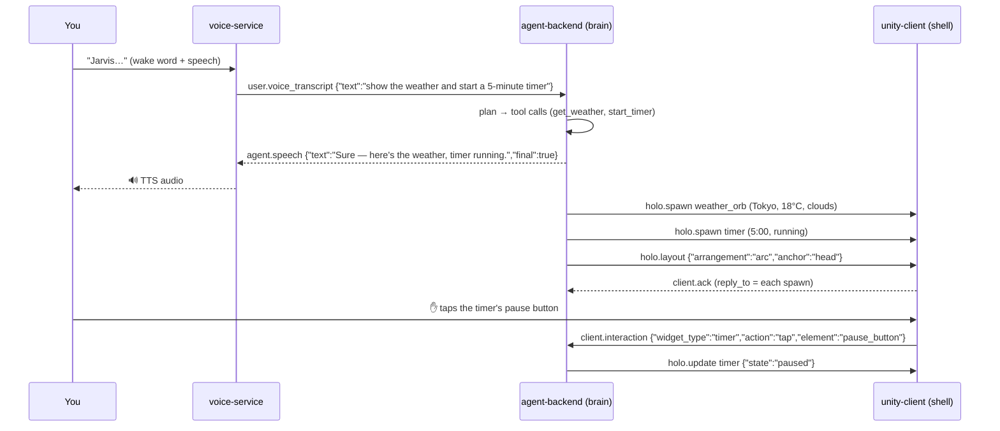

# Getting Started

> **Goal:** in about five minutes you'll have the entire JarvisVR stack running on
> your laptop — **no API key, no Quest 3, no cloud** — and you'll watch a real
> conversation flow through the protocol, message by message.

JarvisVR is an AI agentic operating system for mixed reality. Normally it runs as a
headset **shell** (the Unity app on a Meta Quest 3) talking to an AI **brain** (a
Python server) over a WebSocket protocol. The brain plans, calls tools, and
materializes interactive 3D holograms in your room — and it can *see* and *hear*
your physical space.

You don't need any of that hardware to start. Every component ships with a
deterministic **offline mock** so you can run and understand the whole system on a
plain machine. That's exactly what this guide does.

If you want the deeper "why," skim the **[Overview](./concepts/overview.md)** after
this. If you want every prerequisite and per-OS detail, see
**[Installation](./installation.md)**.

---

## What you'll need (for the offline demo)

- **Python 3.11+** (the backend and harness are Python).
- **`make`** and a POSIX shell (macOS and Linux have these; on Windows use WSL2 or
  Git Bash — see [Installation](./installation.md)).
- That's it. No GPU, no API keys, no headset, and Docker is **optional**.

> The whole stack runs on the deterministic `mock` provider, so it produces the
> **same** output every time — perfect for learning, demos, and tests.

---

## The 5-minute path (fully offline)

### Step 1 — run the end-to-end conformance harness

The single fastest way to see JarvisVR work is the end-to-end (e2e) harness in
`infra/`. It starts the **mock brain** locally (a self-contained WebSocket server
that implements [the protocol](./PROTOCOL.md)) and drives a scripted, multimodal
conversation through it — validating every frame against the protocol schemas.

```bash
cd infra
make e2e
```

This creates a local virtualenv (`infra/.venv`), boots the mock brain on a free
port, and runs the harness. **No Docker required.** When it finishes you should
see:

```text
RESULT: PASS ✅
```

That single command exercised: the `client.hello` / `server.hello_ack` handshake,
heartbeats, a "weather in Tokyo" turn, a "5-minute timer" turn, a hologram
interaction (tapping the timer), **and** a v1.1 multimodal vision turn ("what is
this on my desk?"). If you see `PASS`, the entire protocol surface works on your
machine.

### Step 2 — run the brain yourself and talk to it

The harness is great, but it's more fun to drive the agent yourself. Install the
backend with the interactive key wizard and choose the offline provider:

```bash
cd infra
make install      # installs agent-backend + runs the LLM key wizard
```

When the wizard asks which provider to use, **pick `mock`** (offline, no key).
You can re-run it anytime with `jarvis-backend setup`, and list every provider with
`jarvis-backend providers`. See [Configuration](./configuration.md) for the full
wizard tour.

Now start the server:

```bash
cd ../agent-backend
source .venv/bin/activate
python -m jarvis_backend
# -> JarvisVR agent-backend listening on ws://0.0.0.0:8765/jarvis
```

> **Even simpler:** if you skip the wizard entirely, the backend still boots on the
> `mock` provider by default — zero configuration required. Prefer containers? `make
> mock` starts the same offline brain in Docker instead.

### Step 3 — send it a message

Open a second terminal. The backend speaks JSON over WebSocket on
`ws://127.0.0.1:8765/jarvis`. The easiest way to poke it is the bundled smoke
client:

```bash
cd agent-backend
source .venv/bin/activate
python scripts/smoke_client.py "show weather in tokyo and start a 5 minute timer"
```

You'll see the agent's reply stream back: an `agent.transcript` echo, one or more
`agent.thinking` status updates, the spoken `agent.speech`, and the `holo.spawn`
commands that *would* render a weather orb and a timer in your headset.

Prefer a raw client? With [`websocat`](https://github.com/vi/websocat):

```bash
printf '%s\n%s\n' \
  '{"v":"1.1.0","id":"1","type":"client.hello","ts":1,"payload":{"device":"quest3"}}' \
  '{"v":"1.1.0","id":"2","type":"user.text","ts":2,"payload":{"text":"show weather in tokyo and start a 5 minute timer"}}' \
  | websocat ws://127.0.0.1:8765/jarvis
```

---

## What success looks like

When the stack is healthy, a single user turn produces a predictable burst of
protocol messages. Here is the **mock**'s deterministic response, trimmed to the
essential frames (every message is wrapped in the standard envelope — see below):

```jsonc
// you → brain
{"type":"client.hello","payload":{"device":"quest3"}}
{"type":"user.text","payload":{"text":"show weather in tokyo and start a 5 minute timer"}}

// brain → you
{"type":"server.hello_ack","payload":{"session":"…","agent":{"name":"Jarvis","model":"mock"}}}
{"type":"agent.transcript","payload":{"text":"show weather in tokyo and start a 5 minute timer"}}
{"type":"agent.thinking","payload":{"stage":"tool_call","tool":"get_weather"}}
{"type":"agent.thinking","payload":{"stage":"tool_call","tool":"start_timer"}}
{"type":"agent.speech","payload":{"text":"Here's the weather in Tokyo, and your 5-minute timer is running.","final":true}}
{"type":"holo.spawn","payload":{"widget_type":"weather_orb","props":{"city":"Tokyo","temp_c":18,"condition":"clouds"}}}
{"type":"holo.spawn","payload":{"widget_type":"timer","props":{"duration_ms":300000,"remaining_ms":300000,"state":"running"}}}
{"type":"holo.layout","payload":{"arrangement":"arc","anchor":"head"}}
{"type":"agent.thinking","payload":{"stage":"done"}}
```

The key signals that everything is working:

- A `server.hello_ack` came back with a `session` id and the agent model (`mock`).
- The agent emitted `agent.thinking` **tool_call** stages — it *planned and called
  tools*, it didn't just echo you.
- You got `agent.speech` (what Jarvis would say) **and** one `holo.spawn` per
  widget (what the headset would draw).
- Because two holograms appeared, the agent also sent a `holo.layout{arc}` to
  arrange them neatly in front of you.

If you ran `make e2e` instead, the equivalent success signal is the final
`RESULT: PASS ✅` line.

---

## Your first conversation, narrated

Let's trace the canonical request end-to-end so you understand *exactly* what
happens between your voice and the holograms in your room. Imagine you're wearing
the headset and you say:

> 🗣️ **"Jarvis, show me the weather and start a 5-minute timer."**



Step by step:

1. **Wake + speech.** The `voice-service` is always listening for the wake word
   "Jarvis". Once it hears it, it transcribes your speech (STT) and sends the brain
   a `user.voice_transcript`. (In the offline demo you stand in for this by sending
   `user.text`.)

2. **Plan.** The `agent-backend` echoes your words as `agent.transcript`, then
   emits `agent.thinking{stage:"planning"}`. The LLM agent decides this request
   needs **two** tools: `get_weather` and `start_timer`.

3. **Call tools.** For each tool the agent emits
   `agent.thinking{stage:"tool_call", tool:"get_weather"}`, runs the tool, and
   reads its structured result. With no weather API key, `get_weather` returns
   deterministic mock data (Tokyo, 18 °C, clouds) so the demo always works.

4. **Speak.** The agent streams its spoken reply as one or more `agent.speech`
   frames, ending with `final:true`. The `voice-service` turns that text into audio
   (TTS) and plays it.

5. **Render.** Each tool also produced **holo directives**, which the brain turns
   into `holo.spawn` commands carrying a *Holographic Object* — a `weather_orb` and
   a `timer`, each with a `widget_type`, a `transform` (position in meters +
   rotation quaternion), and validated `props`. Because two objects appeared, the
   brain follows up with `holo.layout{arc}` to fan them in front of you. The shell
   replies `client.ack` for each spawn.

6. **Interact.** You reach out and tap the timer's pause button. The shell sends
   `client.interaction{widget_type:"timer", action:"tap", element:"pause_button"}`.
   The brain handles it and sends `holo.update` to flip the timer to `paused` — a
   live, two-way loop.

Every one of those messages uses the same JSON **envelope**:

```jsonc
{
  "v": "1.1.0",            // protocol version
  "id": "uuid-v4",         // unique message id
  "type": "agent.speech",  // namespace.name
  "ts": 1733397600000,      // epoch milliseconds
  "session": "uuid-v4",    // assigned in server.hello_ack
  "payload": { }            // type-specific
}
```

That envelope, and every payload above, is specified in the
**[Protocol reference](./PROTOCOL.md)** — the single source of truth all components
conform to.

---

## A multimodal turn (Jarvis can see)

The same loop powers perception. If instead you looked at your desk and asked
*"Jarvis, what is this?"*, the brain would enable the camera with
`perception.request{stream:"vision", action:"start"}`, the headset would stream
`perception.vision_frame`s, and the agent would answer with an `agent.observation`
plus a world-anchored `vision_annotation` hologram pinned to the real object — then
turn the camera back off for privacy. You can see this exact turn run inside
`make e2e`, or drive it manually:

```bash
python scripts/smoke_client.py "what is this on my desk?"
```

Read the full story in **[Perception](./concepts/perception.md)**.

---

## Next steps

You've run the brain, sent it messages, and traced a full turn. Where to go next:

**Understand how it works**
- **[Overview](./concepts/overview.md)** — the shell ↔ brain mental model and the perceive → plan → call tools → render → interact loop.
- **[The agent loop](./concepts/agent-loop.md)** — planning, tool-calling, and memory.
- **[Holograms & interaction](./concepts/holograms.md)** — the widget system and how tool results become 3D objects.
- **[Perception](./concepts/perception.md)** — sight, hearing, and gaze.
- **[Voice](./concepts/voice.md)** — wake word, STT, TTS, and barge-in.

**Configure & extend**
- **[Configuration](./configuration.md)** — switch from `mock` to a real LLM provider (OpenAI, Anthropic, local Ollama, …), set keys, and tune perception.
- **[Add an LLM provider](./guides/add-an-llm-provider.md)** · **[Write a tool](./guides/write-a-tool.md)** · **[Add a widget](./guides/add-a-widget.md)**.

**Put it on a real Quest 3**
- **[Installation](./installation.md)** — full prerequisites, then the Unity-side setup. Note there is **no prebuilt APK**: you open `unity-client/` in Unity 2022 LTS with the Meta XR SDK and **build it locally** to your headset.

---

<sub>Stuck? See **[Troubleshooting](./guides/troubleshooting.md)** and the
**[FAQ](./faq.md)**.</sub>
